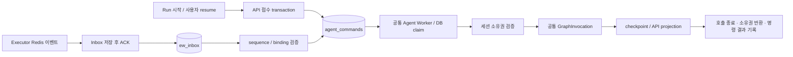

# 공통 Agent 명령 Worker: 개발·이행 안내

101 API 패키지·DB 정리 기준. 060의 공통 명령 실행 설계는 유지한다. 구현·격리 검증 결과이며 운영 DB 이행·배포 완료를 뜻하지 않는다. [작업 기록](improvements/060-unified-agent-command-worker.md), [Run 실행 경계](run-execution-architecture.md)를 함께 읽는다.

## 기동과 실행 흐름

`app.py → dtest.bootstrap`가 같은 프로세스에서 API, 공통 Agent Worker, Executor 이벤트 수신·routing을 조립한다. 이벤트 수신부도 background task이지만 그래프를 실행하는 Worker는 하나다. Task 정리·메트릭 같은 별도 background 작업은 계속 존재한다.

- 사용자 접수는 Task·private invocation·queued 이벤트·내부 명령을 같은 SQLAlchemy transaction에서 기록한다. 원장 기록 실패 시 HTTP 접수도 실패하고 전부 롤백한다.
- Executor 수신은 Inbox commit 후 원본 Redis 메시지를 ACK한다. graph 완료를 기다리지 않는다. Router는 연속된 sequence를 검증하고 Inbox 상태·binding 순번·명령을 같은 psycopg transaction에서 기록한다.
- 명령 원장은 `agent_commands` 하나다. 구 `ew_commands`·`ew_outbox`·`ew_audit`는 ew_0003에서 이관 후 삭제하며, runtime은 이 테이블을 읽거나 쓰지 않는다.
- 공통 Worker는 빈 실행 자리가 있을 때만 한 명령씩 claim한다. 사용자와 Executor 결과가 동일 `AGENT_WORKER_CONCURRENCY`를 공유한다. 오래된 eligible 명령부터 선택하며, 종류별 가중치·자리 예약은 아직 적용하지 않는다.
- graph·모델·HTTP를 기다리는 동안 claim/admission transaction을 유지하지 않는다. checkpoint/Store/observer가 자기 I/O용 연결을 잠깐 빌리는 것은 별개다.

## 파일별 책임

| 위치 | 책임 |
|---|---|
| `src/dtest/infrastructure/database/models/agent_command_model.py` | 내부 원장 모델·제약·index |
| `src/dtest/application/runs/commands/admission.py` | 사용자 입력과 같은 transaction의 명령 기록 |
| `src/dtest/application/runs/commands/claim.py` | 순서·준비 상태·소유권을 검사하고 원자적 claim |
| `src/dtest/application/runs/commands/types.py` | 실행에 넘기는 immutable 사용자/이벤트 claim 값 |
| `src/dtest/application/runs/commands/outcome.py` | token 대조 후 완료·유예·실패·복구 기록 |
| `migrations/versions/0003_retire_unused_worker_storage.py` | 구 명령 일회 이관 후 폐기 테이블 삭제 |
| `src/dtest/worker_service/command_worker.py` | 총한도·실행 task·종료 수명, 두 입력의 공통 실행 |
| `src/dtest/worker_service/executor_events/main.py`, `src/dtest/worker_service/executor_events/event_types.py` | 이벤트 수신 bootstrap·허용 event 종류, graph callback 없음 |
| `src/dtest/worker_service/executor_events/runtime.py`, `src/dtest/worker_service/executor_events/ingress.py`, `src/dtest/infrastructure/database/event_store.py` | Redis ingress·Inbox·routing·binding·메트릭 |
| `crud_migrations/versions/20261003_0026_agent_commands.py` | 동결된 DDL, runtime namespace 자동 추론 없음 |

`worker/dispatcher.py`, `guard.py`, `outbox.py`, 독립 graph_provider와 구 전용 테스트·Store 발행/재시도 메서드는 사용자 명시 승인 후 삭제했다. DB claim·소유권·취소/종료 검증과 Redis 원본 이벤트 consumer의 lease는 유지한다. 이전 버전의 실행기를 현재 원장과 동시에 띄우면 안 된다.

## ID·필드와 상태

공개 `run_id`는 사용자 업무 전체를 가리키며 계속 고정된다. private invocation ID는 사용자 요청/승인 한 번에 하나씩 생긴다. 내부 command ID가 공개 Run ID를 대체하지 않는다.

| 필드 | 의미 |
|---|---|
| namespace + command_id | 멱등 명령 키. 사용자 입력은 private invocation ID, 이벤트는 기존 namespace/event ID 기반 UUID5 |
| session_id | 직렬 실행·데이터 보호 단위인 내부 세션 UUID |
| ordinal | DB identity 순서. 세션별 advisory lock으로 삽입/commit을 직렬화해 앞선 미커밋 입력의 추월 방지 |
| kind | `user_start`, `user_resume`, `executor_resume` |
| invocation_id | 사용자 입력의 기존 agent_runs 참조. Executor 입력에서는 NULL |
| payload | Executor event·execution·Task identity snapshot. 사용자 입력은 agent_runs를 참조하므로 NULL |
| state | 아래 내부 명령 상태, 공개 Run 업무 상태와 별개 |
| available_at | 다시 실행 가능한 시각. 미래인 선행 명령도 뒤 명령의 추월을 막음 |
| attempt | claim 횟수 |
| failure_attempts | 업무 오류 예산. DB/Redis 연결 장애·checkpoint 준비 유예는 사용하지 않음 |
| owner_token | 현재 세션 실행 점유의 immutable token |
| last_error | 마지막 처리 오류/복구 사유, 최대 2,000자 |
| created_at / updated_at | 기록·상태 갱신 시각 |

| state | 의미와 순서 규칙 |
|---|---|
| READY | 아직 실행 전 또는 재예약. 뒤 같은 세션 명령은 대기 |
| RUNNING | claim commit 완료. heartbeat가 오래되어도 다른 Worker가 자동 탈취하지 않음 |
| DONE | 해당 graph 호출의 checkpoint·API 반영과 소유권 반환 확인. 공개 Run은 HITL/Executor 대기일 수 있음 |
| IGNORED | 중복/오래된 입력 등 명시적 무시. 뒤 명령 진행 가능 |
| FAILED | 영구 거절/업무 재시도 소진. 뒤 명령의 선행 조건에서는 제외하되 Task·공개 업무의 기존 입력 잠금은 별도로 유지 |
| RECOVERY | graph/소유권/결과 기록이 불확실. token·세션 보호 유지, 자동 재실행하지 않음 |

claim 직후 프로세스가 강제 종료되면 행이 RUNNING으로 남을 수도 있다. heartbeat 만료를 RECOVERY 해제나 자동 탈취 근거로 삼지 않는다. 기존 실행 종료 확인과 별도 운영 복구가 필요하다. 복구 API 확장은 현재 단계 범위가 아니다. 이전 Store retry/skip 메서드는 삭제했다. 공통 원장의 운영 복구 경로는 별도로 제공해야 한다.

## 순서·공통 한도

claim은 namespace의 READY 명령 중 available_at이 지난 것을 `FOR UPDATE SKIP LOCKED`로 선택한다. 같은 세션에 ordinal이 작은 READY/RUNNING/RECOVERY가 있거나 세션 owner가 점유·복구 상태이면 선택하지 않는다. Executor 명령은 API Task가 PENDING/RUNNING/복구 상태인 동안도 기다린다. event 준비와 receipt 검증은 GraphInvocation에서도 수행한다.

다른 Pod·프로세스가 동시에 조회해도 DB 행과 세션 소유권 획득을 같은 transaction에서 처리한다. 세션 순서는 namespace가 달라도 추월하지 않는다. 한 프로세스의 한도는 전체 Pod 수에 따라 곱해지며, 전역 한도나 HPA 동작을 보장하는 값이 아니다.

예: 한도32이면 예전 API32 + Event4와 달리 **전체 graph 호출 최대32**다. 부하 비교는 이전 합계36과 새36, 또는 양쪽 합계32로 맞춰야 한다. 한쪽 입력이 적을 때 남은 자리를 다른 종류가 사용할 수 있다. 이것만으로 균형 부하에서 큰 처리량 향상을 주장하지 않는다.

HITL/Executor 대기에서는 현재 명령이 DONE이고 자리를 반환한다. `WAITING_EXECUTOR`의 같은 세션 새 입력 잠금은 그대로다. 일주일짜리 외부 작업을 기다리는 기간 동안 Agent 실행 자리나 실행 준비용 연결을 점유하지 않는다. 취소는 일반 FIFO에 넣지 않고 기존 직접 제어 경로를 유지한다.

## 설정

| 설정 | 현재 의미 |
|---|---|
| DATABASE_URL | API·명령 원장·Inbox/binding의 공통 DB 원천 |
| EW_DATABASE_URL | 미지정 시 DATABASE_URL에서 psycopg 표기로 파생. 실행 활성 상태에서 다른 DB/접속 정본이면 기동 거절 |
| CHECKPOINT_DB_URI | LangGraph checkpoint DB. 별도 DB·풀 유지 가능 |
| Workflow 저장 | DATABASE_URL의 현재 workflows·workflow_embeddings. 별도 DB 설정 삭제 |
| AGENT_WORKER_CONCURRENCY | 사용자 시작·승인·Executor 결과를 합친 프로세스별 graph 한도 |
| AGENT_WORKER_POLL_INTERVAL_SECONDS | LISTEN 미연결/비활성 시 fallback. 기본0.25초, 최소0.05초 |
| AGENT_WORKER_NOTIFY_ENABLED / AGENT_WORKER_RECONCILE_INTERVAL_SECONDS | 기본true/5초. 공용 LISTEN 힌트와 유실 시 느린 재확인 |
| EVENT_WORKER_ENABLED | 외부 이벤트 수신/routing 활성화. true이면 공통 Agent Worker도 필요하여 함께 기동 |
| EW_INGRESS_CONCURRENCY / EW_POOL_SIZE | 이벤트 수신·routing 병렬성과 해당 DB pool 상한. graph 한도가 아님 |
| EW_DISPATCH_CONCURRENCY / EW_COMMAND_STREAM_NAME / EW_COMMAND_GROUP_NAME / EW_PUBLISH_LEASE_SECONDS | 삭제된 설정. YAML/env에 남으면 명시적 오류로 중단하므로 제거해야 함 |
| EW_CONCURRENCY | EW_INGRESS_CONCURRENCY의 구 별칭. 별도 한도가 아니며 두 값이 다르면 거절 |

config > env > 기본값 우선순위와 공유 snapshot을 유지한다. 같은 서버의 `chat_app`과 `agent`는 다른 database다. 공통 원장·Inbox는 같은 DB에 있어야 한다. credentials·host·기본port·dbname·query의 정본도 일치시킨다. driver 이름만 정규화한다. 서로 다른 인증 계정/DB나 DNS 별칭을 임의로 같다고 추정하지 않는다.

## 기존 배포 전환

롤링 혼재를 지원하지 않는다. 다음 절차는 **별도 전환 작업 시** 운영자와 현재 데이터/권한을 확인하고 수행한다. 본 구현에서 실제 DB 복사·권한 변경·컨테이너 재기동은 하지 않았다.

1. 새 사용자 접수를 차단하고 기존 API/Agent/Event graph 실행기를 drain·종료한다. 이전 standalone Event Worker도 남아 있지 않아야 한다. Executor 외부 실행 자체는 계속될 수 있으며 원본 Redis 전달 보존이 필요하다.
2. 실제 DATABASE_URL/EW_DATABASE_URL/namespace와 binding·Inbox·미처리 명령·outbox 상태를 확인한다. 기존 event DB가 따로라면 키/FK/sequence를 보존해 공통 API DB로 이관하는 별도 작업이 먼저다. namespace·event group을 동시에 임의 변경하지 않는다.
3. 선택한 YAML로 `uv run python scripts/migrate.py`를 실행한다. CRUD head 다음 Event head가 기존 pending Run·READY/FAILED 이벤트를 원래 ID로 자동 이관하고 폐기 테이블을 삭제한다. checkpoint는 기존 대상에 setup한다.
4. RUNNING/RECOVERY 명령·점유 owner·실행 중 invocation이 있으면 이행을 거절한다. 원장 일부만 있고 같은 세션의 누락된 구 명령이 있으면 새 ordinal로 뒤에 붙이지 않고 거절한다. 원래 순서와 기존 writer 종료를 확인한 후 해결하며 임의로 token을 지우지 않는다.
5. 새 `app.py`를 기동한다. 공통 원장·순서·소유권, Inbox duplicate/sequence, API/SSE 결과를 확인한다. readiness는 현재 원장과 활성 자원 상태를 검사한다.
6. 기존 Redis 내부 dispatch group의 잔여 데이터는 자동 삭제하지 않는다. 외부 원본 이벤트·SSO 세션과 별개인 이전 배포 전달 데이터이므로 다른 환경과 공유 여부를 확인해야 한다. PostgreSQL의 폐기 Outbox/Audit/구 명령은 이번 migration에서 삭제한다. 공통 원장에 미종료 명령이 있으면 기존 CRUD downgrade도 거절된다.

로컬 `scripts/local.py up/update`는 기존 API와 legacy Event 컨테이너를 먼저 멈추고 migration/bootstrap에서 backfill을 실행한다. 생성된 .env.local에 기존 별도 EW DB가 남으면 자동으로 DB를 바꾸지 않는다. 먼저 위 데이터 이행과 공통 DB 설정을 완료해야 한다. 기존 .env를 직접 덮어쓰지 않는다.

## 다음 단계

[061 알림/대기 최적화](agent-command-wakeup.md)에서 Worker와 SSE의 공용 LISTEN 수명, 재연결·알림 유실·fan-out·빈 claim 감소를 구현했다. 명령은 DB 정본이고 timer/주기 scan도 유지한다. 동일 총한도·5초 역할별 모델 fixture·혼합/결과 폭주·1/10/30/50명 반복 성능 비교는 5단계다.

057 `executor_throughput/run.py`는 API/Event 별도 한도 capture 구조여서 새 Worker에서 실행을 명시적으로 거절한다. 이전 source에서 baseline 재현을 유지하고, diagnostic hook은 공통 경계도 지원한다. 새 공유 peak/한도·역할별 fixture capture를 5단계에서 제공한다. 기존 측정 원본은 삭제하지 않는다.
