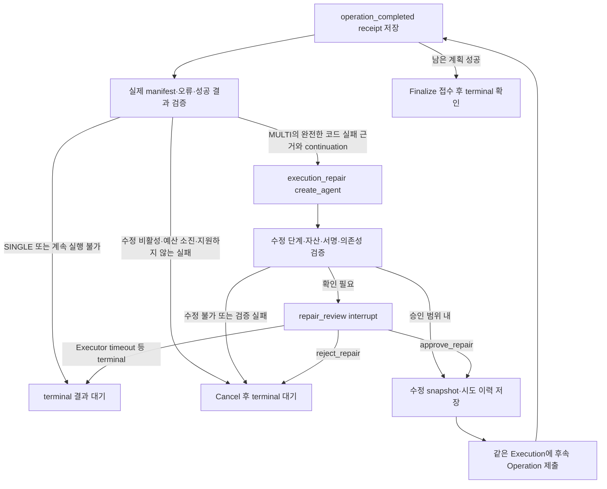

# MULTI 실행 오류 분석과 수정

040 구현, 2026-10-01. 039의 실제 실행·관찰 경계에 오류 수정 역할과 사용자 확인 경계를 추가했다. 정상 결과를 보고 다음 파라미터를 정하는 `execution_review`와, 실제 코드 실패를 읽는 `execution_repair`는 별개다. HTTP 재시도·Worker 장애 복구 정책을 새로운 코드 수정 시도로 계산하지 않는다.

## 실행 흐름



API·Event Worker는 같은 Graph와 모델 cache를 사용한다. 수정 판단은 비동기 `create_agent.ainvoke`이며 프로젝트 system_prompt 및 JSON 검증 middleware를 적용한다. JSON/의미 검증은 최대 두 번의 모델 응답으로 제한한다. 이는 실제 수정 Operation 시도 횟수와 다르다. 모델 HTTP 오류·취소를 수정 성공이나 정상 실패 분석으로 변환하지 않는다.

낮은 수정 수준 1~2에서는 이미 고정된 함수·활성 Tool metadata·실제 오류만 전달해 불필요한 자산 탐색을 하지 않는다. 3~4의 등록 자산 재계획은 기존 read_skill/search_tools metadata 탐색을 사용하며, 중복/round 한도 이후에는 RepairResponse schema로 합성한다. 코드 실행 Tool calling은 제공하지 않는다.

## 수정 수준

| 수준 | 허용 행위 | 사용자 확인 |
|---|---|---|
| 0 | 실패 결과 전달. 실제 수정 없음 | 해당 없음 |
| 1 | 등록 함수 원문을 유지한 인자 binding·selector 보정 | 읽기 전용 값 변경·판단 불확실성 또는 정책 상승 시 |
| 2 | 실패한 함수의 이름·인자·default·annotation을 유지한 실행별 구현 수정 | 판단 불확실성 또는 정책 상승 시 |
| 3 | 성공/skip anchor를 유지하고 등록 Skill·Tool로 남은 계획 재작성 | 수준 3에서는 확인. 수준 4를 승인한 Run은 자동 허용 |
| 4 | 원래 목표 범위에서 실행별 함수·남은 계획 수정 | 승인된 수준 이내면 자동. 불확실성·정책 상승 시 확인 |

필요한 수준은 모델이 선언한 숫자를 신뢰하지 않고 실제 변경 종류에서 계산한다. 서비스 ceiling 위의 제안은 검증을 통과하지 못한다. 사용자 승인으로 서비스 ceiling을 넘지 않는다. 이미 승인한 수준보다 높은 제안에는 별도 명시적 상승 승인이 필요하다. 승인한 상승 수준은 해당 Run의 남은 실행에 적용한다. 원래 승인 snapshot을 덮어쓰지 않는다.

1~2는 Step 구조를 바꾸지 않는다. 이미 완료했거나 건너뛴 Step은 구조와 소스를 고정한다. 해결됐거나 근거가 이미 완료된 decision을 재작성하지 않는다. 기존 데이터·system_context binding과 승인된 데이터 해석을 임의로 바꾸지 않는다. 기존 decision의 출력 schema를 우회한 값도 거절한다.

2의 수정 함수는 실행별 `custom.repair_*` ID로 분리한다. 등록 함수 파일은 수정하지 않고 다른 Step에서 같은 Tool을 참조한 원문도 바꾸지 않는다. 4의 새 함수는 `custom.*` ID와 기존 Skill을 사용한다. 제출 함수는 단일 일반 함수, 함수 내부 import, module-level 실행문/decorator 금지 규칙을 따른다. 입력 default와 annotation이 정의 시 임의 식을 실행하지 않도록 검사한다.

**검증 범위는 구조·서명·binding·자산·의존성이다.** AST 검증은 Python sandbox가 아니며 목적/입출력의 의미적 동등성을 완전히 증명하지 않는다. 실제 Tool 결과와 다음 단계의 동작을 함께 검증해야 한다. 실패한 함수는 이미 파일/외부 상태를 일부 변경했을 수 있다. 성공 Step을 다시 제출하지 않는 것과 실패 Step의 모든 부작용이 exactly-once라는 것은 다르다.

수정 함수/자유 함수가 포함된 실행은 `workflow_eligible=false`로 표시한다. 등록 자산만의 Workflow로 자동 승격하지 않는다. 정식 새 Workflow CRUD/승격 경계 이행은 후속이다. 현재 API에 자동 승격 기능을 새로 붙인 작업이 아니다.

## snapshot·실행 이력

- `approved_snapshot`: 최초 사용자 승인. 원문·소스 hash·데이터 경로·커널·목표·예산을 보존한다.
- `execution_snapshot`: 검증하고 승인/자동 확정한 실행별 수정본. 독립 hash와 accepted proposal 이력을 대조한다.
- `repair_candidate`: 모델 제안과 내부 수정 소스. 승인 전까지 제출하지 않는다.
- `repair_history`: 수정 원인·단계·hash·실패/변경 Step·Operation 식별자와 실제 outcome을 내부에 보관한다.
- 공개 최종 결과의 `repair`: 시도 횟수, 최대값, 승인 수준, 종료 이유, 소스 없는 변경 설명과 해당 Operation outcome을 제공한다.

수정 Operation도 최초 승인 hash+Operation 번호의 멱등성 키와 정확한 body를 제출 전에 checkpoint에 저장한다. sequence는 전체 Execution의 다음 번호부터 이어가고 event continuation의 expected_version을 사용한다. 과거 실패와 미실행 Step을 성공으로 고치지 않는다. 실패 이벤트에 manifest가 없는 제출 Step은 NOT_RUN으로 관찰하며, 실제 성공 결과와 커널 변수만 재사용한다.

`max_repair_attempts`는 Run 전체에서 **확정한 수정 Operation**의 상한이다. 실패한 Step이 바뀌어도 새로 초기화하지 않는다. 승인 거절/JSON 검증 재시도는 실행 시도를 소비하지 않는다. 별도의 AGENT_MAX_OPERATIONS 상한도 그대로 적용한다. 수정 후 성공한 마지막 Operation으로 Finalize하고 `execution.completed`를 확인해야 Run과 세션 잠금을 끝낸다.

## 승인 화면과 API

기존 POST `/api/v1/sessions/{session_id}/runs`, X-User-Id, Idempotency-Key를 사용한다. SSE `interaction.opened`에서 `data.kind=repair_review`를 받는다. payload에는 원인에 대한 짧은 변경 설명, 실패/성공/변경 Step ID, Skill·Tool·function 이름·파라미터와 필요한 수정 수준을 전달한다. Python 소스·원문 traceback은 화면에 주지 않는다.

```json
{
  "run_id":"공개 Run UUID",
  "resume_token":"현재 화면의 resume_token UUID",
  "command":{"resume":{
    "action":"approve_repair",
    "interaction_id":"수정 확인 화면 UUID",
    "revision":1,
    "proposal_sha256":"화면에서 받은 proposal hash",
    "allow_policy_escalation":false
  }}
}
```

정책 상승 화면에서는 allow_policy_escalation을 명시적으로 true로 보낸다. `reject_repair`는 수정하지 않고 Executor를 Cancel한 뒤 terminal을 기다린다. 화면 revision이 오래됐으면 409, 다른 proposal hash/추가 code 필드/명시 승인 누락 등은 422다. 오류 응답이 현재 token을 소비하지 않는다. 동일 idempotency key의 승인 재전달로 추가 Operation을 만들지 않는다.

승인 화면이 열린 상태에서 Executor 대기 timeout의 terminal 이벤트가 오면 후보를 폐기하고 최종 결과로 닫는다. 이때 사용자 확인을 기다리며 종료 이벤트를 계속 막지 않는다. 현재 수정 화면은 확정한 수정안의 승인/거절을 받으며 화면에서 Python이나 변경안을 직접 입력하는 API는 없다.

## 중앙 설정

Workflow 명시 값 → 중앙 config/env에서 해석한 기본값 → 기본 상수 순서로 정책을 정하고, 허용된 HITL override로 최종 승인한다. 중앙 설정 출처는 기존대로 config 우선, env 다음이다.

| 설정 | 기본값 / 범위 | 의미 |
|---|---|---|
| AGENT_REPAIR_LEVEL | 0 / 0~ceiling | Workflow에 값이 없을 때 적용하는 기본 권한. 기본은 자동 수정 없음 |
| AGENT_REPAIR_LEVEL_LIMIT | 4 / 0~4 | 구현된 서비스 기능의 최대 허용 수준. 사용자 승인도 이 값을 넘지 않음 |
| AGENT_MAX_REPAIR_ATTEMPTS | 3 / 0~10 | 서비스 시도 ceiling. 권한이 양수이고 Workflow에 시도 값이 없으면 기본 시도 값으로도 사용 |

```yaml
service:
  agent:
    agent_repair_level: 1
    agent_repair_level_limit: 2
    agent_max_repair_attempts: 2
```

Workflow에 repair_level=0/max_repair_attempts=0이 명시되면 위 config를 넣어도 자동으로 권한을 올리지 않는다. 계획 화면에서 적법하게 수정·승인해야 한다. SINGLE은 수준·시도 모두 0으로 제한한다. Operation timeout/대기 timeout은 기존 설정을 따르며 1주 이상 실제 실행 검증을 새로 수행하지 않았다.

## 검증 재현

[040 작업 기록](improvements/040-agentic-execution-repair.md) 및 [기계 판독 검증 결과](reports/agentic-repair-verification-2026-10-01.json)를 참조한다. 진단 스크립트는 소스 checkout의 테스트 전용 등록 함수와 고정 계획으로 실패를 주입하며 제품의 등록 자산 파일을 변경하지 않는다.

```sh
PYTHONPATH=src .venv/bin/python scripts/diagnostics/verify_agentic_repair_http.py --settings-file /private/tmp/private-local-config.json --output /private/tmp/repair-local.json
PYTHONPATH=src .venv/bin/python scripts/diagnostics/verify_agentic_repair_http.py --real --settings-file /private/tmp/private-local-config.json --output /private/tmp/repair-real-role.json
```

기존 039 harness와 동일한 격리 DB/localhost Executor 설정을 사용한다. 기본 시험은 명시적인 수정 모델 대역과 **실제 Executor/Jupyter**의 8개 시나리오다. --real은 계획은 고정하고 수정 역할만 실제 모델로 호출한다. 실제 모델의 계획 생성부터 모두 실험한 E2E로 표시하지 않는다. 개인 설정/모델 키는 저장소에 넣지 않는다. 전용 Redis namespace/group, 신규 진단용 Execution·노트북을 사용하고 임시 API 서버를 종료한다.
