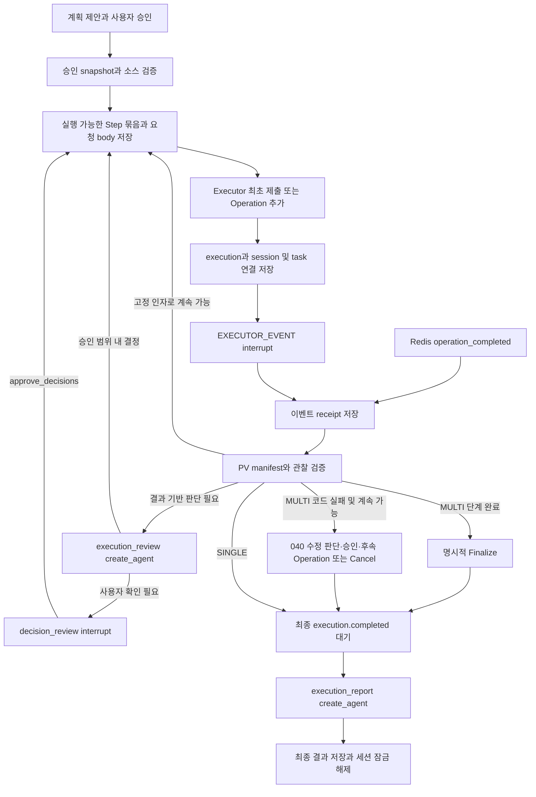

# 승인된 분석 계획의 Executor 실행

039 실행 경계 및 040 오류 수정 구현, 2026-10-01. 공개 Run API는 승인한 계획으로 실제 Executor를 호출한다. 장기 실행은 LangGraph의 `interrupt`에서 멈추고 Redis 이벤트를 받아 이어간다. Agent 프로세스가 분석 함수를 실행하거나 실행 완료까지 HTTP 응답을 기다리지 않는다.

## 그래프와 실행 경계



`execution_wait`가 반환되면 현재 Agent invocation과 실행 슬롯을 끝낸다. DB 연결은 개별 저장·조회에만 빌린다. 몇 시간 이상의 Executor 실행을 기다리는 동안 Graph, 상태, 연결 정보는 PostgreSQL에 남고 그래프를 계속 실행하는 Python task는 없다. 이벤트 처리가 시작되면 별도의 Event Worker dispatch 동시성 한도를 사용한다. 모델의 결과 판단·리포트 생성은 그 dispatch 슬롯을 사용하므로 비용이 없는 작업이 아니다.

**멀티 Operation 성공과 최종 실행 성공은 다르다.** MULTI에서는 다음 Operation을 추가하거나 Finalize를 접수한 뒤 `execution.completed`를 받아야 끝난다. SINGLE에는 추가 Operation과 Finalize를 보내지 않는다. 마지막 결과를 받아 새 분석을 요청하면 새 Executor Execution을 만들며, 종료한 커널의 객체가 유지된다고 가정하지 않는다.

## 승인 내용과 코드 제출

`approved_snapshot`에 사용자 수정값, 남은 Step, 등록 Skill 원문, 등록 Tool 함수 소스, 데이터 ID와 실제 Jupyter 경로, 커널 profile, 승인 SHA256을 고정한다. 컴파일할 때 승인 hash와 함수 hash를 다시 확인한다.

등록 함수는 docstring만 제거한 원문을 제출한다. 함수 안의 import는 유지한다. 그 다음 시스템이 함수 호출과 결과 관찰 코드를 덧붙인다. DataFrame 같은 실제 객체는 Jupyter 커널의 Step별 변수에 보관하고 후속 Tool 인자로 연결한다. Agent에게 DataFrame 전체를 돌려주거나 JSON으로 직렬화해서 옮기지 않는다.

입력은 다음과 같이 구분한다.

| 정의의 binding | 실행 시 처리 |
|---|---|
| literal | 승인된 JSON 값을 Python 인자로 전달 |
| workflow_input | 승인값 사용. 데이터 참조는 서버가 고정한 Jupyter 경로로 변환 |
| step_output | 해당 Step의 커널 변수와 selector를 직접 참조 |
| agent_decision | 승인된 decision ID와 schema에 맞는 확정값 사용 |
| system_context | 승인한 사용자·프로젝트·세션 및 서버 경로 context 사용 |

필수 입력은 승인 전에 검증한다. 선택 입력이 없으면 함수 인자를 생략해 Tool의 Python 기본값을 사용한다. 같은 Step에 필요한 함수 정의만 넣으며 Tool 모듈을 Agent 서버에서 import하거나 실행하지 않는다.

INITIAL/CONTINUE 요청 body는 HTTP 호출 전 별도 node에서 checkpoint에 저장한다. 멱등성 키는 공개 Run ID·승인 hash·Operation 번호로 만든다. 동일 요청 재시도는 같은 body와 키를 사용한다. Finalize/Cancel도 승인에 대응하는 고정 키를 사용한다. 접수 응답의 execution/operation/step ID와 sequence를 검증하고 기록한다. 공유 ExecutorClient의 timeout·취소·불확실한 접수 보호는 기존 구현을 사용한다.

`EXECUTOR_SOURCE_TYPE=INLINE`은 body로 보낸다. `PATH`는 `EXECUTOR_SHARED_INPUT_ROOT/agentic-sources/{sha256}.py`를 원자적으로 발행한다. 기존 파일을 덮어쓰지 않으며 동일 내용인지 확인한다. Executor와 같은 공유 PV를 사용해야 한다. 소스 작성과 manifest 읽기는 기존 retained `run_sync`를 통해 이벤트 루프 밖에서 처리한다.

## 실제 관찰과 조건부 실행

Operation 이벤트의 sequence와 접수 Step ID를 대조하고, manifest의 실행·Operation·Step·attempt ID, 크기, checksum, 완료 상태를 검증한다. manifest가 가리키는 representation은 공유 PV root 안에서만 읽고 크기와 SHA256을 검증한다. 새 Runtime은 이 PV 관찰 경로를 사용하며 이전 Graph의 EXECUTOR_RESULT_READ_MODE=API 분기를 사용하지 않는다. Agent와 Executor가 같은 결과 PV를 읽을 수 있어야 한다. 본문은 text/plain, application/json, text/markdown UTF8에 한정한다. 이미지 내용은 모델에 보내지 않고 `has_image`만 기록한다.

호출 코드가 찍은 `DTEST_OBSERVATION`에서 DataFrame의 shape·컬럼·dtype·head, dict/list의 제한된 내용, 수치형 값을 얻는다. stdout 등은 제한된 텍스트 관찰로 전달한다. 전체 파일과 전체 결과 객체는 Executor/Jupyter에 남는다. 관찰은 분석 결과의 일부이며 Tool이 충분한 수치·설명을 출력하지 않으면 Agent도 그 이상을 알 수 없다. 모든 가능한 객체/파일 형식을 해석하는 일반 데이터 카탈로그가 아니다.

Step의 의존성과 조건이 충족되는 것만 묶는다. 아직 실행되지 않은 Step의 결과를 근거로 조건이나 파라미터를 정하지 않는다. decision의 `after_steps`가 실제 완료된 뒤 `execution_review`가 관찰을 보고 값과 근거 Step ID를 반환한다. 승인된 decision ID·schema·근거 조건을 검증한다. 불충분하거나 사용자 확인을 요청하면 `decision_review`로 멈춘다. 조건이 false인 Step과 그 결과를 필요로 하는 후속 Step은 실행하지 않고 skipped로 보존한다.

execution.review_mode은 `decision_boundary`, `every_tool`, `every_n_tools`를 사용한다. 후자의 두 모드는 MULTI만 허용하고 지정한 간격의 Tool 실행 후 관찰을 검토한다. 선언되지 않은 Tool을 추가하거나 새로운 코드를 만들 수는 없다.

## 사용자 결정 화면

기존 Run 경로와 SSE envelope를 유지한다. `interaction.opened`의 `data.kind=decision_review`는 다음 형식이다.

```json
{
  "interaction_id":"확인 화면 UUID",
  "revision":1,
  "kind":"decision_review",
  "status":"open",
  "resume_token":"현재 invocation UUID",
  "summary":"관찰 결과를 확인하고 다음 값을 확정해 주세요.",
  "payload":{"decisions":[{
    "decision_id":"outlier_method",
    "guidance":"실제 분포를 보고 이상치 탐지 방법을 결정",
    "evidence_steps":["statistics"],
    "value_schema":{"enum":["iqr","zscore"]},
    "has_value":true,
    "value":"iqr"
  }]}
}
```

`has_value=false`는 아직 확정하지 않은 값이다. 프론트는 schema를 따라 기본값 또는 빈 입력을 보여주고 사용자가 수정해 제출할 수 있다. 요청은 동일 `POST /api/v1/sessions/{session_id}/runs`, 동일 `X-User-Id`, 새로운 `Idempotency-Key`를 사용한다.

```json
{
  "run_id":"공개 Run UUID",
  "resume_token":"현재 invocation UUID",
  "command":{"resume":{
    "action":"approve_decisions",
    "interaction_id":"확인 화면 UUID",
    "revision":1,
    "values":{"outlier_method":"iqr"}
  }}
}
```

대기 중인 결정값 전체를 보낸다. 오래된 token/revision은 409, 잘못된 값·모르는 결정·다른 화면은 422이며 실패하면 token을 소비하지 않는다. 이후 공개 Run ID는 유지하고 내부 invocation만 바뀐다. MULTI의 대기 timeout 등 terminal 이벤트가 도착하면 열려 있는 결정 화면도 최종 상태로 정리한다.

`waiting_executor`에서는 resume_token이 없고 같은 세션에 새 입력을 받지 않는다. 다른 세션은 독립적이다. 프론트는 GET 재조회 또는 SSE snapshot으로 서버의 실제 상태를 따라야 한다.

## 결과와 리포트

최종 이벤트 이후에만 `final_response.status=analysis_completed/analysis_failed`를 저장한다. 성공·실패·건너뛴 Step을 함께 표시한다. 리포트의 해석문은 별도 `execution_report` create_agent가 실제 관찰을 근거로 작성한다. 프로젝트 prompt는 middleware로 적용한다. 근거 ID가 실제 성공한 Step ID인지, 모델 해석문에 숫자·수치 표를 임의로 넣지 않았는지 검증하고 prompt JSON/native JSON schema 모드에서 최대 2회 수정 요청한다. 수치 표는 서버가 검증된 구조화 출력에서 그대로 렌더링하여 모델의 재계산·숫자 전사 오류를 피한다. `report.evidence_steps`, `validation_scope=step_ids_and_rendered_facts`로 범위를 표시한다. 이는 자연어 해석·인과 주장까지 모두 자동 사실 검증한 것이 아니다. 제한된 수정 후에도 해석문을 검증하지 못하면 `report.status=evidence_only`와 사유를 표시하고 실제 실행 근거만 제공한다. 네트워크 오류·취소를 정상 해석으로 감추지 않는다.

현재 리포트는 API 결과와 `message.completed`에만 전달한다. `report.artifact_registration=deferred`로 명시한다. **Executor Artifact POST, 노트북 리포트 셀 추가 시점은 사용자가 추후 결정하기로 한 사항이다.** 임의로 실행 중 Artifact API를 호출하거나 파일이 등록되었다고 표시하지 않는다.

## 자원·설정·제한

임베디드 Event Worker는 API의 `AgentGraphRuntime.open_graph()`로 같은 compiled graph·checkpointer·모델 cache를 빌린다. 별도 worker 프로세스는 자체 graph/resource lifespan을 가진다. API CRUD 풀과 Worker inbox/binding 풀이 전부 단일 풀이 된 것은 아니다.

| 설정 | 의미 |
|---|---|
| EXECUTOR_SUBMIT_ENABLED | false이면 기존 계획 승인 저장까지만, true이면 PostgreSQL API Runtime의 실제 제출 활성화 |
| EVENT_WORKER_ENABLED | 임베디드 Redis 이벤트 Worker 실행. 끄면 별도의 Event Worker가 같은 DB/checkpoint/namespace를 처리해야 함 |
| EXECUTOR_RUNTIME_PROFILE | 세션 settings.kernel_profile이 없을 때 기본 profile. 실제 Executor에 등록된 profile이어야 함 |
| EXECUTOR_OPERATION_TIMEOUT_SECONDS | 각 Operation 실행 timeout. 1주 작업이라면 작업 범위에 맞게 별도 설정해야 함. 기본 600초 |
| EXECUTOR_OPERATION_WAIT_TIMEOUT_SECONDS | MULTI가 다음 Operation/Finalize를 기다릴 시간. 모델 판단과 HITL 대기 시간도 감안. 기본 600초 |
| AGENT_OBSERVATION_MAX_CHARS | Step 텍스트/구조 관찰 크기 제한, 기본 16000, 허용 1024~64000 |
| AGENT_MAX_OPERATIONS | 한 분석의 MULTI Operation 상한, 기본 64, 허용 1~256. 초과하면 Cancel 요청 후 최종 이벤트 대기 |
| EW_DISPATCH_CONCURRENCY | 이벤트 재개·모델 결과 판단·리포트 생성의 실행 동시성 |
| EW_EXECUTOR_BASE_URL | 누락 이벤트 history를 조회할 /api/v1 포함 URL. 제출용 EXECUTOR_BASE_URL과 path 기준이 다름 |

설정은 중앙 YAML→env→기본값 우선순위를 따른다. memory checkpointer/독립 port 없는 PlanningRuntime은 계획 승인 저장용이다. 실제 비동기 배포에는 영속 checkpoint·binding 테이블 migration·Redis 소비 설정·PV mount가 필요하다. Worker 테이블은 top-level `alembic.ini`, API 관리 테이블은 `alembic.crud.ini`로 migration한다.

040에서 수정 수준 1~4의 실행별 코드/연결/등록 자산 재계획과 승인·시도 한도를 연결했다. 기본 권한은 0이며 SINGLE은 실패 전달을 유지한다. [오류 수정 Runtime](agentic-execution-repair.md)의 설정·승인 경계를 따른다. 정식 PVC 데이터 catalog·scope별 쓰기 root·metadata Artifact 등록, project_memory, pgvector Workflow 추천·CRUD, Gaia adapter, 첨부·VLM은 후속이다. 후보 거절 후 실행 전 재작성/자유 함수/별도 승인은 [041](agentic-plan-revision.md)에 구현했다. 현재 dataset_output_dir는 프로젝트 기본 경로이며 scope별 카탈로그 구현이 완료된 것이 아니다.

기존 graph/CLI는 아직 남아 있으나 공개 API와 이벤트 Worker는 새 Runtime을 사용한다. 이전 그래프 checkpoint 및 진행 중 Run의 자동 이행은 하지 않는다. 038에서 이미 완료한 계획 승인 checkpoint는 실제 제출을 위해 새 Run을 시작한다.

## 로컬 연계 재현

`scripts/diagnostics/verify_agentic_executor_http.py`는 기본 포트 18091에 임시 API를 열고 항상 마지막에 종료한다. 테스트 DB 이름과 host를 검사하고 이 DB에만 관리/Worker migration을 실행한다. 기존 업무 DB를 지정하지 않는다. 실제 모델을 쓰려면 `--real`을 추가한다.

```sh
PYTHONPATH=src .venv/bin/python scripts/diagnostics/verify_agentic_executor_http.py \
  --settings-file /private/tmp/agentic-executor-test-settings.json \
  --output /private/tmp/agentic-executor-result.json
```

settings-file은 비밀 값을 Git에 넣지 않은 flat JSON 중앙 설정 mapping이다. DATABASE_URL은 로컬 agentic_runtime_test, CHECKPOINT_DB_URI는 로컬 agentic_checkpoint_test를 지정한다. EXECUTOR_BASE_URL은 로컬 8000, EXECUTOR_SHARED_RESULT_ROOT는 host에서 읽을 수 있는 executor/shared_dir이며 ANALYSIS_DATASETS에 default-nce Jupyter 경로를 선언한다. 실제 모델에는 MODEL_NAME/API_BASE_URL/MODEL_API_KEY 및 Phoenix 설정을 추가한다. 파일 접근 권한은 600으로 둔다. 이 harness는 로컬 Redis 6379와 기본 kernel profile을 사용하고 매 시험 전용 namespace/group을 만든다. 기존 Executor 이벤트 stream이나 다른 consumer group을 변경하지 않는다. 원천 파일은 수정하지 않지만 새 notebook/execution 결과는 Executor에 생성된다. 부하 테스트나 운영 배포 스크립트가 아니다.
