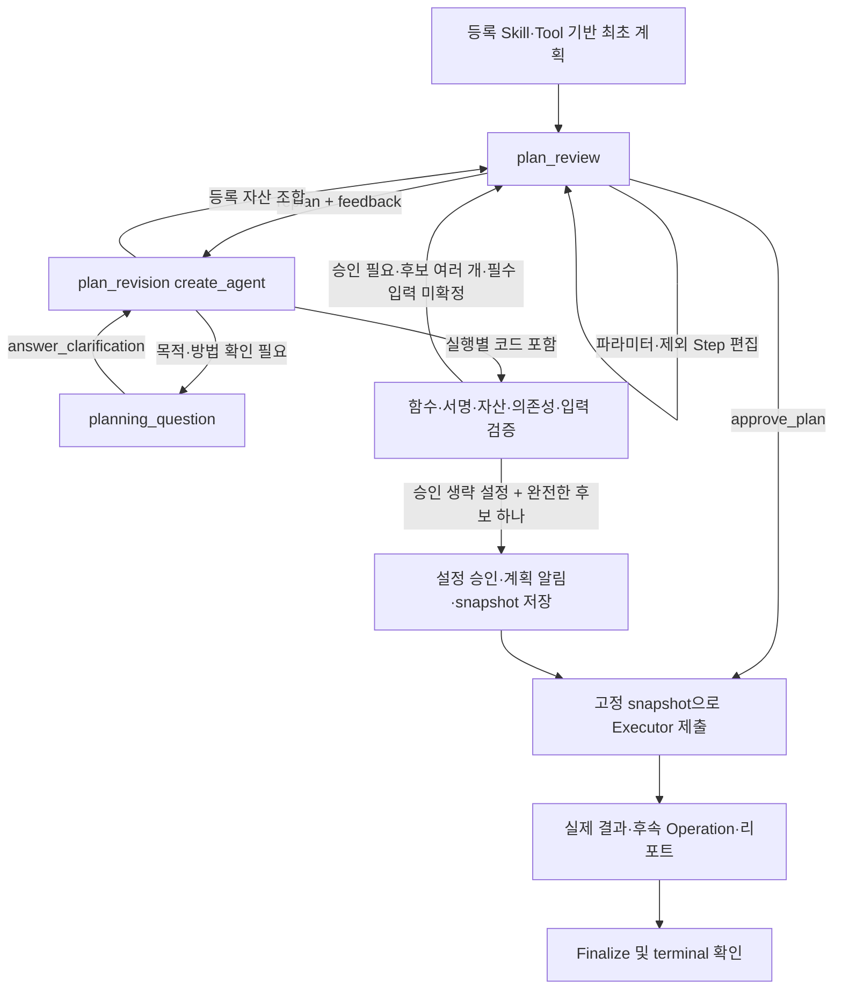

# 실행 전 계획 재작성과 자유 코드 계획

041 구현. 기존 POST `/api/v1/sessions/{session_id}/runs`에서 계획 편집·승인에 더해 자연어 재작성 요청과 추가 질문 답변을 받는다. 같은 공개 Run과 세션 checkpoint를 유지한다. 이미 Executor가 실행 중인 세션 입력 잠금은 유지한다.

## 흐름



`apply_review`는 사용자 명령 receipt·피드백·재작성 횟수를 checkpoint에 기록한다. 별도 `revise_plan`에서 모델을 호출하고 다음 확인 화면을 연다. 따라서 승인/단순 편집이 모델을 재호출하지 않으며 사용자 resume 재전송은 기존 멱등성 경계를 따른다. 승인 전에는 Executor Execution을 생성하지 않는다.

등록된 Skill 지침과 Tool을 우선 사용한다. 실행별 코드에는 기존 Skill 및 등록 자산으로 충족하지 못한 이유를 요구한다. 이 이유가 사실인지, 계획이 업무 목표를 올바르게 달성하는지는 모델 판단과 별도 업무 검증 대상이다. 코드에 reason을 붙였다는 사실만으로 의미적 적합성을 증명하지 않는다.

## 프론트 명령과 SSE

SSO 로그인 쿠키·X-CSRF-Token과 Idempotency-Key를 기존대로 사용한다. 모든 후보를 거절하고 새 계획을 요청할 때는 plan_id 대신 **현재 interaction_id와 화면 revision**을 보낸다.

```json
{
  "run_id": "같은 공개 Run UUID",
  "resume_token": "현재 resume token UUID",
  "command": {"resume": {
    "action": "replan",
    "interaction_id": "현재 계획 화면 UUID",
    "revision": 1,
    "feedback": "모델링은 빼고 다른 전처리 방법으로 분석해 주세요."
  }}
}
```

추가 질문은 `interaction.opened/updated`의 `data.kind=planning_question`, `payload.question`으로 전달한다. 같은 모양의 명령에서 action을 `answer_clarification`으로 바꾸고 feedback에 답을 넣는다. 질문 화면에서는 replan을, 계획 화면에서는 answer_clarification을 받지 않는다. 질문이 있는데 계획 승인을 보내도 실행하지 않는다.

재작성 중에는 기존 화면을 `interaction.resolved`로 닫고 resolution을 replanning/answered로 보낸다. activity.started/completed와 commentary 메시지로 진행 상황을 알린다. 새 plan_review는 새로운 plan_id와 증가한 interaction revision을 갖는다. 이전 후보는 더 이상 선택할 수 없다.

각 계획은 기존 Skill·함수 이름·설명·파라미터에 더해 다음을 제공한다.

- execution_kind: registered 또는 free_code.
- workflow_eligible: 등록 자산만으로 구성됐는지. 실행 성공이나 정식 승격 완료 여부가 아니다.
- approval_mode: user 또는 configuration.
- payload.revision_policy: 사용한 재작성 횟수, 한도, 자유 코드 허용/승인 설정.

자동 승인도 새 계획의 code-free view와 `resolution=auto_approved` 및 설정 승인 안내를 SSE에 남긴다. Python·함수 source hash·PV 경로는 공개 화면에 넣지 않는다. 최초 요청 및 사용자 피드백 자체는 사용자가 입력한 메시지로 보인다. 서버에서 프론트 컴포넌트를 구현한 작업은 아니며 프론트는 새 kind/resolution과 선택 가능한 action을 지원해야 한다.

오래된 token/interaction/revision은 409, 빈 feedback·추가 code 필드·잘못된 화면 action·횟수 한도는 422다. API 거절은 token을 소비하지 않는다. feedback은 4,000자 이내이며 임의 코드나 소스를 입력하는 별도 구조화 필드는 없다.

## 중앙 설정

config → env → 기본값 우선순위를 유지한다. 노드가 환경변수를 직접 읽지 않는다.

| 설정 | 기본값 / 범위 | 의미 |
|---|---|---|
| AGENT_FREE_PLAN_ENABLED | true | 사용자 재작성 이후 실행별 코드 작성 허용. 최초 호출에는 자유 코드를 받지 않음 |
| AGENT_FREE_PLAN_REQUIRE_APPROVAL | true | 자유 코드 계획을 다시 보여주고 최종 사용자 승인을 받을지 |
| AGENT_MAX_PLAN_REVISIONS | 5 / 1~20 | Run 전체의 사용자 재작성·추가 질문 답변 횟수. JSON 보정/실행 실패 수정 시도와 별개 |

```yaml
service:
  agent:
    agent_free_plan_enabled: true
    agent_free_plan_require_approval: true
    agent_max_plan_revisions: 5
```

승인 설정을 false로 해도 등록 자산 계획은 기존 승인 화면을 사용한다. 후보 여러 개, 필수 입력 미확정, 추가 질문은 자동으로 선택/추측하지 않는다. 완전한 자유 코드 후보가 하나일 때만 설정에 따른 승인을 기록하고 실행한다. 단순 실행별 코드 작성 허용은 실패 후 repair_level을 올리지 않는다. 자유 코드 계획이라도 SINGLE/MULTI 및 시도 정책을 별도로 확인한다.

한도에 도달하면 현재 계획 승인은 가능하고 추가 재작성은 거절한다. 질문 상태에서는 취소 후 새 Run 또는 서비스 한도 조정이 필요하다. 기존 040 이전 metadata만 있는 대기 Run은 신규 재작성 action을 바로 지원한다고 가정하지 않는다. 기존 편집/승인은 유지하며 필요하면 취소 후 새 Run을 시작한다.

## 개발자 책임과 코드 보존

`agent_builders/plan_revision/`에 Agent 선언과 prompt를 둔다. ProjectPromptMiddleware, MetadataDiscoveryMiddleware, PromptJsonMiddleware 및 create_agent.ainvoke를 재사용한다. 탐색은 metadata와 원문 조회이며 Tool 코드를 Agent에서 실행하지 않는다. 실제 데이터·스키마를 확인하지 않고 만들었다고 말하지 않는다.

`planning/proposals.py`는 실행별 함수를 등록 catalogue의 복사본에만 넣어 검증한다. 전역 registry/레포 Tool 파일은 수정하지 않는다. 등록 Tool을 그대로 사용할 때는 docstring만 제거한 원문이 그대로 제출된다. 실행별 함수의 모델 출력은 header 한 줄과 body의 indent/text 목록으로 받는다. 서비스가 네 칸 단위 들여쓰기로 원문을 조립하고 AST로 검증한다. 여러 줄 코드를 JSON 문자열 한 덩어리로 생성하며 생기는 escape/본문 누락 문제를 피하고, 함수를 자동으로 고치거나 누락된 코드를 임의로 보충하지 않는다. 함수 수정은 custom.* ID와 origin_tool_id로 분리하고 이름·인자/default/annotation을 유지한다. 새 함수는 origin_tool_id=null이다. 모든 custom Step에는 하나의 함수 소스와 기존 Skill이 필요하다.

기존 후보의 일부를 바꿀 때 모델은 `base_plan_id`와 `patches`를 반환한다. 서버가 해당 후보의 문서를 복사하고 변경된 Step·인자만 반영하므로 수정하지 않은 결과 연결·실행 정책·입력값과 출처를 보존한다. 이전 자유 함수도 같은 후보의 동일 Step·Tool ID일 때만 보존한다. 알 수 없는/폐기된 후보 또는 출처 없는 custom 함수는 거절한다. 새 함수는 별도 functions로 제출하고, 전체 구조 변경이 필요한 경우에는 완전한 definition도 지원한다. 조립 뒤에는 부분 검사만 하지 않고 전체 계획을 다시 검증한다. 이 구조는 private 모델 응답이며 REST 요청에 임의 코드 제출 필드를 추가한 것이 아니다.

함수 구조/서명 검증은 `execution/sources.py`에서 최초 자유 계획과 실패 후 수정이 공유한다. 단일 일반 함수, 내부 import, decorator/module-level 실행문 금지, 정의 시 평가되는 default/annotation 제한을 검사한다. `freeze_approval`이 편집된 파라미터, 신뢰된 데이터 참조, source/hash, 설정 승인 근거를 함께 고정한다. 컴파일·Execution 생성·Operation·Finalize 경로는 기존 구현을 재사용한다.

자유 코드가 포함된 계획은 registered-only Workflow JSON 규격으로 등록 가능한 Workflow와 구분한다. Workflow 자체의 검증 규칙을 느슨하게 바꾸지 않았다. 정식 Workflow 승격 API 이행은 후속이다. 코드 검증은 Python sandbox/결과 정답 증명이 아니며 새로운 함수 내부의 모든 데이터 접근·부작용을 정적으로 증명하지 않는다.

## 실제 모델과 JSON Schema

prompt_json과 provider_json_schema를 모두 지원한다. 모델별 structured_output_mode는 기존 중앙 MODEL_CATALOG 설정 또는 MODEL_STRUCTURED_OUTPUT_MODE로 선택하고 Run 시작 시 고정한다. 이번 실제 gateway 시험에서는 prompt_json의 잘못된 JSON/빈 응답을 실패 기록으로 보존했다.

RevisionReply의 native schema에 Workflow 구조 전체와 재귀 참조를 연결했다. 실제 gateway가 거절한 uniqueItems/propertyNames/$comment 및 pattern는 모델 생성용 스키마에서만 제외한다. 실행 전에는 원래 전체 Workflow validator가 중복/조건/의존성/인자/데이터 범위를 검증한다. 공통 CompatibleChatOpenAI는 public bind_tools 변환 결과를 유지하고 빈 tools/tool_choice/parallel_tool_calls만 생략해 실제 gateway HTTP 400을 방지한다.

이 설정을 모든 역할/모델에 무조건 유효한 것으로 해석하지 않는다. 실제 모델 검증 범위·이전 실패·최종 성공 여부는 [041 작업 기록](improvements/041-agentic-plan-revision.md)을 따른다.

## 검증 재현

`scripts/diagnostics/verify_agentic_plan_revision_http.py`는 기존과 같은 격리된 로컬 DB와 실제 Compose Executor/Jupyter를 사용한다. 최초 계획/함수는 테스트 전용이고 제품 자산과 원천 Parquet는 변경하지 않는다.

```sh
PYTHONPATH=src .venv/bin/python scripts/diagnostics/verify_agentic_plan_revision_http.py --settings-file /private/tmp/private-local-config.json --output /private/tmp/revision-local.json
PYTHONPATH=src .venv/bin/python scripts/diagnostics/verify_agentic_plan_revision_http.py --settings-file /private/tmp/private-local-config.json --no-approval --scenarios free --output /private/tmp/revision-auto.json
PYTHONPATH=src .venv/bin/python scripts/diagnostics/verify_agentic_plan_revision_http.py --settings-file /private/tmp/private-local-config.json --real --structured-output-mode provider_json_schema --output /private/tmp/revision-real.json
```

--real은 재작성 역할만 실제 모델로 실행하며 최초 계획은 고정한다. 최초 실제 LLM 계획부터 수행한 업무 E2E, 100명 처리량, Kubernetes 재배포, 주 단위 작업, 일반 업무 코드의 정답을 검증한 시험으로 표시하지 않는다.

055부터 이 진단 도구도 명시적인 사내 SDK verdict fixture와 실제 localhost Redis 로그인 세션을 사용한다. /auth/login/sso→/users/me→cookie/CSRF로 호출하며 X-User-Id나 권한 dependency override를 사용하지 않는다. 사내 SDK 왕복은 외부 검증 대상이 아니다. [현재 연계 검증](agentic-executor-runtime.md#현재-인증을-포함한-http-연계-검증-055)을 따른다.
