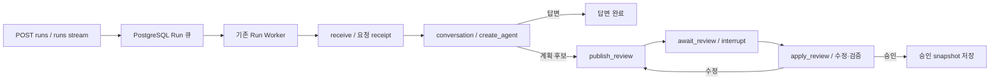

# 분석 Agent 계획 Runtime 개발 안내

2026-09-30 · 038 계획 Runtime, 039 Executor 연결. 아래는 계획 구간의 설명이며 승인 이후는 [Executor Runtime 안내](agentic-executor-runtime.md)를 따른다.

## 실행 구조



LLM 호출은 conversation의 `create_agent` 안에서 `ainvoke`한다. 조회 가능한 도구는 read_skill/search_tools 두 가지이며 분석 함수를 실행하지 않는다. Skill·Tool의 Python을 실행하거나 import하지 않고 AST로 registry 함수와 파라미터·docstring을 읽는다. 모델은 사용자 질문·세션 이력·프로젝트 system_prompt·허용 데이터 참조·Skill 목록을 보고 답변 또는 여러 후보를 반환한다. 후보 합계는 MAX_PLAN_CANDIDATES 이하이며 추천 검색이 없으므로 검색했다고 주장하지 않는다.

`ProjectPromptMiddleware`는 모델 호출·JSON 수정 요청마다 프로젝트 prompt를 적용한다. `PromptJsonMiddleware`는 schema/등록 자산/인자/의존성 검증 실패만 최대 3회 수정 요청한다. `MetadataDiscoveryMiddleware`는 같은 조회를 반복해 관찰 전체를 계속 복사하지 않으며 중복이 발생하거나 조회 round 한도에 도달하면 조회 도구를 끄고 기존 관찰로 답변/계획을 합성하게 한다. 합성 단계에서도 도구를 호출하면 실패한다. create_agent recursion 한도도 32로 제한한다. 모델 호출 자체가 늘어나는 조회 loop는 Run concurrency를 늘리는 것으로 해결하지 않는다.

HITL 수정·승인은 LLM을 다시 호출하지 않는다. 값 검증은 API와 Agent가 같은 순수 함수로 적용한다. API는 DB의 현재 review를 검증한 후 큐에 명령을 넣고, Graph는 실제 checkpoint의 review에 다시 검증한다. receipt를 보존하고 다음 publish node에서 새 interrupt를 열어 기존 답을 중복 소비하지 않는다. 값 누락/잘못된 제외는 수정·승인을 완료하지 않는다.

LLM 대기 때 CRUD DB transaction을 닫는다. Graph/checkpointer/model instances는 프로세스당 재사용하며 프로젝트별 prompt/history/data는 호출 context로 분리한다. node 반환의 이벤트를 별도 API 저장 어댑터가 짧은 transaction으로 Message·Log·TaskEvent에 함께 기록한다. 이벤트 ID 기반으로 checkpoint projection 재생을 멱등 처리한다.

## 파일별 책임

| 위치 | 책임 |
|---|---|
| agent_builders/conversation/agent.py, prompt.md | 대화 Agent 생성, 독립 프롬프트와 모델 응답 검증 |
| planning/catalog.py | 배포된 Skill Markdown·Tool signature/docstring/소스 hash 읽기 |
| planning/runtime.py | 고정 모델 선택, 프로세스 Agent cache, 허용 데이터 metadata |
| planning/graph.py | 대화→후보→HITL→승인 그래프, 사용자 이벤트 선언 |
| service_contracts/run_request.py, run_events.py | 통합 입력과 SSE envelope |
| service_contracts/plan_interaction.py | 계획 화면 및 수정·승인 DTO |
| service_contracts/plan_review.py, plan_projection.py | 순수 검증/화면 projection/승인 고정 |
| service_contracts/resources/workflow-definition.schema.json | 2.0-draft Workflow 정의 계약 |
| api_service/services/plan_event_persistence.py | DB 저장 경계 |
| api_service/api/v1/routes/runs.py | start/resume 접수, POST/GET stream |

기존 `agents/analysis/workflow` 자산 패키지는 유지한다. 그 안의 tools/skills/workflows와 등록 YAML을 수정한 뒤 재배포한다. Tool registry의 availability는 ready(기본) 또는 test_only다. 기존 placeholder extract_data/transform_nce/transform_wt는 test_only로 지정해 이 Runtime의 모델에게 실행 후보로 주지 않는다. Registry 재생성은 이 수동 가용성 정책을 보존한다. 원래 레거시 Tool 파일과 이전 실행 코드는 제거하지 않았다.

새 자산은 등록 Tool·Skill membership, 함수 signature, docstring, 필요한 import를 함수 내부에 포함하는 규칙을 따른다. 승인 snapshot은 등록 함수에서 docstring만 제거한 코드와 hash 및 해당 Skill 원문을 내부에 저장한다. 실제 제출 compiler는 039의 analysis/execution/compiler.py에 연결했다. 038 당시에는 임의 Tool 수정·자유 코드 작성이 없었다. 041에서 [실행 전 재작성·질문·자유 코드 계획](agentic-plan-revision.md)을 같은 Run에 추가했다. 최초 계획은 여전히 등록 자산을 사용한다.

새 Runtime은 API Run Worker에 연결했고 기존 graph.py/구 Agent builders/CLI는 이전 흐름의 검증과 차기 이행을 위해 남아 있다. 039에서 Executor event Worker도 새 PlanningRuntime/실행 그래프를 사용하도록 연결했다. **모두 새 흐름으로 바뀌었다고 보면 안 된다.** Executor 단계 이행 이후 실제 미사용 코드·개발 도구를 확인하여 제거한다. 제공 Gaia core/router는 수정하지 않았고 등록 객체 adapter는 후속 구현이다.

## 데이터와 설정

042의 [Dataset Registry 계약 초안](design/dataset-registry-contract/README.md)은 정적 데이터 목록을 동적 PVC 목록으로 확장하기 위한 명세다. 현재 Runtime은 여전히 설정 목록을 사용하며 신규 API·범위 경로·fresh resolve는 구현 전이다.

서비스 YAML 우선, env 다음, 기본값 마지막의 중앙 설정을 따른다. 예:

```yaml
service:
  agent:
    max_plan_candidates: 5
    agent_discovery_max_rounds: 4
    agent_history_message_limit: 40
    analysis_datasets:
      default-nce:
        title: NCE 원천 예제
        description: Jupyter에 준비한 Parquet 참조. 분석 결과는 아직 없음.
        runtime_path: /workspace/pv/default_data/df_nce_long_format.parquet
        scope: GLOBAL
```

| 설정/env | 기본값·제한 | 의미 |
|---|---|---|
| MAX_PLAN_CANDIDATES | 5, 1~20 | 추천+신규 후보의 표시 상한. 현재는 신규 후보만 생성 |
| AGENT_DISCOVERY_MAX_ROUNDS | 4, 1~12 | metadata Tool 호출이 있는 모델 round 한도. 이후 합성·JSON 검증 수정 호출은 별도 |
| AGENT_HISTORY_MESSAGE_LIMIT | 40, 2~200 | 같은 세션의 대화 메시지 개수 상한. token 기반 요약/project_memory는 후속 |
| ANALYSIS_DATASETS | 빈 mapping, 최대 1000 | 검증용 서버 데이터 선언. 정식 PVC catalog API를 대체하는 운영 카탈로그가 아님 |

GLOBAL은 공유 원천/test 데이터만 사용한다. 전처리 데이터는 USER/PROJECT/SESSION을 쓰고 owner_user_id(서비스 내부 UUID), project_id, session_id를 해당 scope에 맞게 지정한다. 서버 runtime_path는 Jupyter에서 접근할 절대 경로이며 프론트·LLM에는 공개 dataset_id/title/description/scope만 전달한다. Agent 서버가 그 Parquet를 직접 읽거나 MinIO에 metadata를 쓰지 않는다. 이 선언은 schema/행 내용을 실시간 확인한 결과가 아니며 실제 관찰은 039의 Executor 실행과 manifest 검증에서 얻는다.

040에서 repair_level 1~4를 실제 MULTI 실행에 연결했다. 기본 권한은 0, 서비스 ceiling은 기본 4, 시도 ceiling은 기본 3이며 Workflow의 명시 값과 중앙 기본값, 적법한 사용자 수정으로 확정한다. SINGLE은 repair_level/attempts=0만 허용한다. [오류 수정 Runtime](agentic-execution-repair.md)을 따른다. port 없는 계획 전용 실행이 실제 Executor 수정을 수행하는 것은 아니다.

## 실행·검증

기본 `app.py`와 중앙 bootstrap을 유지한다. PHOENIX_ENDPOINT를 설정하면 API lifespan에서 register하고 종료 때 flush/shutdown한다. batch exporter를 사용한다. host alias는 실행 환경에서 model.frodo.com→10.250.110.99, 그 외 frodo 서비스→10.250.110.100으로 설정한다. 비밀 값은 저장소에 넣지 않는다.

오프라인 테스트는 test_planning_runtime.py, test_discovery_middleware.py. 실제 PostgreSQL 검증은 DTEST_AGENTIC_TEST_SETTINGS_FILE로 별도 local agentic_runtime_test/agentic_checkpoint_test DSN JSON 파일을 지정한 test_planning_api_postgres.py. 이 suite는 테스트 CRUD DB의 users를 TRUNCATE하므로 기존 업무 DB를 지정하지 않는다. 실제 모델 검증 결과는 reports의 JSON을 확인한다. 어떤 결과가 검증됐는지는 [038 작업 기록](improvements/038-agentic-planning-runtime.md)에 따로 명시한다.
