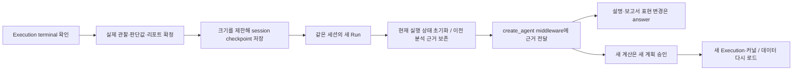

# 완료된 분석을 후속 대화에 전달하기

043 · `feature/agentic-session-analysis-context`. 실제 데이터 등록 API는 Executor 개발 전이므로 [042 계약](design/dataset-registry-contract/README.md)의 런타임 연결은 보류한다.

## 이전에 빠져 있던 것

현재 MULTI 실행은 결과 관찰 → 승인된 decision 판단 → 조건부 다음 Tool → Finalize → 리포트까지 지원한다. 그러나 `execution_report`가 만든 최종 결과·보고서는 `history`에 들어가지 않았다. 다음 Run의 `receive`가 observations와 final_response를 비우므로 conversation 모델은 이전 계획 메시지를 보더라도 실제 실행 결과를 받지 못했다.

이번에는 완료된 분석 하나를 `last_analysis_context`라는 checkpoint 필드에 남기고 **같은 사용자·프로젝트·세션의 후속 대화**에만 전달한다. 별도 메모리 DB나 프로젝트 공유 저장소를 만든 작업이 아니다.



## 저장하는 내용과 수명

record는 schema_version=1, owner(user_id/project_id/session_id), payload를 갖는다. payload에는 이전 Run/Execution ID, 최초 요청 목표(`requested_goal`), 최종 승인 범위(`execution_scope`), 공개 데이터 참조 ID/제목, 실제 결정값, 공개 Step 관찰, 보고서 발췌가 들어간다.

원시 manifest/result_ref·PVC 경로·Tool 소스·Python 변수·전체 로그·DB client를 구조 필드로 넣지 않는다. 관찰값과 리포트의 자유 텍스트가 자동으로 민감정보 제거·의미 검증된다는 뜻은 아니다. 원본 실행 기록과 전체 보고서는 기존 Run/Executor 보관 수명을 따른다.

- terminal event 확인 후에만 새 분석 record를 만든다. 승인·실행 대기만으로 결과가 생긴 것처럼 보관하지 않는다.
- 다음 대화·새 계획·계획 수정은 이 record를 유지한다. 다음 분석이 최종 완료되면 교체한다.
- 실패한 분석도 analysis_failed 상태와 실제 관찰을 보존하며 성공으로 바꾸지 않는다.
- 다른 사용자·프로젝트·세션에는 전달하지 않는다. 이는 기존 API 소유권 검사에 추가된 문맥 전달 검사이며 파일 시스템 ACL을 대신하지 않는다.
- 최근 분석 하나만 유지한다. 이전 모든 분석 검색·여러 세션 공유·project_memory·보고서 버전 관리·파일 Registry는 후속이다.

## 크기 제한

중앙 설정 하나로 모델에 전달할 분석 payload 크기를 조절한다. YAML → env → 기본값 순서는 기존대로다.

```yaml
service:
  agent:
    # 최근 완료 분석의 JSON payload 문자 수 상한. 전체 LLM prompt/token 상한은 아님.
    # 0이면 전달을 끔. 원본 보고서·Executor 결과는 삭제하지 않음.
    agent_session_analysis_max_chars: 16000
```

env 이름은 `AGENT_SESSION_ANALYSIS_MAX_CHARS`. 허용값은 **0 또는 2048~64000**, 기본 16000이다. `agent_history_message_limit`은 대화 메시지 수, `agent_observation_max_chars`는 Step 출력 관찰 크기이며 목적이 다르다. 운영 YAML/env 파일에 필수로 새 값을 추가할 필요는 없다.

크기는 JSON escaping 이후 Python 문자 수로 측정하며 토큰 수나 HTTP 바이트 수가 아니다. requested_goal은 일부 발췌할 수 있다. 데이터 참조·결정값·관찰은 들어갈 수 있는 것만 보관한다. 관찰은 최근 결과를 우선하고 보관 순서는 실행 순서를 유지한다. 개별 수치의 문자열 중간을 잘라 다른 수치처럼 만들지 않는다. summary가 빠지면 summary_omitted=true, 관찰·참조·결정이 빠지면 각 omitted count를 남긴다. 보고서는 excerpt와 truncated를 함께 전달한다. 작은 새 상한으로 읽을 때도 다시 제한한다.

090에서 최종 승인 범위를 추가했다. `execution_scope`는 plan_id/plan_revision, 현재 유효한 승인 계획의 Step별 Skill/Tool ID·최종 argument binding·실제 상태, 사용자 제외 Step 목록을 갖는다. literal/workflow_input/agent_decision 값은 정확하게 복사하며 step_output은 참조로 남긴다. 데이터는 공개 ID·제목을 쓰고 PVC 경로, system_context 값, frozen Tool 소스는 투영하지 않는다. 이는 각 재시도의 파라미터 원장이 아니며 실제 출력은 observations로 확인한다.

이 범위는 예산 절반 안에 metadata와 함께 들어갈 때 전체 보관한다. 들어가지 않으면 통째로 생략하고 `execution_scope_omitted=true`를 남긴다. 배열이나 문자열을 잘라 다른 승인값처럼 전달하지 않는다. 최초 목표보다 최종 승인 범위·실제 관찰이 우선이며, 범위가 없으면 최초 요청으로 복원하지 않는다. 예전 schema_version=1의 goal은 읽을 때 requested_goal로 정규화하며 과거 기록에 없던 승인 범위를 새로 만들어내지 않는다. 새 DDL·공개 API 필드는 없다.

상한을 나중에 늘려도 이전에 생략한 문맥이 자동 복원되지는 않는다. 원본 조회·과거 분석 검색을 연결한 기능은 아직 없다.

## Middleware와 역할

`SessionAnalysisMiddleware`는 `AgentContext.session_analysis_context`를 읽어 매 모델 호출에 제한된 근거 HumanMessage를 삽입한다. 재검증·metadata Tool loop에서도 적용하며 context가 없거나 owner가 다르면 삽입하지 않는다. 모델과 역할 Agent 인스턴스에 세션 record를 저장하지 않으므로 공유 캐시가 다른 호출의 값을 가져가지 않는다.

근거 메시지는 `reference_type=previous_completed_session_analysis`로 표시하며 시스템 지시문으로 올리지 않는다. 기존 역할 payload를 첫 HumanMessage로 유지하므로 계획 재작성 validator가 retry 문장이나 이전 보고서를 원래 요청으로 해석하지 않는다. 프로젝트 system_prompt middleware도 기존대로 매 호출 적용한다.

conversation과 plan_revision에만 이전 분석 문맥을 전달한다. 현재 실행의 review/report/repair는 현재 승인 snapshot과 현재 실행 근거를 계속 사용한다. 과거 분석을 현재 실행의 성공 증거로 섞지 않는다.

prompt는 다음을 구분한다.

- 방금 결과의 설명·리포트 표현 변경: kind=answer. 대화 Markdown을 반환하고 파일·Artifact 등록 완료를 주장하지 않음.
- 추가 계산·다른 분석 기법·검증: kind=plans. 현재 허용된 데이터 목록에서 골라 새 승인을 받아 실행.
- 이전 결과 없음·생략된 사실·텍스트 모델의 이미지 해석 한계: 확인되지 않은 결과를 만들어내지 않음.

API path/header/body와 SSE envelope는 변경하지 않았다. `last_analysis_context`와 내부 validation error는 checkpoint 전용이며 Run 응답 전체에 새 필드로 노출하지 않는다.

## 실제 결과 판단에서 함께 보완한 부분

첫 실제 시험에서 outlier_method에 필요한 after_steps는 profile/statistics 둘인데 모델은 statistics만 인용했다. 값 iqr과 inspect_outliers=true 자체는 유효했지만 서버는 불완전한 근거를 거절했다. 모델의 안내는 승인한다고 했는데 HITL 두 값은 모두 비어 있었다.

기존 검증은 node에서 결과를 거절하고 즉시 사용자 확인으로 넘어갔다. 이제 execution_review의 create_agent middleware가 원래 pending_decisions·성공한 complete observation으로 다음을 검사하고 최대 두 번의 응답 시도 안에서 오류를 모델에 알려준다.

- decision ID의 허용 범위·중복
- 실제 Step ID와 필수 after_steps 누락
- 승인 output_schema의 타입·enum
- 모든 판단을 제공하지 못하면 needs_user_input=true

재검증해도 실패하면 사용자 확인으로 대기하고 값을 자동 승인하지 않는다. 오류는 private `execution_review_validation_error`에 남긴다. 네트워크 오류를 이 확인 흐름으로 숨기지 않는다. 이 검증은 구조·근거 ID를 확인하며 선택한 방법의 업무 정답까지 자동 증명하지 않는다.

## 검증 및 한계

[043 작업 기록](improvements/043-session-analysis-context.md)과 [검증 결과](reports/session-analysis-context-verification-2026-10-01.json)를 참고한다.

실제 시험의 최초 계획만 등록 quality-review fixture로 고정했다. 이후 Executor/Jupyter 실행, 결과 판단·리포트·후속 대화는 실제 on-prem 모델을 사용했다. 두 후속 요청이 원래 완료 분석의 네 Step 근거를 전달받고 새 Execution 없이 answer로 완료하는 것을 확인했다. 실제 대화 답변의 모든 정성 해석·인과 설명·숫자 반올림을 자동 검증한 시험은 아니다. 평균/사분위수만으로 균일 분포를 단정하는 등 과한 해석을 막는 평가·인용 정책은 추가 검토가 필요하다.

이번 변경은 후속 대화의 근거 전달과 결과 판단 계약 보완이다. 다중 사용자 처리량·지연 개선을 측정한 작업이 아니며 모델에 문맥이 추가되므로 토큰이 늘 수 있다. 데이터 자동 등록·다른 세션 재사용·Artifact 저장 시점과 project_memory는 여전히 후속이다.
