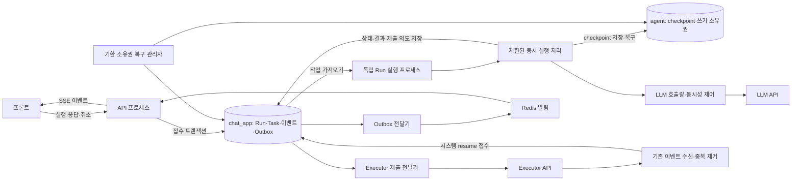

# Agent 실행 구조 개선 설계안

작성일: 2026-09-28. 대상: 현재 브랜치의 API → Run → LangGraph → HITL → Executor 연계. **설계 문서이며 구현·배포 완료를 의미하지 않는다. 이번 작업에서 서버 코드와 실행 환경은 변경하지 않는다.**

배포 조건 보완: 최종 환경은 Kubernetes의 단일 컨테이너 Pod이며, CI/CD는 매번 다른 이미지 태그를 배포하고 자동 확장은 자원 사용량 기반이다. [Kubernetes 배치·효율·자동 확장 설계](/Users/a10054/SKAX_PROJECT/dtest-agent/docs/design/kubernetes-runtime-efficiency-2026-09-28.md)에 **단일 Deployment의 통합 Pod + 제한된 내부 동시성**을 현재 기본안으로 반영했다. 아래 API/실행 분리는 우선 코드의 책임·예산 분리로 적용하고 별도 프로세스/Deployment 분리는 향후 조건부 선택으로 바꾼다. 물리 배치·최소 replica·확장 정책은 보완 문서를 우선한다.

**결정: LangGraph와 PostgreSQL 기반 작업 접수는 유지한다. API와 그래프 실행을 분리하고, 모든 실행·재개 요청을 하나의 실행 제어 경로로 모은다. 실행 프로세스마다 제한된 수의 Run을 동시에 처리하되, 동일 세션의 checkpoint를 쓰는 실행은 하나만 허용한다. 그래프·연결 풀을 재사용하고, 취소·복구·외부 제출의 중복 방지를 먼저 보장한 뒤 동시성을 확대한다.**

추가 확장 조건: API는 공통으로 유지하고 여러 업무 Agent를 같은 레포에 등록한다. 새 runtime은 analysis graph를 직접 고정하지 않고 agent_id/version의 공통 계약으로 실행한다. Agent별 상태 격리 때문에 신규 checkpoint 매핑은 session_id만으로 구성하지 않으며 기존 실행은 legacy 매핑을 보존한다. 동일 세션의 실행 잠금은 Agent 종류와 무관하게 유지한다. 관련 기존 ID 규칙의 변경/이행은 [다중 업무 Agent 확장 설계](extensible-agent-runtime-2026-09-28.md)를 따른다.

이 구조는 LLM 추론 자체를 빠르게 만드는 설계가 아니다. LLM 응답을 기다리는 동안 다른 세션까지 불필요하게 대기하는 현상, 반복 초기화, API와 실행 작업의 자원 경쟁, 장애 후 중복 실행 위험을 줄이는 설계다. LLM·DB의 실제 처리 능력을 넘는 요청에는 접수량 제한과 명시적인 대기가 여전히 필요하다.

**1. 현재 확인된 사실과 설계 판단**

| 항목 | 현재 코드·측정에서 확인한 사실 | 설계 결정 |
|---|---|---|
| 실행 단위 | 한 Run은 최초 호출 또는 resume 한 번부터 다음 interrupt/종료와 저장·정리까지 | 이 단위를 유지. 사용자 전체 여정을 한 워커에 묶지 않음 |
| 실행 개수 | API 프로세스당 순차 Run 소비 루프 1개 | API 프로세스 수와 Run 동시 실행 수를 분리 |
| 동일 세션 보호 | `tasks`의 pending/running 부분 유일 인덱스, Executor 경로의 Redis SessionGuard | 모든 그래프 작성자가 공유하는 세션 실행 소유권으로 통합 |
| Executor 이벤트 | 별도 이벤트 워커가 직접 graph.ainvoke를 수행 | 이벤트 수신은 유지하되 그래프 재개는 공통 Run 경로로 전달 |
| 초기화 | 사용자 Run 경로에서 Graph·checkpoint pool·bridge를 생성/종료 | 풀은 프로세스 단위, Graph/Saver는 실행 자리 단위로 유지 |
| Checkpointer 내부 잠금 | 로컬 설치 `langgraph-checkpoint-postgres 3.1.2`의 Saver가 인스턴스별 asyncio.Lock 사용 | 모든 실행에 Saver 하나를 공유해 DB 접근을 다시 직렬화하지 않음 |
| 취소 | Run마다 DB 감시 coroutine, 정리 중 무한 대기 관측 | 종료 신호·정리 기한·프로세스 감독, 취소 신호 전달 통합 |
| 상태 전달 | GET은 반복 인증·상태 조회, SSE도 연결별 DB 반복 조회 | 처음에는 제어된 폴링, 이후 저장된 이벤트와 알림 기반 SSE |
| checkpoint 식별 | 현재 실제 `thread_id`는 session_id. `checkpoint_run_id` 인자는 thread 선택에 사용되지 않음 | ID와 저장소 책임을 명시하고 기존 thread 매핑 보존 |

공통 정상 워커 4개·100명·LLM mock 0ms·첫 200초의 측정값:

| 조회 주기 | Run 대기 평균 | Run 처리 평균 | 네 단계 평균 | Graph 생성 평균 | 결과 저장 평균 |
|---|---:|---:|---:|---:|---:|
| 0.25초 | 7.19초 | 282ms | 31.00초 | 54ms | 81ms |
| 1초 | 3.63초 | 155ms | 17.36초 | 49ms | 46ms |
| 2초 | 3.71초 | 175ms | 19.98초 | 52ms | 55ms |

이 표는 처리 여유와 조회 비용 문제의 근거다. Graph 재사용으로 49ms가 그대로 사라진다거나 동시성을 5배 늘리면 처리량도 5배 된다는 보장은 아니다. LLM 0ms 조건에서는 CPU·DB가 한계일 수 있고, 긴 LLM 대기 조건은 별도 검증해야 한다. [실험 보고서](/Users/a10054/SKAX_PROJECT/dtest-agent/docs/reports/polling-delay-diagnosis-2026-09-28.md)

**2. 목표 구조**

박스마다 새로운 제품이나 별도 서버가 필요한 것은 아니다. 같은 이미지의 실행 역할로 시작하고, API / Run 실행 / Executor 연계 / 복구·전달의 배포와 자원 한도를 분리한다. 현재 단계에서 Kafka·Celery·Temporal을 추가하는 것을 기본안으로 삼지 않는다. 기존 PostgreSQL 큐와 Redis 이벤트 기반을 우선 활용한다.

| 구성 요소 | 맡는 일 | 맡지 않는 일 |
|---|---|---|
| API | 인증, 접수 검증, 멱등 응답, 상태·결과 조회, SSE | Graph 실행, LLM 대기, Executor 장기 실행 대기 |
| Run 실행 프로세스 | Run 소유권 획득, 제한된 동시 실행, checkpoint, 결과 반영 | HTTP 사용자 접속 유지 |
| Executor 이벤트 수신기 | 기존 이벤트 저장·검증·순서·중복 처리, 시스템 Run 접수 | 공통 소유권을 우회한 직접 그래프 재개 |
| Executor 제출 전달기 | 저장된 제출 명령을 API로 전달, 접수 결과 복구 | 사용자 입력이나 Executor 작업 완료까지 대기 |
| Outbox 전달기 | 커밋된 변경을 알림으로 전달, 실패 시 재시도 | 알림을 업무 상태의 유일한 원본으로 취급 |
| 복구 관리자 | 기한 초과·유실 실행·미반영 결과 복구 | heartbeat가 있다는 이유만으로 무기한 실행 허용 |

**3. 반드시 지킬 불변 조건**

1. 환경·세션·checkpoint namespace가 같은 그래프의 현재 작성자는 최대 한 개다. 최초 호출, 사용자 resume, Executor resume, 자동 복구에 모두 적용한다.
2. 서로 다른 세션은 제한된 개수까지 동시에 실행한다. 전역 무제한 `create_task`는 사용하지 않는다.
3. 사용자 입력 대기와 Executor 비동기 완료 대기는 실행 자리를 차지하지 않는다. LLM 요청 중에는 자리를 차지하지만 다른 자리의 실행은 진행한다.
4. 접수 응답 202는 명령이 영속 저장된 뒤에만 반환한다. 프로세스 메모리에만 넣고 성공 응답하지 않는다.
5. 같은 논리 명령은 재전송·재시도·프로세스 재시작으로 업무 효과가 중복되지 않아야 한다. 메시지 전달 자체는 중복될 수 있다.
6. 소유권 교체를 완료한 뒤에는 이전 실행자가 결과와 checkpoint를 더 쓰지 못해야 한다. DB 상태 갱신만 막고 checkpoint 쓰기를 허용하는 구현은 불완전하다.
7. checkpoint에 없는 상태를 API가 입력 가능/완료 상태로 먼저 공개하지 않는다.
8. Run 수행 중 LLM 응답을 기다리는 동안 업무 DB transaction이나 row lock을 계속 잡지 않는다.
9. 정상 Run과 정체 Run의 종료 경로 모두 기한이 있다. 단, 기한 초과가 실제 작업 중단을 자동으로 보장한다고 가정하지 않는다.
10. 재시도는 동일한 입력을 무조건 다시 보내는 것이 아니라 checkpoint와 명령 처리 기록에 따라 결정한다.
11. 종료 상태, 최종 결과, 다음 입력 요구, 전달 이벤트의 관계를 복구할 수 있어야 한다.
12. 운영과 테스트의 데이터셋·큐·checkpoint는 명확히 구분하며, 같은 환경의 모든 역할은 동일한 식별 규칙을 사용한다.

**4. 실행 프로세스와 동시 실행 자리**

프로세스 수를 `P`, 프로세스당 실행 자리 수를 `K`라고 하면 최대 활성 Run 수는 원칙적으로 `P × K`다. 실제 상한은 세션 잠금·LLM·DB·메모리 제한에 의해 더 낮아질 수 있다.

예: `P=4, K=5`라면 최대 20개 Run이 활성 상태일 수 있다. 한 자리가 LLM 응답을 기다리는 동안 다른 19개 자리의 작업은 진행할 수 있다. 이는 개념 예시이며 운영 권장값이나 성능 보장이 아니다.

실행 자리는 장기 유지되는 슬롯으로 구현한다. 슬롯 하나는 동시에 Run 하나를 맡으며, 완료 후 다음 Run을 가져온다. 기존 순차 워커의 의미를 유지하면서 프로세스 내부에 슬롯을 여러 개 두는 방식이다.

- 슬롯이 비었을 때만 Run을 claim한다. DB에서 많은 작업을 running으로 바꾸고 로컬 세마포어 앞에 쌓아두지 않는다.
- 슬롯별 예외를 내부에서 Run 실패로 처리한다. 한 Run의 예외가 전체 슬롯 그룹을 취소하지 않도록 한다.
- 사용자·tenant별 접수량/실행량 제한을 둔다. 최초 요청과 resume, 시스템 이벤트에 가중치를 줄 수 있지만 한 종류가 나머지를 영구적으로 밀어내지 않게 한다.
- 시스템 완료 이벤트용 처리 여유를 둬 이미 시작한 작업이 신규 작업 때문에 끝나지 못하는 현상을 방지한다. 처음에는 공유 풀의 예약량으로 시작할 수 있다.
- 대기열 poll은 슬롯마다 고속으로 돌리지 않는다. 프로세스 단위 알림과 제한된 주기 확인으로 빈 슬롯을 깨운다. 알림 유실 시에도 DB 큐에서 복구한다.
- 긴 작업과 짧은 작업의 편차가 실제로 크면 동일한 실행 프로토콜을 사용하는 작업군별 풀로 분리한다. 처음부터 노드마다 별도 서비스를 만드는 것은 피한다.

동시성을 늘리는 것은 외부 응답 대기를 겹쳐 처리하는 데 도움이 된다. 순수 Python CPU 작업을 같은 프로세스에서 무한 병렬화하지는 못한다. 무거운 파일 처리·변환·계산은 별도 CPU 작업 풀/작업 서비스로 넘기고, 반환값을 명령으로 재개하는 경계를 검토한다. 동기 I/O를 무조건 스레드로 넘기면 취소 시 실제 스레드 작업이 계속될 수 있으므로 외부 부작용에는 별도 기한·멱등 처리가 필요하다.

**5. 그래프와 연결 풀의 수명**

현재 `open_graph()`의 생성·종료 구조를 그대로 두고 동시 슬롯만 추가하는 안은 채택하지 않는다. `open_graph()`와 `get_graph()`가 공유 `_stack`을 관리하므로, 현재 수명 관리의 동시 사용 안전성도 먼저 정리해야 한다.

| 객체 | 목표 수명 | 비고 |
|---|---|---|
| 정규화된 설정, HTTP/LLM client, SQLAlchemy engine | 프로세스 | 시작 시 생성, 종료 시 정리 |
| checkpoint/bridge connection pool | 프로세스 | 최대 연결 수는 프로세스별 예산으로 제한 |
| compiled graph와 AsyncPostgresSaver wrapper | 실행 슬롯 | 시작 때 준비, 슬롯 내 순차 재사용 |
| Run context, callback, token buffer, deadline | Run/attempt | 다른 Run에 공유하지 않음 |
| AsyncSession 및 DB transaction | 짧은 저장/조회 작업 | 동시에 실행하는 coroutine 사이에 공유하지 않음 |

**슬롯별 Saver가 필요한 이유:** 로컬 설치본은 Saver의 `_cursor()`에서 인스턴스 lock을 획득한다. 따라서 하나의 Saver를 모든 슬롯에 공유하면 서로 다른 세션의 checkpoint I/O가 그 lock에 모일 수 있다. 슬롯마다 Saver와 Graph를 만들고, Saver들이 제한된 공통 connection pool을 사용하도록 한다. 라이브러리의 잠금을 임의로 제거하지 않는다. 슬롯 안의 노드 병렬화와 checkpoint 접근은 해당 Saver가 조정한다.

Graph와 dependency에 Run별 사용자·DB session·callback을 closure나 전역 변수로 남기지 않는다. 다른 사용자의 상태가 누출되지 않는 병렬 테스트를 통과해야 재사용을 허용한다. 모델 client 재사용 가능 여부도 현재 설치 라이브러리와 custom wrapper 기준으로 검증한다.

SQLAlchemy는 동시 task마다 별도 AsyncSession 사용을 요구한다. 장기 Run별 Session 하나라도 내부에서 heartbeat/token flush/노드 병렬 호출에 공유하면 안 된다. [SQLAlchemy 공식 문서](https://docs.sqlalchemy.org/en/20/orm/extensions/asyncio.html#using-asyncsession-with-concurrent-tasks)

**6. 접수·claim·resume의 정확한 규칙**

**확정된 제품 전제: 동일 세션에서 Agent가 실행 중이면 세션을 잠그고 사용자의 새 실행 입력·resume를 받지 않는다. 동시 Run 처리는 서로 다른 세션 사이에서만 허용한다.** 접수 commit으로 pending이 된 시점부터 실행·결과 반영이 끝날 때까지 일반 입력을 막는다. 프론트 입력 비활성화와 별개로 API도 DB 상태를 원자적으로 검사해 거절한다. 두 탭·직접 API 호출도 같은 규칙을 따른다. 동일 idempotency key의 동일 요청 재전송은 새 실행을 만들지 않고 기존 Run을 반환할 수 있다.

현재 입력 대기가 checkpoint와 업무 상태에 확정된 경우에만 해당 wait_token의 사용자 응답을 허용한다. 사용자 HITL 대기에서 실행 슬롯을 반환하는 것은 임의의 새 분석 입력까지 허용한다는 뜻이 아니다. Executor 이벤트 대기도 실행 슬롯은 반환하지만 일반 사용자 입력 가능 상태로 해석하지 않는다. 그래프 작성자의 일시적인 실행 소유권과 사용자 입력 허용 여부를 구분한다. 상태 조회·명시적 취소 API는 일반 실행 입력과 별도 계약으로 관리한다. 정상 종료 후 새 작업 접수는 세션의 업무 정책에 따른다.

사용자 요청 접수:

1. 인증과 소유권, body 스키마, 접수량 제한을 검증한다.
2. `(환경, session_id, idempotency_key)`와 정규화한 요청 hash를 확인한다. 같은 키·같은 요청이면 기존 Run 반환, 같은 키·다른 요청이면 409로 거절한다.
3. 세션의 현재 입력 대기 토큰과 상태 버전을 검사한다. resume라면 마지막으로 공개된 입력 대기와 일치해야 한다.
4. 짧은 transaction에서 Run, Task 전환, 접수 이벤트와 알림 Outbox를 저장한다.
5. commit 후 202와 Run ID·상태 URL·조회 권장 간격을 반환한다. 아직 그래프 실행이 끝났다는 뜻이 아니다.

실행 claim:

1. 빈 슬롯에 대해 실행 가능한 후보를 고른다. 지연 재시도·만료·취소·graph version 불일치 명령은 제외한다.
2. 모든 작성자가 같은 순서로 `session 실행 제어 행 → Task → Run → event head`를 잠그고 상태를 재검증한다. 후보를 찾기 위해 먼저 Run을 잠근 뒤 반대 순서로 다른 행을 잠그는 경로를 섞지 않는다.
3. 세션의 새로운 실행 세대 번호(epoch), owner, lease, attempt를 예약하고 commit한다. 9절의 checkpoint 쓰기 권한 전환과 활성화까지 확인한 뒤 DB transaction을 닫은 상태에서 Graph를 실행한다. 업무 DB claim 성공만으로 실행 권한이 완성되지는 않는다.
4. 경쟁에서 진 후보는 건너뛰고 다른 작업을 찾는다. `SKIP LOCKED`는 큐 claim 용도에 적합하지만 세션 소유권·공정성·복구를 모두 대신해 주지는 않는다. [PostgreSQL 17 문서](https://www.postgresql.org/docs/17/sql-select.html)

resume 검증은 API와 실제 실행 시점에 모두 한다. `resume_run_id`를 명시했더라도 해당 Run이 최신 유효 interrupt인지 확인해야 한다. 현재 `_interrupted_run()`은 ID가 명시되면 Run 상태 조건을 생략하므로, Task 상태 검사만으로 이 계약을 완성했다고 보지 않는다.

권장 요청 식별 정보는 `resume_run_id + interrupt_id 또는 서버 wait_token + expected_session_version`이다. 현재 응답은 interrupt의 value를 중심으로 구성하므로 안정적인 interrupt 식별자 전달을 추가해야 한다. 새 필드는 기존 API에 추가하고, 구형 클라이언트는 오직 현재 단일 interrupt로 명확히 해석되는 경우에만 호환한다.

입력 대기 중 같은 세션에서 새 분석을 시작하는 정책도 명시한다. 기본은 현재 대기를 계속하거나 명시적으로 취소/대체하는 것이다. 과거 Task는 WAITING_INPUT인데 같은 thread의 최신 checkpoint는 다른 작업인 상태에서 과거 Task resume를 허용하지 않는다. 동시에 독립 분석을 진행하려면 새 세션 또는 별도 명시적 thread를 사용한다.

**7. 모든 그래프 재개를 공통 경로로 모으기**

사용자 호출과 Executor 이벤트를 동일한 내부 명령 모델로 표현한다.

| 내부 명령 종류 | 출처 | 검증 |
|---|---|---|
| user_start | 공개 API | 사용자·세션·새 실행 정책 |
| user_resume | 공개 API | 최신 입력 대기·버전·응답 스키마 |
| executor_event | 이벤트 수신기 | execution binding·event ID·sequence·현재 대기 종류 |
| recovery | 복구 관리자 | 실행 세대·checkpoint·이전 명령 처리 기록 |

내부 명령은 `agent_runs`를 확장해 표현하거나 별도 command 테이블과 Run을 1:1 연결한다. **기본안은 기존 Run durable queue를 확장**하는 것이다. API용 큐와 시스템 이벤트용 큐가 서로 다른 소유권으로 같은 checkpoint를 쓰게 하지 않는다.

기존 이벤트 ingress/outbox/receipt 기능은 보존한다. `LangGraphEventAdapter`가 수행하던 binding·오래된 sequence·중복 receipt 검증은 공통 실행 경로의 executor_event handler로 이동한다. 전송 ACK는 내부 명령의 durable enqueue가 확인된 뒤 가능하지만, **전송 완료와 그래프 적용 완료는 별도 상태**로 기록한다. graph receipt가 기록되기 전에 업무 명령 DONE으로 표시하지 않는다.

이벤트 저장 DB와 Run DB가 다르면 단일 transaction이라고 가정하지 않는다. 기존 event command에 Outbox를 두고 공통 Run 접수기로 전달하며, `source_command_id`에 unique 제약을 둔다. Run 접수 성공 후 응답이 유실되어 재전달돼도 같은 Run으로 수렴해야 한다. 내부 접수는 신뢰된 서버 인증을 사용하며 사용자 UUID를 임의로 만들어 전달하지 않는다.

**8. 상태 모델과 사용자에게 보이는 완료**

Run의 기존 status 계약은 최대한 유지하고, 상세 대기 사유와 실행 phase를 추가한다.

| 상태/phase | 의미 | 실행 자리 |
|---|---|---|
| pending / queued | durable queue에서 실행 대기 | 없음 |
| pending / retry_wait 또는 rate_limit | 재시도/용량 허용 시각까지 대기 | 없음 |
| running / graph | Graph·LLM·checkpoint 실행 | 있음 |
| running / projecting | Graph 결과를 업무 DB·메시지·이벤트에 반영 | 있음 또는 별도 제한된 복구 자리 |
| running / cleanup | 유한한 정리 단계 | 종료 확인 전까지 유지 |
| interrupted / user_input | 사용자 입력이 필요함 | 없음 |
| interrupted / executor_submission | 제출 명령의 접수 결과를 기다림, 목표안에서 추가 | 없음 |
| interrupted / executor_event | Executor 비동기 이벤트를 기다림 | 없음 |
| success/error/canceled/timeout | 해당 Run 실행 단위 종료 | 없음 |

Task에는 `waiting_input`과 `waiting_executor`를 명확히 구분하는 필드/상태를 추가한다. Run은 한 번의 실행 이력이고 Task는 전체 분석 여정이다. Run의 interrupted를 Task 전체 완료로 해석하지 않는다. 실행 시간 통계를 위해 interrupted에도 `execution_finished_at`을 남기고, 기존 `completed_at` 의미는 무리하게 바꾸지 않는다.

Graph의 checkpoint가 durable하게 확정되고, 업무 DB에 다음 입력 상태와 이벤트가 반영된 뒤 입력 UI를 활성화한다. LangGraph의 interrupt 재개는 같은 thread를 사용하며, interrupt가 있는 노드는 처음부터 다시 실행될 수 있다. 따라서 노드 실행 전후 부작용은 멱등해야 한다. [LangGraph interrupt 문서](https://docs.langchain.com/oss/python/langgraph/interrupts)

**9. DB·checkpoint·ID의 책임과 소유권 교체**

현시점의 기본안은 기존 `chat_app` 업무 DB와 `agent` checkpoint/연계 DB를 명시적으로 구분해 유지하는 것이다. 물리적으로 DB를 합치는 일을 성능 개선의 선행 조건으로 두지 않는다. 다만 두 DB를 한 transaction처럼 취급하지 않으며, 복구 규칙을 구현해야 한다.

| 정보 | 원본 저장소/식별자 |
|---|---|
| 사용자·프로젝트·세션, Run 접수·상태, Task, 사용자 메시지 | chat_app |
| 그래프 상태·pending writes·checkpoint history | 지정된 checkpoint DB 및 namespace 한 곳 |
| 외부 이벤트·기존 execution binding/receipt | 현재 Worker store. 명령 변환 시 명시적으로 연결 |
| UI 이벤트 | 업무 DB의 durable event log |
| Redis | 깨우기·알림·용량 제어용 보조 정보. 업무 실행 결과의 유일한 원본 아님 |
| 실제 checkpoint thread | 현재는 session_id. 기존 매핑 보존 |
| checkpoint_id | 특정 checkpoint 버전. session_id나 Run ID와 다른 개념 |
| graph_task_id / Task.task_id / run_id | 각각 그래프 분석 식별자 / 업무 여정 / 실행 이력. 별도로 매핑 |

`checkpoint_run_id`는 현재 의미와 실제 thread 선택이 혼동되므로 새 `checkpoint_thread_id`, `checkpoint_namespace`, `graph_build_id`, `runtime_dataset_id`를 명시한다. 기존 필드를 바로 삭제하거나 기존 checkpoint key를 일괄 변경하지 않는다. 버전 호환 읽기·백필·새 필드 쓰기·구 필드 폐기 순서로 전환한다.

설정은 프로세스 시작 시 한 번 정규화한다. 같은 checkpoint 설정의 alias가 서로 다른 DB를 가리키면 시작 실패로 처리하고 우선순위로 조용히 선택하지 않는다. 모든 역할이 DB의 데이터셋 UUID marker, schema revision, checkpoint namespace, graph build를 검증해 준비 상태를 결정한다. 로그에는 비밀정보를 제외한 저장소 식별 fingerprint를 남긴다. `.env`를 Run마다 새로 해석하거나 graph 재개 도중 다른 DSN으로 넘어가지 않는다. migration/setup은 별도 배포 단계에서 수행한다.

소유권을 강제하는 실행 세대(epoch)는 UUID 멱등 키와 다른 역할이다. 새 실행자가 이전 실행자보다 새 세대임을 저장소가 확인하게 만드는 번호다.

- 업무 DB에 세션별 실행 제어 행을 둔다: `session_id, epoch, owner, active_run_id, phase, lease_expires_at, deadline_at, state_version`.
- heartbeat·최종 상태·메시지·Outbox 저장은 현재 owner와 epoch를 확인하는 **동일한 짧은 transaction**에서 수행한다. 검사 후 transaction을 끊고 나중에 무조건 UPDATE하는 방식은 금지한다.
- checkpoint DB에도 thread별 쓰기 소유권 행을 두고, checkpoint 및 pending writes의 각 저장 transaction이 현재 epoch/owner/lease를 확인한 상태로 기록하게 한다. 검사 행 잠금과 실제 쓰기는 같은 transaction이어야 한다.
- 표준 Saver의 프로세스 내부 lock은 이 분산 소유권 검사를 대신하지 않는다. 현재 설치본에 맞춘 fenced checkpoint adapter와 transaction/pipeline 테스트가 필요하다. `config`에 epoch 값을 추가하는 것만으로 구현 완료라고 보지 않는다.

**두 DB에 걸친 takeover는 단계적으로 수행한다.** 업무 DB를 `revoking/recovering`으로 바꾸고 새 epoch를 예약 → checkpoint DB의 fence를 새 epoch로 전환 → 두 저장소의 소유권과 기존 checkpoint를 재검증 → 새 실행 활성화 순서다. 중간에 죽으면 복구 관리자가 같은 목표 epoch로 이어서 완료하며 이전 epoch로 되돌리지 않는다. 교체 중에는 새 writer를 실행하거나 사용자에게 새 입력 가능 상태를 공개하지 않는다. 이전 checkpoint transaction이 먼저 끝날 수 있는 구간은 있지만, 새 writer는 fence 전환이 끝난 뒤에만 시작하므로 서로 다른 세대의 동시 작성은 허용하지 않는다.

복구 관리자끼리도 해당 제어 행의 잠금과 조건부 갱신으로 경쟁을 제어한다. heartbeat는 두 저장소에서 현재 epoch/owner가 일치하는 경우에만 갱신하고, 한쪽이라도 갱신에 실패하면 새 외부 호출을 멈추고 소유권 재확인 또는 실행 중단으로 전환한다. 갱신 실패를 새 epoch 발급으로 임의 보상하지 않는다. DB 서버 시간과 저장소별 유효 기한을 사용하며, 둘 사이의 일시적인 기한 차이가 새 writer의 조기 실행으로 이어지지 않도록 fence 전환 완료를 최종 기준으로 삼는다. fence 잠금 대기에도 기한을 둬 오래 남은 저장 transaction 때문에 복구 관리자가 무기한 멈추지 않게 한다.

이 절차는 두 DB의 원자 commit을 제공하지 않는다. 중간 상태를 기록하고 닫힌 상태로 복구하는 방식이다. 이를 구현하지 못한 초기 단계에서는 lease 만료만으로 즉시 다른 워커를 실행하지 않고, 이전 프로세스 중단을 확인한 뒤 재개하는 보수적인 복구 정책을 사용한다. 네트워크 분할로 중단을 확인할 수 없다면 가용성보다 중복 작성 방지를 우선한다.

더 단순한 강한 transaction 경계를 원하면 향후 실행 제어 행과 checkpoint를 같은 DB의 분리 schema에 배치할 수 있다. 이 경우에도 표준 Saver와 업무 저장이 자동으로 하나의 transaction이 되는 것은 아니며, 데이터 이동은 별도 승인·검증 대상이다.

**10. checkpoint와 업무 DB 사이의 부분 성공 복구**

분산 transaction을 도입하는 대신 명령 처리 기록과 재적용 가능한 결과 반영을 둔다.

1. Run 접수 시 원본 command ID·payload hash를 저장한다.
2. 그래프는 현재 command ID와 처리 단계, 적용한 이벤트 receipt를 checkpoint에 기록한다. 이미 소비한 사용자 resume를 같은 Command로 다시 소비하지 않는다.
3. Graph의 다음 interrupt/종료 checkpoint가 확정되면 결과 반영 단계로 간다. 중요 경계는 sync durability를 명시하고 현재 설치 버전에서 동작을 검증한다.
4. 업무 DB transaction에서 메시지·Run 상태·Task 대기 상태·상태 버전·이벤트·Outbox를 원자 반영한다. 메시지/효과 키에 `(command_id, logical_effect_key)` unique 제약을 둬 재반영 가능하게 한다.
5. 그 뒤 입력 가능/완료 이벤트를 공개한다.

| 죽은 시점 | 복구 방법 |
|---|---|
| 접수 commit 후 실행 전 | DB에 남은 Run claim |
| Graph 실행 중 | fencing 후 checkpoint/command 기록을 읽고 안전한 지점부터 재개 |
| checkpoint 성공, 업무 DB 반영 전 | checkpoint에서 결과를 읽어 반영만 재시도. LLM·Executor 호출을 무조건 반복하지 않음 |
| 업무 DB commit 후 알림 전 | Outbox 재전달 |
| 알림 전달 후 전달 완료 기록 전 | 중복 알림 허용, event sequence로 클라이언트 중복 제거 |
| resume인데 checkpoint가 없음 | `CHECKPOINT_MISSING`으로 명시적 실패/복구 대기. 새 사용자 요청으로 바꿔 실행하지 않음 |

명령 재개 시 `Command(resume=...)`와 `ainvoke(None, ...)`의 선택은 checkpoint의 미처리 interrupt와 명령 receipt에 따라 달라진다. 같은 resume를 무조건 재전송하는 재시도 정책은 채택하지 않는다. 체크포인터는 상태 복구 기반이며 외부 효과의 정확히 한 번 실행까지 자동으로 제공하지 않는다. [LangGraph 영속성 문서](https://docs.langchain.com/oss/python/langgraph/persistence)

**11. 취소·기한·정체 복구**

현재 정체 버그는 확대 운영 전에 먼저 해결한다. 앱 cleanup에서 `await cancel_task`가 끝나지 않는 현상은 확인됐지만, 실제 운영 중 라이브러리 내부에서 취소가 소실되는 정확한 순간까지 직접 관측한 것은 아니다. 라이브러리 버전만 바꿔 해결됐다고 판단하지 않는다.

- 취소 API는 취소 요청을 DB에 저장하고 알림을 보낸 뒤 접수 응답한다. 실제 중단 확인 전까지 canceled 완료로 표시하지 않는다.
- 실행 프로세스는 활성 Run registry를 갖고 알림을 해당 Run에 전달한다. 알림 유실 대비 DB 확인은 Run마다 감시 task를 만드는 대신 활성 ID를 묶어 프로세스 단위로 조회한다.
- 취소 감시를 정상 종료하는 stop 신호와 사용자의 실행 취소 신호를 구분한다. stop 신호는 DB 응답 후·반복 진입 전에 확인해 한 번의 CancelledError 전달에만 종료를 의존하지 않는다.
- Graph, LLM 호출, 결과 저장, token flush, heartbeat 종료, 연결 정리에 각각 기한을 둔다. no-token 시간이 길다는 이유만으로 정상적인 긴 추론을 죽이지 않고 해당 단계의 명시적 deadline을 적용한다.
- `wait_for` 또는 `asyncio.timeout`은 비협조적인 coroutine·thread·외부 API를 강제로 종료하는 장치가 아니다. 정리 완료를 제한 시간 동안 관측한 뒤 계속 남으면 슬롯을 격리하고 프로세스를 drain한다.
- 아직 살아 있는 graph 작업을 방치한 채 슬롯과 세션 소유권을 재사용하지 않는다. 필요한 경우 감독 프로세스가 해당 실행 프로세스를 종료하고, fencing 및 멱등 복구 후 재배치한다.
- API가 분리되어 있으므로 실행 프로세스를 교체해도 상태 조회·취소 접수는 계속 제공할 수 있다. 다른 정상 Run의 영향 범위를 줄이기 위해 프로세스당 슬롯을 무한히 늘리지 않는다.

heartbeat는 **프로세스가 살아 있다는 증거와 진행 가능성의 증거를 분리**한다. 현재처럼 cleanup이 영원히 기다려도 heartbeat가 lease를 계속 연장하면 복구되지 않는다. lease 연장에는 owner 일치, 유효한 실행 phase, phase deadline을 함께 검사한다. LLM HTTP timeout, 외부 side effect 상태, 마지막 checkpoint 시각도 진단에 남긴다.

lease 만료 시 취소 요청이 있으면 정상 실행 재시도보다 취소 복구를 우선한다. 자동 재시도에는 최대 횟수뿐 아니라 총 시간·비용 예산이 있다. 정책 위반/입력 오류/없는 checkpoint를 네트워크 오류와 같은 방식으로 반복하지 않는다.

검증 시작용 후보값: lease 30초·heartbeat 5초, cleanup 관측 5초, 작업 큐 deadline 60초. 이는 운영 확정값이 아니며 DB 지연·프로세스 일시 정지·LLM 실제 timeout을 함께 측정해 조정한다. Run 전체 기한은 노드 수·모델 호출 상한을 반영해 업무 종류별로 정한다.

**12. Executor 제출과 비동기 이벤트**

사용자 확인: Executor는 body의 idempotency 값뿐 아니라 동일 요청 재제출 시 기존 execution_id 반환과 장기 작업에 필요한 멱등성 계약도 충족한다. 이번 개선에서 Executor 변경은 요구하지 않고 기존 계약을 사용한다. 이는 사용자 확인 전제이며 이 저장소에서 Executor 자체를 시험한 결과는 아니다.

2026-09-28 Agent 확인 결과(구현 변경 아님):

- `executor_request.py:40`은 graph task_id로 `{task_id}:start`를 생성한다. 같은 task_id라면 키는 같으며 재시도마다 무작위 키를 만드는 구조가 아니다.
- 같은 노드에서 payload를 구성하고 HTTP 제출한 다음 `store.start_execution`과 state 반환을 수행한다(`:164`, `:234`, `:254`, `:263`). 제출 전에 완성된 body를 DB에 고정하는 단계는 없다. 선택적 demo JSON 파일 저장은 존재하지만 이 노드가 복구 시 읽는 원본은 아니다.
- 일반 Run 예외 재시도(`run_service.py:434`)와 lease 만료 재큐잉(`task_service.py:149`)은 이미 있다. 따라서 자동 복구가 전혀 없다고 표현하면 부정확하다. 다만 이것은 Executor 제출 전용의 저장된 body 재전송 경로가 아니며, 실제 Pod 재시작 후 종단 복구는 아직 검증하지 않았다.
- 정상 응답의 execution_id 저장 후 별도 `register_execution` 노드에서 `ew_bindings`를 등록한다. 접수 응답 유실이나 이 단계들 사이의 종료를 하나의 원자적 작업으로 처리하지는 않는다.
- 외부 HTTP/DB 없는 제출 노드 probe: fake submit이 첫 호출에서 접수 후 응답 유실을 가정한 예외를 던지면 `start_execution` 호출이 없었다. 동일 state/settings로 노드를 수동 재호출하면 동일 키·동일 body와 기존 execution_id 수용을 확인했다. `EXECUTOR_OPERATION_TIMEOUT_SECONDS`를 300에서 600으로 변경해 재호출하면 같은 키로 다른 body가 생성됐다. 따라서 배포/설정 변경을 가로지르는 동일 payload 재전송 보장은 현재 없다. PATH 모드에는 생성 당일 날짜를 경로에 넣는 코드도 있다(`executor_request.py:70`).

판정: 키 전달·일반 재시도·정상 접수 결과 저장은 구현되어 있으나, 제출 body 고정과 응답 유실/Pod 교체 시 접수 결과의 종단 복구 보장은 보완·검증 대상이다. 위 probe는 노드 단위 확인이며 실제 Executor나 PostgreSQL, Pod 종료 테스트를 대체하지 않는다.

초기 전환에서는 기존 제출 노드를 유지하되 HTTP timeout·멱등 키·응답 검증을 분리하고, 동기 `urlopen` 경로의 실행 위치를 확인한다. 동기 노드가 프레임워크의 thread executor에서 실행될 수 있으므로 단순히 이벤트 루프를 직접 막는다고 단정하지 않는다. 장기적으로는 공유 async HTTP client와 명시적 연결/읽기/전체 기한을 적용한다.

목표안은 제출 의도도 Outbox로 저장하는 방식이다.

1. 승인 resume가 코드·payload를 만들고, 논리 `executor_command_id`, payload hash, 멱등 키를 영속 저장한다. checkpoint 재실행으로 동일 명령이 다시 만들어져도 unique 키로 수렴한다.
2. 그래프는 제출 결과 대기 interrupt를 기록하고 실행 자리를 반환한다. UI에는 ‘제출 요청됨’을 표시한다.
3. 별도의 제한된 전달기가 실제 Executor API를 호출한다.
4. 실제 접수 응답과 execution_id를 저장하고 binding을 생성한 뒤 시스템 명령을 enqueue한다. 그래프는 이 명령으로 재개해 `EXECUTOR_EVENT` 대기로 이동한다. 이때에만 UI에 ‘Executor 접수됨’을 공개한다.
5. Executor 완료 이벤트는 inbox에 먼저 저장한다. binding 또는 checkpoint가 아직 준비되지 않았으면 durable하게 대기시키며 버리거나 즉시 적용하지 않는다.
6. 실행이 준비되면 같은 세션 소유권 아래 event resume를 수행하고 graph receipt와 업무 상태를 반영한다.

외부 호출의 멱등 키는 `환경 + 분석 task + workflow revision + operation 종류 + operation sequence`처럼 논리 동작에 고정한다. 재시도마다 달라지는 attempt ID나 새로운 Run ID로 키를 만들지 않는다. 같은 키로 다른 payload를 보내지 못하게 hash를 검사한다.

**Executor가 요청을 접수했지만 응답이 유실된 경우가 핵심이다.** 기존 멱등 키로 결과 조회/동일 요청 재시도가 가능해야 한다. Executor가 이를 보장하지 않으면 ‘중복 실행이 절대 없다’는 목표를 서비스 코드만으로 약속할 수 없다. 상태를 submission_unknown으로 보존하고 조회·운영 복구 절차를 둔다. 취소도 외부 실행의 취소 접수와 실제 종료를 구분한다.

이 목표안은 현재 ‘승인 resume 한 번이 곧 제출 접수까지 처리’하는 계약에 내부 단계를 추가한다. UI와 테스트는 HTTP 접수 성공, Executor 접수 성공, Executor 실행 완료를 각각 다른 사건으로 판정하도록 변경해야 한다.

**12-A. 확정된 장기 실행 조건: Executor 작업은 1주 이상 걸릴 수 있다**

외부 실행의 생애주기와 Agent Run·프로세스·연결 풀의 생애주기를 분리한다. Executor 제출 접수 후 binding과 checkpoint를 저장하고 `EXECUTOR_EVENT` interrupt로 현재 Run을 종료한다. 외부 실행 중에는 해당 작업용 실행 슬롯·DB transaction/연결·소유권 heartbeat·HTTP 요청을 계속 유지하지 않는다. Pool은 프로세스 자원으로 다른 실행이 재사용하며, Pod가 교체되면 새 Pool과 호환 Graph로 DB 상태를 읽는다. Pool 유지가 동일 물리 연결을 1주간 유지한다는 뜻은 아니다.

| 시간/상태 | 적용 범위 | 장기 작업 원칙 |
|---|---|---|
| HTTP 접수 timeout | Executor API 응답을 받는 통신 | 작업 실행 1주와 분리. 접수는 비동기 execution_id 계약 필요 |
| Run/cleanup deadline·실행 lease | 지금 실제 Graph를 실행하는 구간 | 외부 이벤트 대기 시간은 포함하지 않음 |
| operation 실행 timeout | Executor의 실제 operation | 단일 operation인지 전체 여정인지 계약 확인 후 업무별 설정 |
| 다음 operation 대기 timeout | MULTI 실행의 operation 간 대기 | 실제 operation 실행 timeout과 별도 |
| 외부 실행 업무 deadline | Executor 장기 작업 생애주기 | 별도 정책. 침묵이나 짧은 worker lease로 실패 처리하지 않음 |
| checkpoint·binding·receipt·artifact 보존 | 재개·중복 제거·결과 확인 | 활성 작업은 보호하고 종료 후 지연 이벤트·복구 기간까지 보존 |

현재 코드의 `EXECUTOR_OPERATION_TIMEOUT_SECONDS`, `EXECUTOR_OPERATION_WAIT_TIMEOUT_SECONDS` 기본값은 각각 600초이고 `.env.example`은 각각 300초다. 전자는 요청의 `operation.operation_timeout_seconds`, 후자는 MULTI의 `lifecycle.operation_wait_timeout_seconds`로 전달된다. 실제 배포 override 및 Executor의 상한·해석은 미확인이다. 전체 여정이 1주인 것과 operation 하나가 1주인 것은 다르므로 모든 timeout을 일괄 1주로 늘리지 않는다. 관련 코드: [설정 기본값](/Users/a10054/SKAX_PROJECT/dtest-agent/src/agent_config.py:340), [Executor payload](/Users/a10054/SKAX_PROJECT/dtest-agent/src/app/graphs/nodes/executor_request.py:177).

현재 analysis interrupt는 Task를 `WAITING_INPUT`으로 저장한다. [Run 상태 반영](/Users/a10054/SKAX_PROJECT/dtest-agent/src/app/services/run_service.py:520). 사용자 입력 대기와 외부 실행 대기를 구분해야 한다. 실행 lease를 풀어도 해당 세션의 일반 입력 잠금은 업무 상태로 유지한다. 같은 사용자의 다른 세션은 실행할 수 있다. [현재 취소 경로](/Users/a10054/SKAX_PROJECT/dtest-agent/src/app/services/run_service.py:644)는 WAITING_INPUT을 즉시 canceled로 전환하므로, 외부 실행 중에는 `cancel_requested → Executor 취소 접수 → 실제 종료 확인`과 완료 이벤트 경쟁 처리를 별도로 검증해야 한다. 로컬 상태 canceled를 외부 작업 중단 확인으로 간주하지 않는다.

추가 필수 조건:

- 장기간 배포가 여러 번 발생해도 기존 checkpoint/event schema를 새 코드가 처리할 수 있어야 한다. 단일 Deployment에서는 호환 코드를 포함해 배포하거나 명시적 상태 migration을 제공한다. 버전 식별자만 남기고 실제 처리 가능한 코드를 모두 제거하지 않는다. 1주 동안 구 Pod를 붙잡아 두는 방식을 기본안으로 삼지 않는다.
- 실행 중 상태는 DB가 원본이다. Redis에는 1주짜리 대기 메시지를 계속 붙잡아 두지 않는다. 실제 도착한 이벤트를 빠르게 durable inbox/Run으로 옮기고, 누락·중복·역순을 복구한다. Redis 장애/보존 한계로 수신 전 이벤트가 유실되면 영속 inbox만으로 복구할 수 없으므로 Executor 재전송 또는 상태 조회·대조 계약이 필요하다.
- 실행 중인 외부 작업의 `last_checked_at/next_check_at`를 저장하고, 이벤트 부재 시 낮은 빈도·batch·jitter·backoff를 적용한 상태 대조를 수행한다. Run 슬롯을 점유하는 무한 polling으로 구현하지 않는다. Executor 조회 API 지원을 확인한 뒤 주기와 전역 조회 한도를 정한다. 조회 실패를 바로 작업 실패로 간주하지 않는다.
- 제출 멱등 키·이벤트 receipt·execution binding은 최대 작업 시간과 재전송/복구 기간보다 오래 유효해야 한다. 미완료 작업은 단순 생성일 기준 정리 대상에서 제외한다. 늦은 이벤트가 세션 삭제/취소/새 작업에 잘못 적용되지 않도록 실행 세대와 tombstone 정책을 둔다.
- 재개에 필요한 입력·Workflow·코드·결과 원본은 Pod 로컬 경로나 만료된 접근 URL에만 의존하지 않는다. 저장소 key와 버전을 남기고 접근 권한/임시 URL은 필요 시 갱신한다.

검증은 제출 직후 Pod 교체, 시간 경과를 주입한 7일 이상 대기, 여러 코드 배포 후 이벤트 재개, 이벤트 누락/중복/역순, 취소·완료 경쟁, 보존 정리 경계를 포함한다. 가상 시간 시험과 실제 장시간 시험은 구분해 기록한다. 대기 작업 수가 늘어도 활성 Run/DB 연결이 같은 비율로 늘지 않아야 한다. 이 요구사항을 기록한 것은 현재 구현이 장기 작업을 이미 보장한다는 뜻이 아니다.

**13. LLM 동시성·요청량·비용 제어**

Run 동시 실행 수와 LLM 호출 한도는 별도다. 한 Run에서 LLM을 여러 번 또는 병렬 호출할 수 있으므로 Run 개수만 제한해서 모델 서버를 보호할 수는 없다.

- 모델/배포별 전역 in-flight 한도, RPM, TPM과 tenant별 예산을 관리한다. 프로세스 로컬 세마포어만 두면 replica 증가 시 전체 한도가 곱해지므로 공통 조정이 필요하다.
- 한도는 실제 HTTP 호출 직전에 획득하고, 스트림 종료·실패·취소 확인 후 반환한다. 입력/출력 token 예상치를 예약하고 실제 사용량으로 보정한다.
- 긴 한도 대기로 모든 Run 슬롯이 막히지 않도록 admission과 모델 장애 circuit 상태를 반영한다. 짧은 permit 대기는 Run 처리 시간에 포함한다. 긴 대기를 슬롯 밖으로 옮기려면 checkpoint에서 안전하게 중단·재개할 수 있는 경계가 먼저 있어야 한다.
- 429/503을 즉시 무한 재시도하지 않는다. provider의 Retry-After, jitter, attempt 및 총 시간 예산을 적용한다. HTTP SDK와 Run 재시도가 곱해지지 않게 책임을 분리한다.
- 분산 permit의 lease 만료가 외부 추론 종료를 의미하지는 않는다. 소유권 유실 시 새 호출을 중단하고, 이미 보낸 요청의 timeout까지 보수적으로 용량을 계산한다. 엄격한 상한은 모델 gateway/provider 측 제한과 함께 보장한다.

평균 도착률을 `λ_run`, Run당 LLM 호출 수를 `k`, 한 호출 평균 점유 시간을 `T_llm`이라 하면 모델 동시성 수요는 대략 `λ_run × k × T_llm`이다. Run 슬롯 수요는 `λ_run × T_run`이다. 운영 여유를 위해 목표 이용률 `ρ`를 두면 각각 이 값을 ρ로 나눈 수에서 검증을 시작한다. 이는 정상 상태의 용량 산정 근사이며 p95나 순간 폭주를 보장하는 공식은 아니다.

예: 목표 5 Run/초, Run당 LLM 1회·평균 5초, 다른 처리 평균 0.2초, ρ=0.7을 가정하면 LLM 동시성은 약 36, Run 자리는 약 38 이상이 검토 출발점이다. 4프로세스×10자리=40은 가능한 실험 후보지만, 모델이 그 동시성과 분당 최소 300회 호출 및 token 처리량을 감당해야 의미가 있다. Run당 호출이 3회면 같은 목표의 LLM 요구량도 크게 늘어난다.

‘100명’만으로 필요한 워커 수를 정하지 않는다. 100명이 한 번씩 동시에 시작하는 경우, 입력에 10초를 쓰는 경우, 생각 시간 없이 반복하는 경우는 도착률이 다르다. 100개 Run이 동시에 들어와 각각 5초를 점유한다면 4자리는 마지막 묶음 시작까지 약 120초, 20자리는 약 20초, 40자리는 약 10초다. 모든 Run을 1초 안에 시작하려면 그 순간 필요한 실행·모델 용량이나 명시적인 접수 제한이 따로 필요하다.

**14. DB 연결·쿼리·자원 예산**

활성 Run 수만큼 DB 연결을 항상 보유하지 않는다. Graph 수행 전 데이터를 plain 값으로 읽고 transaction을 닫고, checkpoint/결과 저장 때 짧게 연결을 빌린다. SQLAlchemy ORM 객체의 지연 로딩으로 나중에 암묵적 DB 접근이 생기지 않게 한다. 업무 저장 handler가 내부에서 제각각 commit하는 경로를 정리하고 transaction 책임을 저장 경계에 모은다.

전체 연결 예산은 **모든 프로세스의 pool maximum과 overflow, 전용 알림 연결, 관리·복구 연결의 합**이다. DB 이름이 달라도 같은 PostgreSQL 인스턴스라면 서버 연결 상한을 공유한다. pool max를 슬롯 수와 동일하게 늘리는 것을 기본값으로 삼지 않는다.

예시 예산은 다음과 같다. PostgreSQL 200연결 중 관리·다른 서비스용 50을 남겨 애플리케이션 상한을 150으로 잡았다는 가정이다.

| 역할 | 예시 최대 연결 수 |
|---|---:|
| API 2프로세스 × 업무 pool 10 | 20 |
| Run 4프로세스 × 업무 pool 6 | 24 |
| Run 4프로세스 × checkpoint pool 6 | 24 |
| Run 4프로세스 × bridge pool 2 | 8 |
| 이벤트 연계 2프로세스 × pool 4 | 8 |
| 복구·Outbox 등 보조 작업 예산 | 8 |
| 필요한 전용 알림 연결 예산 | 4 |
| 합계 | 96 |

예시에서는 overflow를 0으로 두었다. 실제 설정은 DB당 연결 분배, 트랜잭션 길이, checkpoint 쓰기량, pool wait p95를 측정해 정한다. shared pool의 계측 wrapper를 Run마다 덧씌우지 않도록 기존 진단 코드도 수명 변경에 맞춰 정리한다.

큐에는 eligible pending Run을 찾는 부분 인덱스를 검토한다. `status`, `available_at/next_attempt_at`, 생성 순서, tenant 작업군을 실제 claim query와 맞춰 EXPLAIN으로 확인한다. 현재 `next_attempt_at` 인덱스가 있다는 사실만으로 queue query가 충분히 최적화됐다고 판단하지 않는다. 이 항목은 아직 실측으로 확인된 병목이 아니라 검증 대상이다.

checkpoint/event/Run 이력 보존 정책, autovacuum, 장기 transaction도 포함한다. 최신 활성 thread의 복구에 필요한 checkpoint·pending writes를 단순 날짜 조건으로 삭제하지 않는다.

**15. 프론트 상태 전달과 SSE**

우선순위상 SSE 전환보다 실행·복구 구조를 먼저 고친다. 그동안은 다음의 폴링 계약을 적용한다.

- 응답의 권장 조회 간격을 따른다. 1초는 이번 실험에서 비교적 좋았던 출발점이며 보편적인 최적값은 아니다.
- 진행 중인 요청에 조회 요청을 중첩시키지 않고, 지연과 오류에 backoff/jitter를 적용한다.
- 사용자 입력 대기·완료·실패에 도달하면 조회를 멈춘다. 숨겨진 화면과 여러 탭의 중복 조회를 관리한다.
- 폴링 가이드는 권고이므로 백엔드에도 사용자/세션별 조회량 제한과 가벼운 status 응답을 둔다. 상태 조회가 checkpoint 로드나 Graph 생성을 유발하지 않게 한다.

목표 SSE는 **이벤트 저장 → 커밋된 Outbox 알림 → 해당 연결에 전달**이다. 현재처럼 모든 연결이 0.5초마다 이벤트와 Run 상태를 DB에서 조회하는 루프는 제거한다.

1. 상태·이벤트·Outbox는 같은 업무 DB transaction에 저장한다.
2. 전달기는 이벤트 ID/세션·Task 식별자와 최신 sequence를 알린다. 프론트별로 Redis consumer group 하나를 공유해 이벤트를 나눠 가져가는 방식은 broadcast가 아니므로 사용하지 않는다.
3. API 프로세스는 자신의 연결에 필요한 알림을 구독하고 프로세스 내부에서 여러 탭에 전달한다. 동일 Task의 DB fetch도 합칠 수 있다.
4. 접속/재접속 시 인증·소유권 확인 후 Last-Event-ID 이후 durable event를 재생한다. **구독 준비 → high-watermark/catch-up → 중복 제거 후 실시간 전달** 순서로 replay/live 사이의 유실 구간을 막는다.
5. Redis Pub/Sub은 알림 유실이 가능하므로 authoritative store로 쓰지 않는다. 연결 복구 시 replay하고, 활성 Task들을 대상으로 낮은 빈도의 묶음 catch-up을 둔다. 이 주기는 표시 지연 목표에 포함해 정한다. 더 강한 전달 지연 보장이 필요하면 프로세스별 durable subscriber 또는 전용 event gateway를 추가한다. [Redis Pub/Sub 전달 특성](https://redis.io/docs/latest/develop/pubsub/)
6. 느린 클라이언트는 연결별 유한 버퍼로 제한한다. 버퍼가 넘으면 재접속·cursor 복구를 유도하고 실행 워커를 붙잡지 않는다. 권한 회수·세션 종료 시 열린 stream도 정리한다.

token delta는 최종 메시지와 중요 상태 이벤트를 구분한다. 무한 메모리 큐를 없애고 byte/time 기준으로 묶는다. live delta 일부를 합치거나 재연결 시 최종 텍스트로 복구할 수는 있지만, 승인 요청·오류·최종 결과는 durable하게 남긴다. token flush 장애 때문에 전체 Run이 무기한 종료되지 않는 경로를 만들지 않는다.

SSE 연결의 heartbeat, 내부 작업 lease heartbeat, 취소 신호 감시는 서로 다른 기능이다. 어느 하나의 존재를 Graph 진행이나 외부 Executor 정상 완료로 오해하지 않는다.

**16. 용량 초과 시 제품 동작과 목표 지표**

무제한 접수 후 수분 동안 기다리게 하는 것을 기본 정책으로 삼지 않는다. tenant별 처리량과 전체 대기열 상한, 가장 오래 기다린 Run의 나이, 모델 상태를 기준으로 신규 접수를 조절한다.

- 사용자 할당량 초과는 429와 Retry-After, 전체 실행 계층의 일시적 처리 불능은 503과 재시도 안내를 사용한다. 이미 접수한 Run은 조회 가능한 상태와 실패 사유를 남긴다.
- 오래된 접수 Run은 `QUEUE_DEADLINE_EXCEEDED` 등 구분 가능한 원인으로 종료한다. 작업 실행 timeout과 큐 대기 timeout을 혼합하지 않는다.
- 사용자에게 ‘접수됨’, ‘실행 순서를 기다림’, ‘모델 응답 중’, ‘입력 필요’, ‘Executor 접수됨’, ‘외부 실행 중’을 구분해 표시한다. 실제보다 정확한 대기 순위·완료 ETA를 약속하지 않는다.
- 재시도 storm을 막고, 새로고침·중복 클릭·네트워크 재전송이 동일 Run을 재사용하게 한다.

다음은 제품 담당자와 합의할 **초기 검증 목표안**이며 지금 달성했다는 수치가 아니다.

| 지표 | 목표안 | 적용 범위 |
|---|---|---|
| Run 접수 API p95 | 300ms 이하 | 승인된 정상 유입률, 모델 계산 시간 제외 |
| 실행 대기 p95 | 1초 이하 | 먼저 합의한 지속 Run/초와 LLM 용량 안에서 |
| 모델 밖 서버 처리 p95 | 500ms 이하부터 검증 | Run 종류별 측정. 기존 측정 조건과 분리 |
| 상태 변경 → 프론트 표시 p95 | SSE 정상 연결 500ms 이하 목표 | durable commit 이후, 재접속/알림 장애는 별도 지표 |
| 취소 알림 → 실행기 감지 p95 | 2초 이하 | 실제 외부 실행 중단 완료와 별개 |
| 복구 | 장애 주입에서 관측 가능한 기한 내 수렴 | lease+확정 중단/fencing+복구 시간을 각각 기록 |
| 동일 thread 동시 writer | 0건 | 스트레스·장애·배포 중에도 |
| 중복 명령의 중복 업무 효과 | 0건 | 검증된 외부 멱등 계약 범위 |

100명 순간 폭주와 지속 유입은 따로 평가한다. 5초 점유 작업 100개를 40자리에 넣으면서 전체 시작 대기 p95 1초를 동시에 보장할 수는 없다. 더 많은 실제 용량, 완화된 SLO, 접수 제한 중 제품 정책이 필요하다.

필수 시각/시간 계측은 다음과 같다.

`request_received → command_committed → claimed → llm_permit_acquired → llm_request_started → first_token → llm_completed → checkpoint_durable → result_committed → cleanup_finished → client_observed`

각 Run/attempt에 위 구간을 연결하되 여러 LLM 호출은 자식 span으로 분리한다. 큐 대기, LLM permit 대기, 모델 서버 응답, Graph 생성, DB pool 대기, SQL/transaction, 결과 반영, 정리, 사용자 관측 지연을 따로 집계한다. 겹치는 span의 단순 합산으로 총 시간을 만들지 않는다.

운영 지표에는 가장 오래된 pending 나이, 활성 슬롯/설정 슬롯, 세션 소유권 충돌, 오래 남은 background task, lease 연장 실패, epoch 불일치 쓰기 거절, Outbox/inbox lag, 이벤트 재생 지연, DB 연결/lock wait, LLM 429·token량, 프로세스 CPU·event-loop lag·메모리를 포함한다. high-cardinality Run ID는 metric label 대신 trace/log 필드에 둔다.

**17. 필요한 데이터·API 변경**

아래 이름은 제안이며 현재 구현돼 있다는 뜻이 아니다. 모든 필드를 한 번에 추가하지 않고 해당 전환 단계와 함께 확장한다.

| 변경 | 목적 |
|---|---|
| `session_execution` 행 | thread의 현재 owner/epoch/lease/state_version/current_wait 관리 |
| Run `command_kind`, `source_command_id`, `payload_hash` | 사용자/이벤트/복구 명령의 공통 접수와 중복 제거 |
| Run `graph_build_id`, `runtime_dataset_id`, `checkpoint_thread_id`, `checkpoint_namespace` | 실행·checkpoint 식별 계약 |
| Run `deadline_at`, `execution_phase`, `pending_reason`, `execution_finished_at` | 대기·실행·정리 구분과 기한 |
| `run_attempts` 또는 동등한 이력 | 재시도별 owner/epoch/checkpoint/실패 이력 보존 |
| `checkpoint_write_fences` | checkpoint 저장소의 실제 쓰기 권한 검사 |
| 업무 Outbox, 명령 receipt, 결과 effect unique key | 부분 성공과 중복 전달 복구 |
| Executor 명령·접수 결과·inbox | 제출 불확실성·빠른 완료 이벤트·중복 처리 |
| 응답 `state_version`, `wait_token/interrupt_id`, `wait_reason` | 최신 입력 대기만 재개하고 UI 상태를 정확히 표시 |

기존 `POST /sessions/{id}/runs`, GET 상태, cancel, SSE 경로는 가능하면 유지한다. 내부 Executor/복구 명령은 공개 사용자 입력과 구분된 권한을 사용한다. public payload의 metadata만으로 system command나 임의 checkpoint를 선택할 수 없게 한다.

예상 충돌 응답은 원인을 구분한다: `SESSION_BUSY`, `STALE_RESUME`, `WRONG_WAIT_KIND`, `IDEMPOTENCY_PAYLOAD_MISMATCH`, `CHECKPOINT_MISSING`, `RUNTIME_VERSION_UNAVAILABLE`. 현재처럼 동일한 409 문구만 반환하면 프론트가 재시도해야 하는지 새 상태를 읽어야 하는지 구별하기 어렵다.

**18. 구현 순서와 완료 조건**

| 단계 | 작업 | 다음 단계로 가는 조건 | 되돌리는 방법 |
|---|---|---|---|
| P0: 정체·계약 보강 | 취소/cleanup 종료 보장, 기한, resume 현재성 검사, 상태 계측 | 기존 race 재현과 종료·취소·오류 경쟁 테스트 통과, 버려진 실행 task 없음 | 신규 동시성은 아직 켜지 않음. 기존 기능 회귀 확인 |
| P1: 수명·역할 분리 | API에서 Run 소비 분리, 독립 진입점, 슬롯 수 1로 Graph/풀 재사용 | 기능 동일성, 메모리/연결 안정, 재시작 후 HITL 재개, API 지연 검증 | ingress 유지, 실행기를 drain한 뒤 검증된 이전 실행기 사용 |
| P2: 공통 실행 권한 | 사용자·Executor·복구 명령 경로 통합, 소유권·fencing·receipt, 제출 멱등/Outbox | 같은 세션 경합·지연된 이전 writer·외부 접수 응답 유실 테스트 통과 | 세션별 routing generation으로 한 경로만 선택. 구·신 writer 동시 허용 금지 |
| P3: 동시성 확대 | 고정 프로세스에서 슬롯 1→2→4→8, 모델/DB/tenant 제한 | 유입 고정 실험에서 지연·처리량 개선, 비용/오류/연결이 예산 안 | 새 claim을 줄이고 진행 중 Run은 정상 drain. 단순 강제 취소로 숫자 맞추지 않음 |
| P4: 상태 전달 | 가벼운 폴링 계약, Outbox 알림 SSE·재생·slow client 제어 | 알림 유실·재연결·역순/중복에서 상태 일관성, DB 조회량 감소 | 폴링 fallback. durable event 저장은 유지 |
| P5: 운영 확대 | SLO·오토스케일·보존·배포 버전 정책 | 실제 모델 제한 안에서 100명 제품 시나리오와 장시간 시험 통과 | 관측 지표와 함께 이전 capacity/graph version으로 제어된 복귀 |

P0/P1은 현재 알려진 정체와 반복 초기화 비용을 먼저 다루는 단계다. P2는 단순히 모든 이벤트를 새 테이블에 복사하는 작업이 아니라 그래프의 모든 작성 경로를 한 규칙 아래 두는 단계다. 이를 생략한 채 `create_task`만 추가하는 변경을 출시하지 않는다.

Executor 제출 Outbox로의 완전한 전환이 길어지면, 실제 외부 제출 기능은 별도 feature gate로 유지하고 P3 검증을 승인 대기까지 먼저 수행할 수 있다. 이 경우 외부 부작용까지 새 복구 보장이 완성됐다고 표시하지 않는다.

**19. 파일별 변경 경계**

| 현재 코드 | 변경 방향 |
|---|---|
| `api/v1/router.py` | 운영 API lifespan에서 Run/reconciler 동시 기동 제거, 역할별 명시적 실행 |
| `agent_run_worker.py` | 슬롯별 claim/execute 루프, supervisor, drain, 공통 명령 실행기 |
| `services/run_service.py` | 접수·실행·결과 반영·취소 책임 분리, epoch/version 검사, 기한 처리 |
| `services/task_service.py` | 세션 소유권과 Task 업무 상태 분리, 취소 우선 복구, 동일 lock 순서 |
| `services/agent_graph_service.py` | 프로세스/슬롯 runtime 수명, thread/build 명시, per-Run 자원 제거 |
| `graphs/checkpointer_factory.py` | 공유 pool과 슬롯별 Saver 생성, fenced 저장 adapter의 명시적 연결 |
| `agent_worker/api_bridge.py` | 프로세스 수명 bridge, 요청별 pool 생성 제거 |
| `agent_worker/worker_main.py`, `langgraph_adapter.py` | 직접 graph 호출을 공통 시스템 명령 경로로 이동, 검증·receipt 로직 보존 |
| `services/graph_crud_persistence.py` 및 결과 handler | 짧은 transaction, 결과 effect 멱등 키, checkpoint 성공 후 재반영 |
| `services/executor_client.py`, 제출 노드 | 제출 계약 분리, async client/기한, 논리 멱등 키·접수 불확실성 복구 |
| `services/task_event_service.py`, `llm_token_event_service.py` | durable 이벤트+Outbox, 한정된 token buffer, 정리 기한 |
| `api/v1/routes/runs.py` | 상태 DTO·조회 안내·에러 원인, 알림 기반 SSE와 replay |
| `config.py`, `agent_config.py`, Compose/deploy | 프로세스 역할, 정규화 DSN, 슬롯/모델/DB 예산·deadline |

신규 모듈의 개념적 책임: `run_submitter`, `run_supervisor`, `session_execution_repository`, `runtime_registry`, `llm_capacity_gate`, `result_projector`, `event_relay`, `executor_command_sender`. 파일 이름은 구현 시 기존 패키지 구조에 맞춰 결정하되, API 라우트가 직접 그래프를 만들거나 이벤트 handler가 실행 정책을 우회하지 않게 한다.

**20. 검증 계획**

성능 비교는 동일 데이터량/이미지/계측/DB 조건을 최대한 맞추고 순서를 교차·반복한다. 준비 구간과 측정 구간, 정체 전후, 관측 누락을 따로 기록한다. 정상 결과만 골라 평균을 만들지 않는다.

| 시험 | 확인할 내용 |
|---|---|
| 슬롯 1 baseline | 재사용·역할 분리만의 효과. 동시성 증가와 혼합하지 않음 |
| 프로세스 고정, 슬롯 1/2/4/8 | 프로세스 내부 동시성의 효과와 CPU/DB 한계 |
| 총 슬롯 고정, 프로세스 수 변경 | CPU 병렬성과 프로세스 메모리·연결 비용 |
| 모델 mock 0/1/5/15초 | CPU/DB 중심과 외부 대기 중심을 분리 |
| 단계별 mock 지연·오류·토큰 스트림 | 긴 단계 쏠림, 취소, token 저장 비용. 별도 테스트 기능으로 추가 |
| Run 유입 고정, GET만 0/1/4회·사용자·초 | 폴링 자체의 영향 분리. 클라이언트 완료 대기로 유입률이 바뀌지 않도록 구성 |
| 100명 순간 시작 / 생각 시간 0초 / 3–10초 / 실제 분포 | 최악 조건과 제품 사용 패턴을 구분 |
| 완료 감지 방식: 폴링 / 현재 SSE / 목표 SSE | HTTP 수뿐 아니라 DB 조회·접속·재생 비용까지 비교 |
| 100명 목표 유입 30분, 별도 장시간 soak | 누수, pool 고갈, checkpoint 증가, worker 정체 |
| 실제 LLM·Executor 소규모 계약 확인 | mock 밖의 rate limit·timeout·멱등성 검증. 별도 실행 범위 확정 후 수행 |

Run 유입 고정 실험은 독립 세션의 실행 가능한 명령을 일정률로 공급하고 부족 시 실제 유입 감소를 기록한다. 완료를 기다려 다음 명령을 보내는 원래 사용자 시험과 별도로 설계한다. 불가능한 resume를 미리 보내 409를 부하로 세지 않는다.

장애·정합성 시험은 다음을 포함한다.

- 같은 세션 동시 최초 호출, 두 탭의 같은/다른 idempotency key resume, 오래된 interrupt 응답.
- 같은 checkpoint에 사용자 resume와 Executor 이벤트가 동시에 도착하는 경우.
- claim 직후, LLM 응답 직후, checkpoint 직후, 업무 DB commit 직후, 알림 직후 강제 프로세스 종료.
- 소유권을 잃은 이전 프로세스가 늦게 checkpoint/메시지/Outbox를 쓰려는 경우.
- DB 한쪽만 장애, Redis 장애, 네트워크 단절, heartbeat 지연, 장시간 event-loop block.
- Executor 접수 성공 후 응답 유실, binding 저장 전 완료 이벤트 도착, 중복·역순·오래된 이벤트.
- 취소와 정상 종료 경쟁, 취소 후 lease 만료, 정리 coroutine의 취소 무시, 동기 thread 작업 잔존.
- SSE 재연결의 replay/live 경계, 알림 유실, 이벤트 중복, 느린 브라우저, 권한 회수.
- Graph/설정 버전이 다른 두 배포의 공존과 롤백.

정합성 합격 조건은 DB row 수만으로 판단하지 않는다. 외부 제출의 논리 command ID별 실제 효과 수, thread별 동시 writer 기록, checkpoint와 Run/Task의 결과 일치, 모든 accepted command의 종료 또는 명시적 대기 상태를 대조한다. 성능 향상이 있어도 이 조건을 깨면 출시하지 않는다.

**21. 배포·버전·롤백**

- schema는 필드/테이블 추가 → 백필 → 이중 읽기 호환 → 새 경로 쓰기 → 구 필드 폐기 순서로 변경한다.
- Graph build/version은 세션에 고정한다. interrupt 위치·순서·노드 이름 변경이 기존 checkpoint 재개에 미치는 영향을 golden replay로 검증한다. 최신 코드가 모든 과거 checkpoint를 읽을 수 있다고 가정하지 않는다.
- 새 실행기와 구 실행기를 서로 다른 세션 집합에 canary 적용하되 같은 세션에는 하나의 실행 권한만 허용한다. 단순히 같은 Redis consumer group에 새 버전을 추가하고 동작을 기대하지 않는다.
- 실행기 종료는 새 claim 중단 → 준비 상태 제외 → 진행 중 Run의 기한 내 drain → 남은 실행의 취소/격리·중단 확인 → 복구 순서다. Graph/DB pool을 먼저 닫지 않는다.
- 축소 배포는 메모리 속 작업을 버리지 않는다. 작업의 durable 상태와 소유권을 확인하고 이동한다.
- 롤백 버전이 새 schema·fence·command 종류를 이해하지 못하면 그 세션을 구 버전으로 넘기지 않는다. P2 이후에는 API만 되돌리는 것과 실행 프로토콜까지 되돌리는 것을 구분한다.
- 실행 replica 증설은 queue age·지속 도착률·슬롯 이용률을 보고 결정하되 LLM 전역 제한과 PostgreSQL 연결 예산을 넘기지 않는다. LLM이 포화인데 replica만 늘리면 효과가 없거나 악화될 수 있다.

**22. 채택하지 않는 단축안과 최종 우선순위**

| 단축안 | 채택하지 않는 이유 |
|---|---|
| Uvicorn worker만 크게 증가 | 실행량·HTTP 처리·연결 수가 함께 커지고 역할별 용량 제어가 어려움 |
| Run마다 무제한 asyncio task 생성 | LLM·DB·메모리를 보호하지 못하고 취소·복구도 더 어려워짐 |
| 전역 compiled graph/Saver 하나로 교체 | 현재 Saver 내부 잠금과 mutable dependency 때문에 별도 병목/정합성 위험 |
| 프론트만 SSE로 전환 | 현재 서버 내부 DB polling 비용이 남음 |
| cleanup timeout 후 실행 중 task를 버리고 슬롯 재사용 | 이전 실행자의 늦은 쓰기·중복 실행 위험 |
| lease 만료면 같은 요청을 처음부터 실행 | LLM·메시지·Executor 부작용 중복 및 checkpoint 불일치 가능 |
| 큐 제품만 변경 | 실행 슬롯·결과 반영·취소·LLM 용량 문제는 그대로 남음 |
| DB 위치만 통일 | 식별자·버전·소유권·부분 성공 복구 계약은 별도로 필요 |

**우선순위는 ‘정체와 실행 소유권 → API/실행 분리 및 자원 재사용 → 안전한 동시성·용량 제어 → 이벤트 전달 효율’이다.** SSE는 사용자 경험과 조회 비용 개선 수단이며, 동시 Run 처리 능력 자체를 대신하지 않는다.

이 설계에서 아직 확정하지 않은 것은 운영 숫자다. 실제 Run 유입률, 모델별 추론 분포·호출 수·token 한도, DB/CPU 처리 예산, 허용 대기 SLO를 측정한 뒤 슬롯/replica/pool 크기를 확정한다. 반대로 실행 경로 통합, 세션별 작성자 하나, 기한 있는 정리, 영속 접수, 중복 방지, 안전한 자원 수명은 운영 숫자와 무관하게 지켜야 할 설계 조건이다.

**코드 및 근거**

- [API 안의 Run 워커 기동](/Users/a10054/SKAX_PROJECT/dtest-agent/src/app/api/v1/router.py:33), [현재 claim/순차 실행](/Users/a10054/SKAX_PROJECT/dtest-agent/src/app/agent_run_worker.py:23)
- [Run 취소 감시와 정리](/Users/a10054/SKAX_PROJECT/dtest-agent/src/app/services/run_service.py:64), [Task heartbeat·복구](/Users/a10054/SKAX_PROJECT/dtest-agent/src/app/services/task_service.py:115)
- [Graph 수명](/Users/a10054/SKAX_PROJECT/dtest-agent/src/app/services/agent_graph_service.py:142), [실제 thread 선택](/Users/a10054/SKAX_PROJECT/dtest-agent/src/app/services/agent_graph_service.py:265)
- [세션 활성 Task 인덱스](/Users/a10054/SKAX_PROJECT/dtest-agent/src/app/models/common/task_model.py:72), [resume origin 조회](/Users/a10054/SKAX_PROJECT/dtest-agent/src/app/services/run_service.py:147)
- [이벤트 워커의 별도 Graph 생성](/Users/a10054/SKAX_PROJECT/dtest-agent/src/app/agent_worker/worker_main.py:93), [직접 이벤트 재개·receipt](/Users/a10054/SKAX_PROJECT/dtest-agent/src/app/agent_worker/langgraph_adapter.py:18)
- [checkpoint pool 생성](/Users/a10054/SKAX_PROJECT/dtest-agent/src/app/graphs/checkpointer_factory.py:20), [bridge 수명](/Users/a10054/SKAX_PROJECT/dtest-agent/src/app/agent_worker/api_bridge.py:20)
- [설치된 Saver 내부 lock](/Users/a10054/SKAX_PROJECT/dtest-agent/.venv/lib/python3.11/site-packages/langgraph/checkpoint/postgres/aio.py:374). 로컬 확인 버전: LangGraph 1.2.11, checkpoint-postgres 3.1.2, psycopg 3.3.4, psycopg-pool 3.3.1, SQLAlchemy 2.0.52. 컨테이너 구현 시 이미지 lockfile/실제 설치본도 다시 대조한다.
- [현재 SSE DB polling](/Users/a10054/SKAX_PROJECT/dtest-agent/src/app/api/v1/routes/runs.py:122), [token buffer](/Users/a10054/SKAX_PROJECT/dtest-agent/src/app/services/llm_token_event_service.py:16)
- [Executor HTTP 호출](/Users/a10054/SKAX_PROJECT/dtest-agent/src/app/services/executor_client.py:26), [제출 payload 구성](/Users/a10054/SKAX_PROJECT/dtest-agent/src/app/graphs/nodes/executor_request.py:157)
- [큐 기반 부하 제어 원칙](https://learn.microsoft.com/en-us/azure/architecture/patterns/queue-based-load-leveling), [경쟁 소비자 패턴](https://learn.microsoft.com/en-us/azure/architecture/patterns/competing-consumers), [Python 동시성 상한 제어](https://docs.python.org/3/library/asyncio-sync.html#semaphore)

공식 문서는 설계 원칙의 참고이며, 최신 문서 예제가 현재 설치 버전에 그대로 적용된다는 보장은 없다. 프레임워크 업그레이드는 이 설계의 선행 조건으로 두지 않고 현재 버전에서 필요한 기능과 장애 복구를 검증한다.
