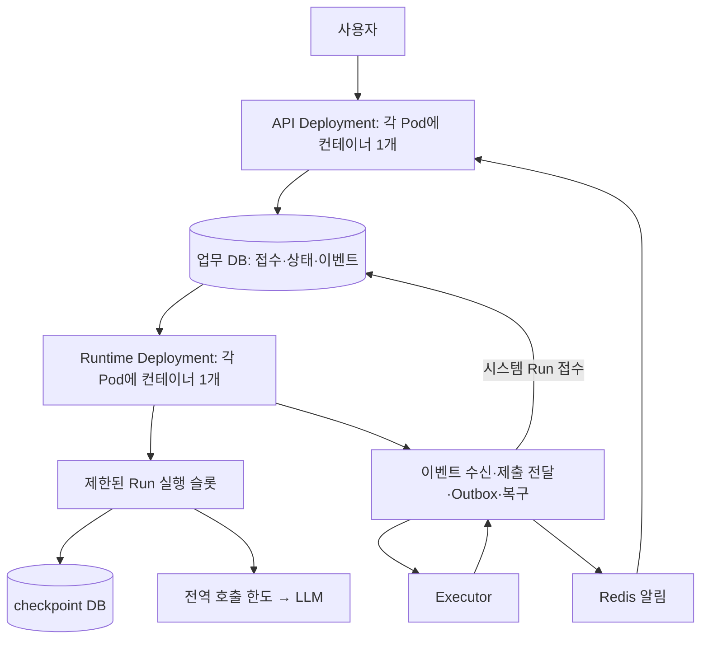

# Kubernetes 단일 컨테이너 Pod·최소 자원 운영 설계

> 과거 설계 기록입니다. 아래 소스 위치·문제점은 작성 당시 기준이며 현재 구현 안내가 아닙니다. 현재 구조는 [서비스 구조](../architecture/service-layout.md), 배포는 [배포 안내](../deployment-configuration.md)를 따릅니다.

작성일: 2026-09-28. 현재 브랜치와 배포 YAML을 읽어 작성한 설계이며 Kubernetes 접속, 부하 시험, 코드 변경, 배포를 수행한 결과가 아니다. 기본 실행 구조 설계（당시 위치: `docs/design/agent-runtime-target-architecture-2026-09-28.md`）를 보완한다. 물리 배치·확장 정책은 이 문서를 우선한다.

**현재 플랫폼에 맞춘 결정: 하나의 Deployment, Pod당 컨테이너 하나, 기본 애플리케이션 프로세스 하나 안에서 API와 제한된 Run 실행 슬롯, 경량 이벤트·전달·복구 loop를 함께 운영한다. 코드의 책임과 용량 한도는 분리한다. Pod 내부의 안전한 동시성을 먼저 확보하고, 자원 기반 자동 확장은 CPU 처리 용량 보강에 사용한다. LLM 대기로만 생기는 큐를 자원 기반 scaler가 알아서 해소한다고 기대하지 않는다.**

사용자 확인: 저장소의 Deployment를 CI/CD가 배포하고 이미지 태그는 배포마다 달라진다. 같은 이미지를 여러 역할로 배포하는 방식은 현재 사용할 수 없으며, 자동 확장은 자원 사용량 기반으로 알고 있다. 정확한 CPU/메모리 metric·임계값·requests·최대 replica는 아직 확인하지 않았다. 기존 두 Deployment 안은 향후 플랫폼 기능이 허용할 때의 비교안으로만 남긴다. 단일 컨테이너 제한을 보수적으로 해석해 sidecar와 init container 모두 필요 없는 구조로 설계한다.

**0. 이번 확인으로 달라지는 우선순위**

**추가 플랫폼 통합 조건:** 폐쇄망은 루트 app.py → GaiaService로 기동하고 get_routers()로 서비스 라우터를 조립한다. 제공 core.py는 수정하지 않는 것을 기본으로 한다. 설명된 main은 lifespan_context를 덮어쓰므로 라우터 등록만으로 Worker startup/shutdown이 보존되지 않을 수 있다. 공식 hook 또는 서비스 소유 bootstrap으로 플랫폼 기능과 공통 supervisor 수명을 합성한다. 실제 원본 확인 및 통합 골격 검증을 핵심 런타임 교체에 선행한다. [상세 통합 설계와 로컬 재현](gaia-template-integration-2026-09-28.md)을 따른다.

**추가 확정 제약: replica 수는 애플리케이션 팀이 조정할 수 없다. 최소·최대 replica, 확장 속도 변경을 구현의 전제로 삼지 않는다.** 아래 replica 조합·확장 정책은 플랫폼 동작을 이해하기 위한 비교/검증 시나리오이며 직접 설정할 배포 계획이 아니다. 우리 측 제어 대상은 Pod 내부 동시성, 서비스 전역 LLM/실행 허가, DB 사용량, 접수·대기 한도다. 플랫폼의 실제 수치가 확인되지 않은 경우 가용성·총 연결 예산을 확보했다고 단정하지 않는다.

1. 별도 실행 Deployment 신설 대신 기존 API 실행 프로세스의 lifespan에 하나의 공통 supervisor를 둔다. 이 supervisor가 Run 슬롯·이벤트 수신·Outbox·복구·종료를 관리한다. 공개 API의 접수 코드는 실행 구현과 분리해 나중에 프로세스 분리가 가능하도록 한다.
2. Pod당 여러 Uvicorn worker로 동시성을 확보하는 것을 기본으로 삼지 않는다. Uvicorn 프로세스 1개와 bounded async 슬롯으로 풀·Graph·경량 loop의 복제를 줄인다. CPU 작업은 실행 위치를 검증하고 필요할 때만 한정된 CPU 작업 풀을 비교한다.
3. 모든 Pod가 같은 durable queue를 경쟁 소비한다. HTTP를 받은 Pod가 그 Run을 실행할 필요가 없고 sticky session도 요구하지 않는다. 모든 Graph writer는 공통 세션 소유권을 따른다.
4. 플랫폼이 실제 제공하는 Pod 수를 조건으로 검증한다. Pod별 슬롯 4/8/16 등은 시험 후보일 뿐 운영 확정값이 아니다. 단일 장애의 데이터 복구와 N-1 처리량 유지 여부는 별도 시험한다.
5. CPU 중심 scaler는 외부 I/O 대기를 직접 판단하지 못한다. 제공된 용량 안에서 Pod 내부 동시성을 조정하고 초과 유입은 bounded queue/접수 제한으로 처리한다. 그래도 목표 지연을 못 맞추면 플랫폼 용량 제약을 결과에 명시하며 자동 증설로 해결된다고 약속하지 않는다.
6. 현재 자원 기반 scaler에는 LLM 포화 여부를 AND 조건으로 연결할 수 있다고 가정하지 않는다. 앱의 전역 모델 한도와 DB 사용량 제한으로 외부 시스템을 보호한다. Pod 생성 비용 자체를 우리가 설정한 최대 replica로 제한할 수 있다는 전제는 제거한다. 외부 병목을 구분하는 정밀 자동 확장은 플랫폼 지원이 달라질 때의 조건부 확장안이다.
7. HTTP 응답과 실행이 같은 event loop를 쓰므로 API CPU 지연, event-loop block, 내부 task 정체를 함께 측정한다. 실행 슬롯을 늘리다 API p95가 나빠지면 해당 Pod의 안전 한도다. 이를 숨기고 최소 replica만 고집하지 않는다.

랜덤 이미지 태그는 기술적으로 역할 분리를 원천 봉쇄하는 조건은 아니다. 다만 현재 CI/CD에서 지원하지 않는다고 했으므로 배포 파이프라인 변경을 기본안에 요구하지 않는다. 태그 문자열을 graph compatibility ID로 쓰지 않고 빌드 시 고정된 commit/release ID, 실제 image digest, 명시적인 graph compatibility version을 기록한다. 같은 코드의 재빌드는 호환 정책상 같은 버전일 수 있으며 서로 다른 코드가 호환된다는 뜻도 아니다. rollout 중 구·신 Pod는 자신의 graph 버전과 호환되는 세션 명령만 claim하고, 기존 세션을 처리할 경로 없이 구버전을 제거하지 않는다.

현재 배치:

```text
단일 Deployment (배포마다 CI/CD가 이미지 태그 지정)
  Pod A: 컨테이너 1개 → API + 공통 supervisor + Run 슬롯 K개 + 경량 연계
  Pod B: 컨테이너 1개 → API + 공통 supervisor + Run 슬롯 K개 + 경량 연계
             ↓ 공유 durable queue / 세션 소유권 / checkpoint / 전역 LLM 한도
  자원 기반 scaler: 동일한 Pod 전체를 확대·축소
```

현재안에서 자원 낭비를 줄이는 구체 규칙:

- 실행 큐의 빈 슬롯 깨우기는 Pod당 한 루프와 알림/완만한 fallback으로 처리한다. 슬롯 K개가 각각 빠른 DB polling을 수행하지 않는다.
- cancel 확인은 활성 Run을 묶어 조회하고 이벤트 전달과 결합한다. 보조 loop의 batch·호출 주기·DB pool을 제한한다.
- 전체 복구 스캔은 leader 하나, 분산 처리 가능한 Outbox는 claim으로 분담한다. Pod 수만큼 동일 전체 스캔이 반복되지 않게 한다.
- Graph warmup은 측정 가능한 startup 단계로 두고 schema 변경은 배포 단계로 이동한다. 시작 CPU 급등을 정상 부하로 오해하는지 플랫폼 scaler에서 확인한다.
- API 및 상태 전달을 위한 CPU·메모리·짧은 DB 작업 여유를 남긴다. async 슬롯은 CPU 격리를 제공하지 않으므로 event-loop 지연과 HTTP p95를 안전 한도로 삼는다.
- 조회량 증가로 통합 Pod가 늘어나는 현상은 전역 모델 한도만으로 막을 수 없다. 가벼운 상태 조회, 중복 polling 억제, 이후 알림 기반 SSE로 실제 CPU 비용을 먼저 줄인다.
- 메모리 확장이 고정 정책이라면 캐시·token queue·활성 상태를 bounded하게 만들고 RSS가 축소 가능한지 시험한다. 메모리 누수를 replica 증가로 가리는 상태를 정상 autoscaling으로 보지 않는다.

**1. 현재 배포에서 확인된 차이**

| 코드/배포 사실 | Kubernetes에서의 영향 | 변경 방향 |
|---|---|---|
| API ConfigMap에 Run worker/reconciler 활성화 | API 증설 시 실행·복구 루프도 증가 | 공통 supervisor·bounded 슬롯, 전역 스캔은 leader만 수행 |
| 기존 worker Deployment는 Executor 이벤트 처리 및 직접 Graph resume | Run 실행 역할과 다름 | 목표 Runtime에 통합하되 공통 Run 경로로만 Graph 실행 |
| API 3개, worker 2개의 init container | 새 Pod마다 migration/bootstrap 수행 | 배포 파이프라인의 단일 컨테이너 Job 또는 별도 일회성 단계 |
| API ready/live가 같은 `/health`, 응답은 고정 ok | 내부 Run loop 정체를 구분하지 못함 | startup/ready/live와 작업 진행 진단 분리 |
| API/worker 모두 CPU request 500m, limit 2; memory request 1Gi, limit 4Gi | 실제 작업 유형과 맞는지 검증 안 됨 | 역할별 자원·슬롯 측정 후 산정 |
| 명시적인 HPA/PDB/종료 유예 설정 없음 | 저장소만으로 플랫폼 실제 정책은 알 수 없음 | 플랫폼 관리 정책을 확인하고 중복 controller 방지 |
| 공유 PVC 마운트는 `/workspace/pv` | PVC 접근 모드와 다중 노드 지원 확인 필요 | PATH 연계 시 RWX 등 실제 공유 보장 |
| workflow 파일 기본 경로는 `var/workflows` | 기본값이면 Pod별 파일이 갈릴 수 있으나 사용자가 공유 PV 연결 계획을 확인함 | 파일 저장 방식 유지, 실제 저장 경로를 공유 PV에 연결하고 교차 Pod 접근 검증 |

위 파일 문제는 실제 운영 장애를 재현했다는 뜻이 아니다. 현재 YAML과 기본 설정을 그대로 사용할 때 생기는 위험이다. Secret이나 플랫폼 설정의 덮어쓰기 값은 확인하지 않았다.

근거: 배포 정의（당시 위치: `deploy/dtest-agent.yaml:46`）, API 내부 실행기（당시 위치: `src/app/api/v1/router.py:33`）, 고정 health 응답（당시 위치: `src/main.py:47`）, Workflow 파일 저장（당시 위치: `src/app/services/workflow_file_store.py:14`）.

**2. 향후 역할별 배포가 가능할 때의 비교안: 두 Deployment**

이 절은 현재 구현 기본안이 아니다. 아래 역할 분리는 코드 책임 분리에 활용하고, 별도 Deployment는 플랫폼 지원이 확인될 때만 채택한다.



- 역할별 image digest와 release/graph compatibility를 명시하고 command/role을 선택한다. 같은 digest 재사용은 가능하면 편리하지만 필수 조건은 아니다. 실행 role 옵션은 제안이며 현재 구현된 기능으로 표시하지 않는다.
- API Pod: 기본 Uvicorn 프로세스 1개, 인증·CRUD·접수·조회·SSE. Run 소비와 복구 loop 비활성화.
- Runtime Pod: 기본 Python 프로세스 1개, 여러 async Run 슬롯, 각 보조 작업의 제한된 coroutine. 관리 HTTP endpoint도 같은 프로세스에서 제공한다. 별도 sidecar가 필요 없다.
- 보조 작업마다 Deployment를 만들지 않는다. 이벤트 ingress/제출/Outbox는 bounded concurrency와 DB claim을 사용한다. 전체 스캔형 복구·전역 metric 수집은 lease로 선출된 한 Runtime이 담당하고 다른 Pod가 인계한다. 업무 상태 변경 자체에도 조건부 갱신을 적용한다.
- Run 업무 예외는 해당 슬롯 안에서 처리한다. supervisor/핵심 소비 loop가 예기치 않게 종료되면 상태를 감지하고 bounded 재시작 또는 Pod 교체로 복구한다. 모르는 상태에서 조용히 반쪽 프로세스로 남지 않는다.
- 기존 ExecutorWorker를 단순 병렬 실행해 두 개의 signal handler가 경쟁하게 하지 않는다. 한 supervisor가 TERM·drain·pool 종료를 소유하고 기존 consumer의 중복 제거·ACK·shutdown 기능을 보존한다.
- 시스템 이벤트 처리를 위한 실행 여유와 짧은 DB 작업용 여유를 둔다. 사용자 LLM 대기가 모든 보조 작업까지 밀어내지 않게 한다. CPU 동기 작업은 event loop를 막지 않도록 검증한다.
- 이벤트 처리량이나 장애 영향이 독립 자원 분리를 요구할 만큼 커진 경우에만 연계 Deployment를 세 번째로 분리한다.

단일 컨테이너 Pod는 단일 coroutine 또는 한 번에 작업 하나라는 뜻이 아니다. 반대로 컨테이너 안에 여러 OS 프로세스를 넣는 것은 가능하더라도 첫 선택으로 삼지 않는다. 여러 프로세스는 풀·그래프·메모리·신호 처리 비용을 복제한다. CPU 병렬 처리가 측정상 필요하고 Pod당 큰 CPU만 배정 가능한 플랫폼이면 별도 비교한다.

**3. 최소 레플리카와 가용성의 구분**

replica 수는 플랫폼이 결정한다. **2 Pod 이상이면 하나가 중단돼도 다른 Pod가 남을 수 있지만, 이를 우리가 최소값으로 설정할 수 있다고 가정하지 않는다.** 실제 1 Pod 운영이면 교체 중 API/실행 공백을 허용해야 한다. 아래 2+2 표는 향후 역할을 별도 Deployment로 분리할 때의 가용성 비교이며 현재 최소 4 Pod를 요구하지 않는다.

| 운영 조건 | API 최소 | Runtime 최소 | 의미 |
|---|---:|---:|---|
| 단일 Pod/노드 장애 중에도 각 역할을 계속 제공하는 기본안 | 2 | 2 | 총 4개 애플리케이션 Pod, 역할별 작은 자원으로 시작 |
| 실행 재시작 동안 큐 대기를 허용하는 절충안 | 2 | 1 | API는 유지, Runtime 장애 시 처리 공백 |
| 비용 우선·중단 허용 환경 | 1 | 1 | 기능 운영 가능, 고가용성 보장 없음 |

2+2는 측정으로 산출된 성능 최소값이나 Kubernetes 필수값이 아니다. 두 독립 역할의 가용성을 위한 시작안이다. Pod를 서로 다른 노드/가용 영역에 배치하고 남은 용량도 확보해야 실제 장애 여유가 생긴다. 노드가 하나면 replica 둘만으로 노드 장애를 견딜 수 없다.

장애 중에도 동일 처리량·지연을 보장하려면 N-1 용량을 별도로 검증한다. Pod 수만 2로 만드는 것으로 충분하지 않다. scale-to-zero는 사용자 요청 및 Executor 이벤트의 시작 지연을 키우고 보조 복구 loop도 없애므로 이 서비스의 기본안에서 제외한다.

최적화 지표는 Pod 수만이 아니다. 성공 여정당 CPU초·메모리 GiB초·DB 비용·외부 재호출·p95 대기를 함께 비교한다. 큰 Pod 1개가 작은 Pod 2개보다 비싸고 장애 영향도 클 수 있다.

**4. 먼저 한 Pod의 효율을 확정한다**

Runtime은 고정된 자원 크기에서 슬롯 1/2/4/8/16을 시험한다. 각 슬롯은 compile된 Graph와 Saver를 재사용하고, 프로세스의 제한된 연결 풀·client를 공유한다. 활성 Run별 context와 AsyncSession은 공유하지 않는다.

슬롯 선택 기준은 최대 숫자가 아니라 다음 조건을 모두 만족하는 가장 효율적인 지점이다.

1. 같은 CPU·메모리에서 처리량이 증가하고 대기가 감소한다.
2. event-loop lag, DB pool wait, checkpoint p95, token buffer, RSS가 안정적이다.
3. 슬롯을 추가해도 증가하는 처리량이 작아지거나 오류·지연이 커지는 지점 이전이다.
4. Run 실패·종료 시 남는 task/connection이 없고 사용자 상태가 섞이지 않는다.
5. Graph/Saver의 슬롯별 상주 메모리까지 측정한다. 재사용이 무료라고 가정하지 않는다.

초기에는 검증된 슬롯 상한을 고정하고 플랫폼 scaler만 Pod 수를 바꾼다. 슬롯 수까지 실시간 자동 조정하면 두 제어 루프가 서로 영향을 줘 용량 해석이 어려워진다. 나중에 내부 적응 제어를 도입하더라도 검증된 상한 안에서 조절한다. 현재 통합 Pod 시험에서는 API·SSE·이벤트 연계의 자원도 함께 포함한다.

busy 슬롯과 productive 슬롯을 구분한다. `LLM 실제 추론 대기`는 정상 작업이지만 `LLM 호출 허가 대기`, `DB pool 대기`, `같은 세션 잠금 대기`, `cleanup 정체`는 확장 판단에서 별도로 봐야 한다. 한 프로세스에 감당할 수 있는 슬롯을 충분히 두되 모델 permit을 못 받은 Run이 모든 슬롯을 영구 점유하지 않게 한다. 긴 permit 대기의 슬롯 반환은 안전한 checkpoint 경계가 있을 때만 가능하다.

**5. 자동 확장에 무엇을 넣고 무엇을 빼는가**

아래 표는 병목별 바람직한 판단이다. **현재 자원 기반 scaler가 이 판단을 전부 구현한다는 뜻은 아니다.** 현 환경에서는 CPU를 쓸데없이 발생시키는 polling/초기화부터 줄이고 전역 호출량·DB 사용량·입력 제한으로 보호한다. 큐 원인을 반영한 정밀 자동 확장은 플랫폼 지원이 있어야 구현할 수 있다.

| 관측 상태 | Pod 확대 판단 | 우선 동작 |
|---|---|---|
| 실행 가능한 큐가 늘고 현재 슬롯이 부족, DB·모델 추가 처리 여유 있음 | 확대 가치 있음 | 검증된 단계로 Runtime 증설 |
| LLM 허가 대기가 길고 provider 처리량이 이미 상한 | 대체로 확대 이익 없음 | 전역 한도 유지, 접수/대기 제어 |
| DB 포화로 pool/lock 대기 증가 | 증설로 악화 가능 | DB 작업량·연결 제한, 원인 조사 |
| cleanup 정체로 슬롯 손실 | 용량 확장으로 숨기지 않음 | 해당 실행 격리·복구, 장애 경보 |
| 사용자 승인/Executor 완료 대기만 많음 | 그래프 실행 용량 수요 아님 | 대기 상태 유지 |
| 아직 재시도 시간이 안 된 명령, 취소된 명령, 같은 세션 뒤의 중복 요청 | 즉시 실행 수요 아님 | 큐에서 사유 구분 |
| API CPU/HTTP 대기가 높고 Runtime 여유 있음 | API만 확대 | 조회·SSE 비용 함께 점검 |
| 관측 지표가 오래됐거나 누락됨 | 0이나 최대값으로 추정하지 않음 | 안전한 검증 용량 유지, 경보·접수 제한 |

LLM permit이 모두 사용 중이라는 한 가지 사실만으로 확장을 금지하지 않는다. 정상 상태에서도 permit은 가득 찰 수 있다. 모델 완료 처리량, 허가 대기, 429, CPU/DB 한계, Pod 추가 실험의 한계 이익을 함께 보고 판단한다. LLM이 포화여도 비-LLM 완료 처리에 CPU가 부족하다면 제한적인 증설 가치가 있다.

**단순 pending 개수 또는 active 슬롯 비율 하나만으로 확장하지 않는다.** 사용자/외부 입력 대기는 제외하고, 실행 가능한 고유 세션 수와 명령 종류별 비용을 반영한다. 실행 중 작업도 용량 수요에 포함해 큐가 0이 됐다는 이유만으로 대량 축소하지 않는다.

**6. 확장 지표의 구현 계약**

이 절은 **custom metric이 가능할 때의 후속안**이다. 현재 릴리스의 구현 전제로 삼지 않는다. 자원 기반 확장만 가능한 상태에서 global queue metric을 적용한 것처럼 설명하거나 HPA YAML을 추가하지 않는다.

가능하면 플랫폼의 기존 custom/external metric 경로를 사용한다. 이미 KEDA가 있다면 이용할 수 있으나 새로 도입하는 것이 전제는 아니다. Deployment 하나의 replica 수는 하나의 autoscaler만 소유한다. 플랫폼 scaler와 자체 HPA/KEDA를 동시에 붙이지 않는다.

제안 계산의 기본 입력:

- 작업군별 접수 Run/초와 실행 가능한 큐, 정상 처리 시간 분포, 현재 진행 중인 잔여 작업량.
- 실제 사용 가능한 Pod/슬롯, 초기화 중·종료 중·격리된 용량의 구분.
- 전역 모델 동시 호출/RPM/TPM, 모델 허가 대기와 완료율, DB 처리·연결 예산.
- 허용 큐 해소 시간 H, 목표 지연, 최소 가용 replica, 정적 최대 replica.

균질 작업군에서의 근사 출발점은 다음과 같다. `mu_pod`는 이미 안전 여유를 반영한 Pod당 검증 처리율이다.

```text
필요 처리율 = 최근 유입률 + 실행 가능한 누적 작업량 / 해소 목표 시간 H
수요 기반 Pod 수 = ceil(필요 처리율 / mu_pod)
목표 Pod 수 = 최소 가용 수 이상이되,
             정적 비용·DB 상한과 현재 하위 시스템을 활용할 수 있는 유효 상한 안으로 제한
```

장시간 진행 중인 작업·급격한 작업 비중 변화는 이 단순 식에 부족하므로 잔여 작업량과 축소 안정화로 보정한다. 평균치 하나로 p95를 보장하지 않는다. 비-LLM 시스템 작업을 모델 포화 때문에 영구 정지시키지 않으며, 상한 충돌로 목표를 못 지키면 접수 제한과 명시적 지연을 사용한다.

이 계산을 Kubernetes가 자동 제공하는 기능으로 오해하면 안 된다. 앱의 측정값과 metric adapter/recording rule에 구현할 제어 정책이다. 초기에는 raw 지표로 shadow 계산을 검증하고, 단순한 정적 상한부터 적용한다.

HPA 연결 시 global workload를 Pod별로 중복 합산하지 않는다. 전역 metric은 선출된 집계자 한 개 또는 중앙 DB 집계에서 생성하고 freshness를 함께 제공한다. 예를 들어 최종 필요 용량을 `Pod-equivalent` 단위의 전역 external metric으로 내보낸다면 `AverageValue: 1`을 사용해 총량을 replica로 나누는 의미를 맞출 수 있다. `Value`에 이미 산정한 replica를 넣어 다시 현재 replica 수가 곱해지는 설정을 피한다. 실제 adapter의 aggregation·HPA tolerance·미준비 Pod 처리는 설치 버전에서 시험한다.

HPA에 여러 metric을 넣으면 일반적으로 그중 가장 큰 replica 권고가 선택된다. 따라서 queue와 CPU를 각각 넣는 것으로 ‘큐가 길고 모델 여유가 있을 때만’이라는 AND 조건을 구현할 수 없다. 외부 한도를 반영한 하나의 결정 metric이나 명시적 상한 정책이 필요하다. [HPA 공식 설명](https://kubernetes.io/docs/concepts/workloads/autoscaling/horizontal-pod-autoscale/)

역할 분리안에서는 API를 HTTP 처리 비용·동시 요청과 CPU 기준으로 따로 조정할 수 있다. 현재 통합안에서는 API 부하로 Pod가 늘어도 전역 모델 허용량은 그대로 유지한다. SSE 연결 수는 연결당 메모리/전송량과 함께 보며, 연결 수만 많다고 계속 증설하지 않는다. 신규 Pod가 기존 SSE 연결을 자동 분산하지 않으므로 연결 수 기반 증설 효과도 따로 검증한다.

**7. 확장 속도와 외부 용량 상한**

확장 속도·최소/최대 replica는 플랫폼 제어 영역이다. 이 절의 수치는 비교용 후보이며 우리가 적용할 설정이 아니다. 실제 생성되는 Pod가 많아져도 애플리케이션의 전역 외부 호출 한도는 유지한다.

후보 정책은 운영 확정값이 아니다. 시작 후보는 확대 판단 안정화 15–30초, 한 번에 1 Pod 또는 작은 증가폭, 축소 안정화 300초와 60초당 최대 1 Pod다. 실제 유입과 startup 시간에 맞춰 조정한다. 이 값은 순간 폭주를 1초 안에 처리한다는 보장과 양립하지 않을 수 있다.

새 Pod의 이미지 준비·스케줄링·Graph warmup·ready까지의 시간을 측정한다. 관측 주기와 startup 시간이 지난 후에야 추가 용량이 생기므로, 짧은 burst는 warm capacity와 bounded queue로 흡수해야 한다. 미래 수요를 모르면서 최소 자원과 모든 순간 폭주의 무대기를 동시에 보장할 수는 없다.

KEDA를 사용한다면 `cooldownPeriod`는 일반적인 N→N-1 축소 대기와 같지 않다. 확인한 2.18 문서에서는 0으로 축소할 때의 설정이며 1 이상 구간은 HPA behavior가 담당한다. 플랫폼 설치 버전에 맞춰 확인한다. [KEDA 명세](https://keda.sh/docs/2.18/reference/scaledobject-spec/)

전역 LLM permit은 Pod 수와 무관하게 고정된 모델 예산을 공유한다. Pod마다 동시 호출 20으로 설정한 뒤 10 Pod로 늘어나 총 200이 되는 방식은 금지한다. permit lease 만료가 실제 모델 요청 종료를 뜻하지 않는다는 기본 설계의 제한도 유지한다.

예: Runtime 2개×8슬롯에서 전역 모델 허용 동시성이 12이고 이미 실제 추론 12개가 진행 중이며 다른 처리 여유가 충분하다면, 큐 100개라는 이유로 10 Pod까지 확대하지 않는다. 반면 모델이 40개를 감당하고 현재 16개 Run 자리 때문에 실제 모델 사용이 12개에 머문다면 증설 후보가 된다. 어느 쪽인지는 trace와 용량 시험으로 확인한다.

**8. DB·CPU·메모리 예산은 최대 배포 순간으로 계산한다**

```text
최대 DB 연결 수 = 모든 역할의 실제 동시 생존 프로세스 수 × 각 pool 최대값의 합
                 + migration·관리·관측·기타 서비스 연결
```

현재 replica만 곱하지 않는다. HPA 최대 replica, rollout surge, 종료 중인 기존 Pod, 재시작의 겹침까지 반영한다. Kubernetes rollout에서는 종료 중 Pod 때문에 실제 자원 사용이 replicas+maxSurge보다 많아질 수도 있다. 따라서 maxSurge만으로 DB 연결의 절대 상한이 보장되지 않는다. [Deployment 동작](https://kubernetes.io/docs/concepts/workloads/controllers/deployment/)

각 풀은 역할에 맞는 작은 최대값과 명시적 overflow를 갖고 연결을 짧게 빌린다. 하드 연결 보호가 필요하면 서버 측 연결 예산 또는 기존 중앙 pooler를 검토하되 prepared statement·session 기능·checkpoint driver 호환성을 검증한다. sidecar pooler는 이 환경의 기본안에 넣지 않는다.

replica 상한이 미확인인 상태에서 Pod별 pool max만으로 전체 DB 연결 수의 안전성을 보장할 수 없다. 전역 활성 Run 제한도 각 Pod의 API·idle pool·관측 연결까지 제한하지는 않는다. 지원되는 풀의 지연 연결·낮은 최소 연결·idle 정리로 낭비를 줄이고, 엄격한 전체 상한이 필요하면 연결 수명 전체를 포함한 공통 예산 관리 또는 인프라의 기존 중앙 pooler/전용 DB 연결 제한 지원이 필요하다. DB 하드 상한에 도달하면 연결 오류·대기를 제한 시간과 backoff로 처리한다. 실제 지원 여부 확인 전 이 보호가 구현됐다고 기록하지 않는다.

CPU requests는 스케줄링과 CPU HPA 비율의 기준이고 limit은 별도 상한이다. 현재 request 500m일 때 평균 CPU 400m는 utilization 80%다. limit 2 CPU 대비 20%라고 해석해서는 안 된다. request를 작게 잡아 HPA가 불필요하게 반응하거나, 반대로 크게 잡아 노드를 낭비하지 않게 역할별 측정으로 정한다. [HPA API 명세](https://kubernetes.io/docs/reference/kubernetes-api/autoscaling/horizontal-pod-autoscaler-v2/)

CPU limit 도달은 throttling, memory limit 초과는 OOM 위험으로 나타난다. 높은 지연을 단순한 replica 부족으로 해석하기 전에 이 지표를 확인한다. RSS에 Graph 슬롯·활성 상태·token buffer·연결 버퍼·일시적 직렬화 메모리가 포함돼야 한다. Python 메모리가 즉시 줄지 않는다고 memory 기반 HPA로 계속 증설하지 않는다. [컨테이너 자원 관리](https://kubernetes.io/docs/concepts/configuration/manage-resources-containers/)

**8-A. 프로젝트 공용 DB의 연결 관리 — 인프라 추가는 이번 범위에서 제외**

사용자 확인: DB 사용자는 이 프로젝트의 API, Agent, Executor 및 추가 예정 배치 API다. 별도 인프라를 추가·운영할 여력이 없으므로 PgBouncer 등 중앙 pooler 도입은 이번 개선 범위에서 제외한다. 아래 중앙 pooling 설명은 향후 참고안이며 현재 작업의 선행 조건이 아니다. 애플리케이션에서 분산 DB 연결 관리기를 새로 구현해 이를 대체하는 것도 현재 기본안에 넣지 않는다.

이번 범위는 기존 DB/배포 환경에서 프로세스 수명 풀 재사용, 검증된 작은 pool maximum과 제한된 overflow, 짧은 transaction, 풀 대기 기한, 불필요한 polling 축소, 연결 사용량 계측이다. 초기 연결 수·idle 정리는 각 driver가 지원하는 범위에서 조정하며 현재 checkpoint factory의 min_size 검증 등과 일치하게 구현한다. 오류 시 무제한 재접속하지 않고 API에는 구분 가능한 일시 실패, 이미 접수된 Run에는 제한된 재시도·복구 상태를 남긴다.

검증은 새로운 독립 부하 시험을 무조건 추가하기보다 해당 변경에 필요한 연결 대기·사용량을 기존 시험에 포함한다. 이 조치들은 자원 사용을 줄이고 장애 영향을 제한하지만 replica 수를 제어하지 못하는 조건에서 프로젝트 전체 연결 수의 강한 상한까지 보장하지는 않는다. 남은 제약을 명시하고 측정 없이 DB 수용량을 확정하지 않는다. 다음은 보류된 인프라 참고안이다.

```text
API·Agent·Executor·배치의 여러 Pod
      ↓ 각 앱의 작고 제한된 client pool
DB 측 공통 pooling endpoint
      ↓ 정해진 수의 실제 PostgreSQL 연결
PostgreSQL
```

일반 경로는 transaction pooling을 검토한다. client 연결과 실제 DB 연결 수를 분리하고, transaction이 끝나면 DB 연결을 다른 요청이 사용하게 한다. 오래 걸리는 외부 실행·LLM 대기는 transaction 밖에 있어야 한다. statement pooling은 여러 SQL로 이루어진 claim·결과 반영 transaction에 적합하지 않다. [PgBouncer pooling 모드](https://www.pgbouncer.org/features.html)

예산 예시: 전체 사용 가능 연결이 20개라는 가정에서 API 5, Agent 5, Executor 5, 배치 2, 관리·migration·관측 예비 3. 총 20이며 실제 권장값은 아니다. 각 서비스 전체에 대한 예산이지 Pod마다 주는 숫자가 아니다. 서비스별 로그인 role과 pooler 측 제한을 사용하고 배치 장기 transaction이 대화형 API의 모든 연결을 점유하지 못하게 한다. 연결 수 분리는 CPU/I/O/lock의 완전한 격리를 제공하지 않으므로 배치는 짧은 chunk commit·실행 동시성·query 기한도 제한한다.

API와 Agent가 같은 Pod/현재 같은 SQLAlchemy engine을 쓰는 부분은 계정만 바꿔 네 개의 독립 예산으로 자동 분리되지 않는다. 초기에는 그 공유 영역을 한 예산으로 묶거나, 실제 접속 factory를 용도별로 명시적으로 분리한 뒤 세부 예산을 적용한다. `chat_app`과 `agent` 등 DB 이름이 달라도 같은 PostgreSQL 인스턴스라면 전체 연결 예산을 함께 계산한다.

주의할 설정 범위:

- PgBouncer pool은 일반적으로 database/user 조합으로 나뉜다. `default_pool_size=20` 하나로 모든 서비스 합계가 20이 되지는 않는다. per-user/per-database 예산, reserve 연결과 예외 접속까지 합산한다.
- `max_db_connections`는 해당 PgBouncer의 database entry 기준이고 `max_user_connections`는 해당 인스턴스의 user 기준이다. 같은 물리 DB를 가리키는 별칭도 포함해 검토한다. PgBouncer 자체가 여러 개 뜨면 상한도 합산해야 한다. 앱 Pod마다 sidecar pooler를 붙이는 안은 채택하지 않는다.
- HA pooler를 여러 개 둘 경우 고정 인스턴스별 예산 합계·failover 연결 겹침을 계획한다. 이 수마저 제어 불가능하면 DB 서버의 role 제한 등 최종 보호와 관리형 endpoint의 실제 전체 상한 보장이 필요하다. 중앙 주소 하나라는 이유만으로 전체 상한이 존재한다고 가정하지 않는다.
- client 수와 query 대기 시간도 제한한다. client 연결 100개가 DB 연결 17개를 공유할 수는 있지만, 그 100개가 모두 동시에 DB에서 실행되는 것은 아니다. 대기열 무한 증가를 허용하지 않는다. [PgBouncer 설정 범위](https://www.pgbouncer.org/config)

DB 직접 접속이 필요한 migration/setup/관리 경로는 작은 별도 예산으로 둔다. 애플리케이션의 알려진 DSN뿐 아니라 Agent bridge, checkpoint, WorkflowStore의 직접 connect, Executor·배치 접속도 포함해야 한다. 네트워크/계정 정책에서 일반 경로가 pooler를 우회하지 않도록 관리한다.

PgBouncer를 쓸 수 없는 최소 대안은 서비스별 일반 로그인 role에 PostgreSQL CONNECTION LIMIT을 두는 것이다. 모든 Pod가 동일한 서비스 role을 사용하므로 role 기준 연결 보호는 Pod 개수와 별개다. 다만 초과 연결을 순서대로 기다리게 하는 pooler와 달리 연결 실패가 발생하고, 공식 문서상 role 제한은 근사적으로 적용되며 superuser에는 적용되지 않는다. 무제한 재접속을 피하고 가용성 저하를 명시한다. [PostgreSQL role 연결 제한](https://www.postgresql.org/docs/17/sql-createrole.html)

호환성 검증 없이 DSN만 바꾸지 않는다. 현재 코드에는 SQLAlchemy+asyncpg, psycopg checkpoint/pipeline, 직접 sync psycopg 접속이 섞여 있다. prepared statement 처리·pool reset·transaction 경계·DDL bootstrap·COPY/임시 테이블·session 설정·장시간 batch를 실제 버전과 함께 시험한다. transaction pooling에서 session-level advisory lock과 LISTEN 같은 기능은 별도 경로가 필요하며, 모든 advisory lock이 불가능한 것은 아니다. 현재 Worker migration은 transaction-level advisory lock을 사용한다. [SQLAlchemy asyncpg 주의사항](https://docs.sqlalchemy.org/en/20/dialects/postgresql.html#prepared-statement-name-with-pgbouncer), [psycopg prepared statements](https://www.psycopg.org/psycopg3/docs/advanced/prepare.html)

검증 기준: replica 변동 시 실제 DB backend 연결 예산 준수, API/Agent/Executor/배치 혼합 부하에서 대화형 지연 유지, pooler 장애·재시작 후 재접속 storm/중복 효과 없음, checkpoint 재개·claim·migration 정확성. 실제 DB 용량 20이나 도입 완료를 확인한 것은 아니다.

**9. 정상 축소를 기본 실행 경로로 설계한다**

Runtime의 종료 순서:

1. TERM/preStop drain 요청을 같은 멱등 종료 절차로 연결한다. 새 claim·새 외부 제출을 중단하고 readiness를 내린다.
2. 이미 맡은 Run의 소유권과 heartbeat는 종료가 확인될 때까지 유지한다. 새 Pod가 먼저 중복 실행하지 않게 한다.
3. 기한 안에 다음 checkpoint/interrupt까지 완료하고 업무 결과를 반영한다. 사용자 입력이나 Executor 전체 작업 완료까지 기다리지 않는다.
4. 제한 시간 안에 끝나지 않으면 취소·격리 상태를 기록한다. 살아 있는 graph를 남긴 채 lease만 반납하지 않는다.
5. 실제 종료/fencing 이후 다른 Pod가 checkpoint와 receipt를 보고 복구한다. 마지막에 pool/client를 닫는다.

Pod 삭제를 사용자의 업무 취소로 바꾸지 않는다. rollout/scale-in으로 중단된 Run은 인프라 중단으로 분류하고 안전하게 재개한다. 프로세스가 죽었다는 이유로 이미 제출된 Executor 작업을 중복 제출하거나 취소하지 않는다.

종료 유예는 가장 긴 정상 Run의 상한·정리·네트워크 전파를 반영한다. 예를 들어 업무 단계 상한 60초라면 90–120초를 시험할 수 있으나, 여러 호출로 긴 Run이라면 다시 산정해야 한다. preStop 시간도 유예 안에 포함된다. 긴 sleep만 두는 방식은 drain이 아니다. 강제 종료·노드 장애에는 유예가 보장되지 않으므로 checkpoint/receipt/fencing이 여전히 필요하다. [Pod 종료 절차](https://kubernetes.io/docs/concepts/workloads/pods/pod-lifecycle/)

HPA가 일이 없는 Pod만 정확히 골라 없애준다고 가정하지 않는다. Pod deletion cost 같은 힌트는 최적화일 뿐 정합성 보장이 아니다. PDB 역시 HPA 축소나 모든 삭제를 막는 작업 보호 장치가 아니다. 노드 eviction의 가용성 예산과 Deployment rollout의 maxUnavailable/maxSurge를 구분해 설정한다. [Disruption 동작](https://kubernetes.io/docs/concepts/workloads/pods/disruptions/)

**10. 건강 상태와 파일 상태도 Pod 수명에서 분리한다**

Probe 계약:

- startup: 설정·schema 호환성·필수 pool·Graph warmup 완료 여부. Pod 시작 때 schema 변경은 하지 않는다.
- readiness: 이 역할이 서비스할 준비가 됐는지, drain 중인지. Runtime은 readiness 외에 앱 자체 claim 차단이 필수다. ready=false가 DB 소비를 자동 중단하지 않는다.
- liveness: supervisor와 event loop의 회복 불가능한 내부 정체. LLM 지연/DB 일시 장애를 즉시 liveness 실패로 만들어 전체 Pod 재시작 폭풍을 일으키지 않는다.
- 용량 full은 건강 이상과 다르다. 모든 슬롯이 busy라는 이유만으로 정상 Pod를 unready로 만들지 않는다.

지표와 로그는 같은 컨테이너의 endpoint/stdout에서 제공하고 클러스터의 기존 수집 경로를 사용한다. 별도 exporter/로그 sidecar를 요구하지 않는다. [Probe 의미](https://kubernetes.io/docs/tasks/configure-pod-container/configure-liveness-readiness-startup-probes/)

파일 계약:

- 사용자 확정 방향: 실행 중 생성하는 Workflow JSON 저장 경로를 공유 PV에 연결한다. 기존 파일 저장 방식을 유지하며 DB JSON/object storage 이전은 이 문제 해결의 필수 개선에서 제외한다. 연결 계획이며 실제 배포·검증 완료를 뜻하지 않는다.
- `WORKFLOW_STORAGE_ROOT`를 공유 PV의 하위 경로로 설정하거나 현재 저장 경로에 공유 볼륨을 마운트한다. 모든 replica가 같은 파일 집합을 읽어야 하며, 서로 다른 노드에서의 읽기·쓰기와 Pod 교체 후 재조회·복제·승격을 검증한다.
- Executor INLINE 입력은 공유 파일 의존을 줄이지만 결과 파일·다른 참조 데이터까지 자동 해결하지는 않는다. 요청 크기 상한을 함께 둔다.
- PATH 입력/결과를 유지한다면 Runtime과 Executor의 실제 경로 계약 및 여러 노드에서 읽을 수 있는 저장소가 필요하다. RWO는 일반적으로 단일 노드 읽기/쓰기이며 같은 노드의 여러 Pod를 허용할 수 있고, 다중 노드 쓰기 공유에는 RWX 등을 확인해야 한다. PVC 이름이 같다는 사실만으로 충분하지 않다. [PV 접근 모드](https://v1-34.docs.kubernetes.io/docs/concepts/storage/persistent-volumes/)
- 임시 파일과 디버그 산출물은 용량·보존 한도를 둔다. 여러 writer가 같은 `.tmp`나 상대 파일명을 공유하지 않도록 revision/command별 불변 경로와 원자 공개 규칙을 사용한다.

migration과 checkpoint setup은 release당 한 번 수행하는 단일 컨테이너 Job 또는 플랫폼 배포 단계로 옮긴다. 완료와 schema 호환성을 확인한 뒤 새 Deployment를 롤아웃한다. Job 재시도·중복 파이프라인에도 안전하도록 migration lock/버전 검사를 유지한다. 새 Pod마다 migration을 수행하거나 시작 스크립트에 무조건 DDL을 넣지 않는다.

**11. 플랫폼 기능이 제한될 때의 대안**

| 제약 | 선택 | 포기하거나 추가 검증할 점 |
|---|---|---|
| Deployment 분리+custom metric 가능 | 두 역할 분리, 유효 수요 metric으로 확장 | 권장안 |
| Deployment 분리 가능, CPU HPA만 가능 | API는 CPU 기반, Runtime은 검증된 warm replica와 보수적 최대값·전역 한도 | LLM 대기 중심 병목은 낮은 CPU에서도 발생. 자동 확장만으로 대응 보장 불가 |
| 현재 배포 제약에 맞춘 기본안 | 단일 Deployment, 한 컨테이너의 공통 supervisor에 API+bounded Run+경량 연계 통합, 두 Pod부터 가용성 검토 | 역할별 독립 확장·장애 격리 손실. 접수/실행 예산은 반드시 분리 |
| init container/Job 모두 불가 | 플랫폼 외부의 release 단계에서 migration 수행 | schema 준비 전 새 버전 ready 금지 |
| 공유 파일 저장 불가 | INLINE/DB 원본/object storage 방식으로 계약 변경 | PATH를 로컬 파일로 흉내 내며 다중 Pod 지원이라고 표시하지 않음 |

CPU-only 환경에서는 CPU를 일부러 태워 HPA를 깨우지 않는다. raw HTTP 요청 수에 GET polling이 많이 포함된다면 그 지표를 Runtime 용량으로 환산하지 않는다. custom metric이 불가능하다는 한계를 제품 지연 목표와 함께 명시한다.

**12. 검증과 출시 순서**

1. 기본 설계 P0의 정체·취소·재개 현재성 문제를 해결하고 계측한다.
2. 상태·Workflow 파일의 Pod 독립성, 공통 소유권, TERM/drain을 우선 확보한다.
3. 기존 Deployment 안에서 API/Runtime의 코드 책임과 예산을 분리한다. 1 Pod 고정 상태에서 슬롯을 단계적으로 늘리고 API 혼합 부하를 포함해 CPU·메모리·DB 비용 곡선을 만든다. 별도 Deployment 생성은 요구하지 않는다.
4. 최소 가용성 프로파일에서 정상 부하와 Pod 하나 손실 시험을 수행한다. 충분한 용량이 없는 구성으로 N-1 SLO를 약속하지 않는다.
5. 현재 플랫폼의 실제 metric·임계값·requests·limits·최소/최대 replica·확대/축소 주기·종료 유예를 확인한다. 지표별로 무엇 때문에 확대되는지 기록한다. custom metric 계산은 현재 controller에 연결하지 않고 필요하면 분석용 shadow 값으로만 남긴다.
6. 플랫폼이 정한 자원 기반 자동 확대/축소 조건에서 시험하고 Pod 내부 동시성·전역 호출량·DB 예산·접수 한도를 조정한다. 아래 replica 조합은 별도 시험 환경에서 가능할 때만 재현하며 운영 replica를 임의로 변경하지 않는다.

| 시험 | 합격 방향 |
|---|---|
| Runtime Pod 1개, 슬롯 1/2/4/8/16; LLM 0/1/5/15초 | 슬롯의 한계 이익과 안전한 Pod 용량 확보 |
| 동일 총 슬롯, 1/2/4 Pod | 최소 Pod와 CPU 병렬성·가용성·연결 비용 비교 |
| 100명 burst/반복/생각 시간 포함, 고정 Run 유입 | warm capacity·대기열·지속 확장 분리 |
| 전역 LLM 한도를 고정하고 큐 폭증 | 모델 포화 때문에 replica가 최대까지 폭증하지 않음 |
| DB 지연/연결 제한/cleanup 정체 | 잘못된 증설 대신 원인 분류·제한·복구 |
| 2→4→2, active Run 도중 scale-in/rollout/강제 종료 | accepted 명령 유실·중복 효과·오래된 writer 저장 없음 |
| 초기화 지연/이미지 준비 지연/metrics 유실 | 반복 과증설·최소값 강제 축소 방지 |
| rollout surge+종료 지연 | DB 연결·모델 전역 한도·메모리 예산 준수 |
| Workflow 생성 Pod와 읽기 Pod가 다름, 노드도 다름 | 파일·checkpoint·결과 일관성 |
| 최소 30분 목표 부하 및 별도 장시간 시험 | 메모리/연결/task 누수·scale 진동 없음 |

보고서는 성공 여정당 CPU초·GiB초·DB query 수, replica-hours, scale 이벤트 수, useful capacity 대비 낭비, queue/LLM/DB/cleanup별 p95, duplicate effect 수를 함께 제시한다. mock 시험으로 실제 provider capacity나 Executor 멱등 계약을 검증했다고 표현하지 않는다.

**최종 운영 원칙: 플랫폼이 제공한 Pod를 효율적으로 사용한다. replica 수를 직접 조정할 수 없으므로 전역 외부 호출 한도·DB 예산·접수 제한을 Pod 수와 분리한다. 불필요한 CPU·메모리 사용을 줄여 과증설 유인을 낮추되, 실제 Pod 수와 인프라 비용의 절대 상한까지 앱이 보장한다고 주장하지 않는다. 강건성은 영속 접수·공통 소유권·기한·안전한 축소·공유 상태에서 확보한다.**
