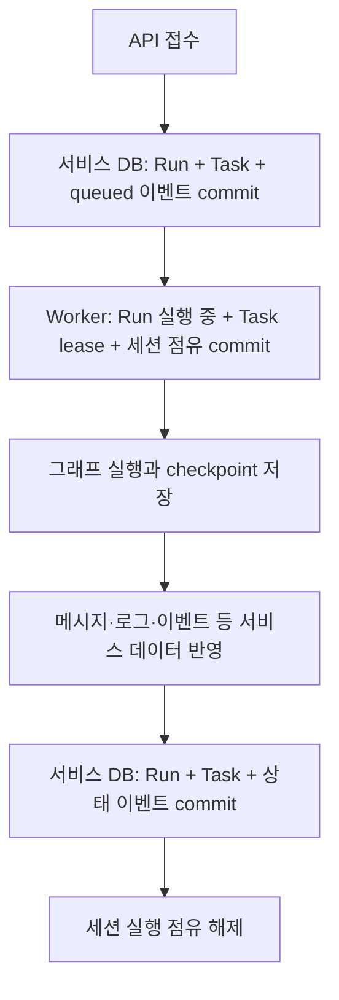

# 상태 저장·재시도·프로세스 장애 복구 검토

검토일: 2026-09-29 · 기준 commit: `4963250` · 검토 브랜치: `feature/state-recovery-review`

## 결론

현재 구조에서 확인한 핵심 결함은 **checkpoint에는 입력 처리가 끝났는데, 서비스 DB 저장 실패를 그래프 실행 실패로 취급하여 같은 입력을 다시 실행할 수 있다는 것**이다. 실제 PostgreSQL checkpoint를 사용하는 두 단계 입력 대기 그래프로 재현했다. 사용자 응답 한 번이 자동 재시도를 거쳐 두 개의 서로 다른 질문에 사용됐다.

이와 별개로, 그래프가 입력 대기에 도달했는데 API는 실행 중으로 남는 경우, 로그가 저장됐지만 대응 이벤트가 없는 경우, 프로세스 종료 후 점유가 남아 자동 재개되지 않는 경우도 확인했다. **실행 성능과 장애 시 정합성은 별개의 평가 항목**이다. 이전 정상 부하 테스트가 통과했다는 사실만으로 장애 복구까지 완성됐다고 평가할 수 없다.

반면 durable 접수, 세션 단위 단일 실행자, API/이벤트 실행자 간 공통 점유, Executor의 불확실한 제출 보호, 이벤트 inbox/outbox·처리 영수증은 이미 구현돼 있다. 이번 증거는 전체 아키텍처를 폐기해야 한다는 결론보다 **저장 경계와 재시도 규칙을 일관되게 보완해야 한다는 결론**을 지지한다. Agent 흐름·모델 호출 횟수·실행 구간 재설계는 사용자 결정대로 보류했다.

**이번에는 검토·재현 코드·문서만 추가했다. 아래 결함은 아직 수정하지 않았다.**

## 검증 조건과 범위

- 서비스 API/Worker/SQLAlchemy와 실제 PostgreSQL 17을 사용했다. 임시 DB는 기존 서비스와 분리했다.
- checkpoint 관련 두 검증은 설치된 LangGraph와 PostgreSQL checkpointer로 실행했다. 비즈니스 Agent 대신 두 번 연속 interrupt하는 작은 typed graph를 사용해 저장 경계만 분리했다.
- 외부 LLM·Executor·Redis는 호출하지 않았다. 실제 Workflow 승인 우회나 외부 작업 중복 제출을 재현한 것은 아니다.
- 장애는 서비스 저장 메서드의 지정 지점에서 `SQLAlchemyError`를 한 번 발생시키거나, 별도 자식 프로세스가 점유 commit 직후 `os._exit(17)`로 종료하도록 주입했다.
- 프로세스 종료 검증은 실제 프로세스 사망을 포함하지만 Kubernetes rollout/SIGKILL 통합 테스트는 아니다. stale 판정에는 미래 시각을 전달했으며 실제 하루를 기다리지 않았다.
- 재현 테스트 5개 통과, 기존 보호 장치 테스트 35개 통과. 프로세스 종료 후 공개 API 상태 검증을 추가한 뒤 관련 2개 재실행 통과.
- 재현 테스트의 성공은 **현재 결함을 관측했다는 의미**다. 일반 회귀 테스트로 편입하지 않고 `scripts/diagnostics`에 뒀다. 수정 후에는 기대값을 정상 복구 결과로 바꾼 회귀 테스트가 필요하다.

## 어떤 상태가 무엇을 의미하는가

| 저장 대상 | 기준으로 삼아야 하는 사실 | 이것만으로 판단할 수 없는 것 |
|---|---|---|
| 공개 Run ID | 사용자가 조회하는 전체 실행의 식별자 | 특정 입력이 어떤 interrupt에 소비됐는지 |
| 내부 Run 행·입력·시도 횟수 | 접수된 실행 명령과 서비스가 기록한 처리 상태 | 최신 checkpoint와 항상 일치한다는 보장 |
| Task | 전체 작업의 세션 잠금·업무 수명·취소·복구 필요 상태 | 그래프 저장과 같은 transaction이라는 보장 |
| LangGraph checkpoint | 그래프가 저장한 진행 상태·현재 대기 위치 | 서비스 메시지/이벤트/Run 상태 저장까지 완료됐다는 보장 |
| `session_executions` | 해당 세션의 쓰기 실행자를 배타적으로 제한하는 점유 | 작업 완료 여부 또는 점유 프로세스가 지금 살아 있다는 사실 |
| 메시지·Agent 로그·Task 이벤트 | 사용자 표시·진단·SSE 재연결용 저장 데이터 | 모든 항목이 한 번에 원자적으로 저장됐다는 보장 |
| Executor 응답·외부 실행 상태 | 외부 작업 접수·진행·완료 사실 | 네트워크 오류만으로 외부 미접수라고 단정할 수 없음 |
| 이벤트 inbox/outbox·checkpoint receipt | 이벤트 전달·특정 명령 소비 여부 | 시스템 전체의 모든 부수효과가 exactly-once라는 보장 |

현재 `graph_config()`는 session ID로 `thread_id`를 구성한다. 인자로 전달되는 run ID를 checkpoint 버전 선택에 사용하지 않는다. **session ID/thread ID는 이력의 묶음이고 checkpoint ID는 그 이력의 특정 저장 버전**이다. 서로 같은 개념으로 취급하면 안 된다.

출처: `src/api_service/services/agent_graph_service.py:319`, `src/api_service/services/public_run_service.py:27`.

## 현재 저장 순서



B와 C의 각 묶음은 transaction으로 보호된다. 정상 경로의 F도 상태와 이벤트를 함께 commit한다. 그러나 D→E→F 전체가 하나의 transaction은 아니다. 같은 PostgreSQL 서버나 같은 DB로 설정해도 별도 연결·별도 transaction인 이상 자동으로 원자적 처리가 되지 않는다.

이 분리 자체는 긴 LLM 실행 동안 DB transaction을 잡아두지 않기 위해 필요하다. 문제는 분리된 저장 사이의 실패를 **다시 그래프를 실행해야 할 실패인지, 이미 나온 결과의 저장만 복구해야 할 실패인지** 구분하지 못하는 구간이 있다는 것이다.

## R1 — 처리된 사용자 입력이 다음 질문에 재사용됨 · P1

### 재현 순서

1. 그래프가 첫 질문에서 입력 대기한다.
2. 사용자가 resume API를 한 번 호출한다. 입력은 `{"approved": true, "marker": "first-question-only"}`다.
3. 그래프는 첫 답변을 처리하고 **두 번째 질문 대기까지 checkpoint에 저장**한다.
4. 이후 `_persist_state()`의 서비스 DB 반영에 오류를 주입한다.
5. RunService는 그래프 실행 실패로 기록하고 같은 내부 Run을 PENDING으로 돌린다.
6. Worker가 같은 명령을 자동 재시도한다. `Command(resume=command)`가 현재 최신 대기인 두 번째 질문으로 들어간다.
7. 첫 답변과 두 번째 답변에 같은 입력이 저장되고 그래프가 끝난다.

| 관측 항목 | 실제 결과 |
|---|---|
| 사용자 resume API 호출 | 1회 |
| Worker 실행 시도 | 2회 |
| 첫 번째 답변 | `first-question-only` |
| 두 번째 답변 | `first-question-only` |
| 최종 내부 Run 상태 | success |

[기계 판독 증거](resume_replay_crosses_interrupt.json).

### 원인과 영향

`graph_crud_persistence.py:81`에서 그래프 호출이 끝난 뒤 `:83`에서 서비스 저장을 수행한다. 이 저장 오류도 `run_service.py:579` 이후의 일반 예외 처리로 들어가 `:601` 이후 같은 Run을 재시도한다. `agent_graph_service.py:400`의 사용자 resume는 특정 interrupt ID를 지정하지 않고 현재 thread에 명령을 전달한다. 공개 API의 resume token 검증은 API 접수 시 중복/오래된 요청을 거르는 장치이며, 내부 재시도 시 이미 진행된 checkpoint에 같은 입력이 재사용되는 문제까지 막지 못한다.

테스트에서는 자동 재시도 1회를 명시적으로 설정했다. 코드 기본값은 최대 3회다. 운영 설정값을 조사한 결과로 해석하지 않는다.

**입력 전달 대상이 달라지는 것을 입증했다.** 실제 Agent가 두 번째 단계에서 payload를 거절할 수도 있고 수용할 수도 있으므로, 실제 Workflow 승인 우회나 Executor 중복 제출까지 확정하지 않는다. 그럼에도 사용자 의도와 다른 대기 단계에 명령이 전달될 수 있는 것은 먼저 해결해야 할 정합성 결함이다.

### 개선 방향

- 실행 명령에 안정적인 command ID와 예상 interrupt 식별자를 고정한다.
- checkpoint 진행과 함께 해당 명령 소비 사실을 남기고, 재시도 시 먼저 확인한다.
- 이미 소비됐다면 그래프에 동일 resume를 전달하지 않고 **서비스 저장만 복구**한다.
- 소비 여부가 불명확하면 자동 재실행 대신 복구 필요 상태로 격리한다.
- 특정 interrupt로 지정하는 것만으로 post-checkpoint 저장 복구까지 완성되는 것은 아니다. 명령 소비 증거와 서비스 반영의 진행 상태가 함께 필요하다.
- 오래된 checkpoint를 지정해 무조건 다시 실행하는 방식도 피해야 한다. 외부 호출 등 부수효과가 반복될 수 있다.
- 재시도 횟수 0은 이 자동 재사용 경로를 줄이는 임시 선택일 뿐 저장 누락 복구의 해결책은 아니다.

## R2 — 그래프는 입력 대기인데 API가 실행 중으로 남음 · P1

그래프의 첫 interrupt checkpoint가 저장된 뒤, 최종 `task.waiting_input` 이벤트를 추가하는 지점에 DB 오류를 주입했다. Run/Task의 최종 transaction이 rollback되어 DB에는 RUNNING이 남았다. 그러나 Worker는 일반 예외를 로그만 남기고 반환했고 세션 실행 점유는 해제됐다.

| 항목 | 관측 |
|---|---|
| 실제 checkpoint | 첫 질문 입력 대기 |
| 공개 API 상태 | running |
| 즉시 recovery 표시 | 없음 |
| 프로세스 health | 정상 |
| 세션 실행 점유 | 해제됨 |
| 다음 Worker claim | 불가 — 해당 Run이 PENDING이 아님 |
| stale reconciler 실행 후 | recovery_required 표시, 자동 재큐잉 없음 |

[기계 판독 증거](final_projection_gap.json).

최종 반영은 `run_service.py:662` 이후에 있어 앞의 그래프 예외 처리 밖에 있다. `agent_run_worker.py:140`의 일반 예외 처리는 RunService가 이미 오류를 기록했다는 가정으로 예외를 삼킨다. 이 경우 그 가정이 맞지 않는다. `session_execution.py:123` 이후에는 작업이 반환됐다고 판단해 점유를 해제한다.

사용자는 실행이 끝나지 않는 것으로 보고 계속 기다릴 수 있다. Worker 한 프로세스 전체가 멈춘 상황과는 다르다. **해당 Run만 진행되지 않으면서 프로세스는 다른 작업을 처리할 수 있다.** stale reconciler가 활성화돼 있으면 기한 후 복구 필요로 보이지만 결과가 자동 반영되지는 않는다.

개선은 최종 저장 오류를 별도로 기록·탐지하고, 저장된 checkpoint/명령 소비 증거로 최종 상태를 복구하는 것이다. Worker가 처리 완료로 반환하기 전에 서비스 반영 완료 또는 복구 필요 상태 중 하나가 확정돼야 한다. DB 자체가 불가한 순간에는 그 표시조차 실패할 수 있으므로, 재시작 후 발견할 durable 진행 기록과 운영 관측도 필요하다. commit 응답 유실 시에는 DB를 다시 읽어 실제 반영 여부를 판단해야 한다.

## R3 — 로그는 있으나 대응 이벤트가 없고 중복 재처리로도 복구되지 않음 · P2

`AgentRunLogService.create()`는 로그를 먼저 commit하고 이후 `agent.event`를 별도로 저장한다. 이벤트 저장 직전에 오류를 주입한 뒤 같은 event key로 재호출했다. 기존 로그를 발견하고 즉시 반환해 이벤트가 여전히 없었다.

- 로그 행: **1개**
- 동일 key 재호출 이후 대응 `agent.event`: **0개**
- [기계 판독 증거](log_event_gap.json)

원인: `agent_run_log_service.py:38`의 선행 commit, `:51`의 후행 이벤트 저장, `:26` 및 `:42`의 중복 처리 조기 반환. SSE 재연결로 이벤트 저장소를 읽어도 저장되지 않은 이벤트는 복구되지 않는다. 로그 조회와 이벤트 이력이 달라질 수 있다.

둘은 같은 서비스 DB 안에 있으므로 우선 **로그와 이벤트를 같은 transaction으로 저장**하는 것이 맞다. 중복 key가 이미 존재하는 과거 불완전 데이터는 누락 이벤트를 확인·복구할 수 있어야 한다. 메시지·로그·Task 연결 전체를 무조건 하나의 큰 transaction으로 만드는 것과는 별개이며, LLM 실행 동안 transaction을 유지할 필요도 없다.

## R4 — API Worker 프로세스 종료 후 자동 재개 없음 · 운영 복구 제약

별도 프로세스가 실제 `claim_one()`으로 Run/Task/세션 점유를 commit한 직후 종료했다. 이후 새 프로세스가 claim하지 못했고, stale reconciler는 Task에 recovery_required만 표시했다. 세션 점유 token은 유지됐다.

[기계 판독 증거](process_exit_api_run.json).

이것은 기존 실행자가 정말 중단됐는지 모르면서 lease 기한만 보고 새 실행자를 투입하는 위험을 피하려는 **의도된 보호 정책**이다. 따라서 token이 남았다는 사실 자체를 무조건 버그라고 보지 않는다. 하지만 운영에서 Pod 강제 종료 후 해당 세션을 다시 사용할 복구 절차/API가 아직 필요하다는 제약은 분명하다.

검증 후 공개 상태는 recovery_required였다. 자동 스케일 아웃으로 Pod가 늘어도 남은 세션 점유를 해결하지 않는다. 기존 사용자 결정대로 관리자 복구 API는 후속 작업이며 이번에 구현하지 않았다. 복구 시에는 기존 프로세스 종료 확인, checkpoint 상태 판정, 외부 제출 결과 확인이 선행돼야 한다. 단순 TTL 만료만으로 token을 비우면 안전성이 약해진다.

## R5 — 이벤트 실행자 종료는 같은 복구 필요 표시조차 빠질 수 있음 · P2

Executor 대기 상태에서 별도 프로세스가 실제 공통 세션 점유 API로 `executor_event` 점유를 commit한 직후 종료했다. Task는 WAITING_INPUT이고 실행 lease가 없기 때문에 RUNNING Task를 대상으로 하는 stale reconciler에 잡히지 않았다.

| 항목 | 관측 |
|---|---|
| 세션 점유 token | 유지 |
| 세션 점유 recovery flag | false |
| Task recovery flag | false |
| 미래 시각으로 reconciler 실행 시 처리 수 | 0 |
| 공개 API 상태 | waiting_executor |

[기계 판독 증거](process_exit_executor_event.json).

테스트는 실제 Redis 이벤트 전송 전체를 재현하지 않고, 이벤트 실행자가 사용하는 DB 점유 경계를 직접 실행했다. 코드상 새 이벤트 실행도 같은 점유 획득을 통과해야 하므로, 해당 점유가 유지되면 재전달만으로 진행할 수 없다. `task_service.py:196`의 reconciler는 이 owner를 검사하지 않고, `public_run_service.py:35`는 Task의 recovery flag만 사용한다.

API와 이벤트 실행자 양쪽의 stale 점유를 진단해야 하며 공개 상태에도 복구 필요를 일관되게 반영해야 한다. **stale 감지와 자동 점유 해제는 별개의 정책**이다. 이번 발견을 이유로 TTL 자동 해제를 도입하는 것은 권장하지 않는다.

## 이미 갖춰진 보호 장치

| 구간 | 현재 구현과 의미 | 남는 한계 |
|---|---|---|
| Run 접수 | Run/Task/queued 이벤트를 함께 commit | 이후 checkpoint 반영과는 분리 |
| Worker claim | SKIP LOCKED와 공통 세션 점유를 transaction으로 처리 | 프로세스 사망 후 점유 복구는 별도 |
| Executor 제출 결과 불명확 | 복구 필요 처리와 세션 보호 | 자동 재제출로 결과를 추측하지 않음 |
| 이벤트 수신 | DB inbox 저장 후 ACK, 실패 시 defer | Redis/DB 전체 장애 통합은 이번 범위 밖 |
| 이벤트 명령 생성·전달 | 결정적인 command ID와 outbox로 중복 전달 대비 | Redis 전달 자체는 반복될 수 있음 |
| 이벤트의 그래프 resume | 예상 경계 확인·interrupt ID 지정·checkpoint receipt | API 사용자 resume에는 동등한 보호가 없음 |
| Executor 완료 서비스 반영 | receipt 확인 후 상태/이벤트 반영, 반복에 대비 | hard crash로 owner가 남으면 이 복구 경로 진입도 막힘 |

참고 소스: `src/api_service/worker/{ingress,store,outbox,dispatcher}.py`, `src/api_service/agent_worker/langgraph_adapter.py`, `src/api_service/agent_worker/worker_main.py`, `src/api_service/services/executor_completion.py`.

이벤트 경로에는 이미 명령 소비와 결과 반영을 나눠 복구하는 요소가 있다. 이를 기준으로 사용자 resume 경로의 계약을 정리할 수 있다. Redis를 버리거나 새 큐/서비스를 도입해야 하는 문제로 확대할 근거는 없다.

## 권장 작업 순서와 완료 기준

| 순서 | 작업 | 완료를 입증할 검증 |
|---|---|---|
| 1 | 사용자 resume의 소비 여부·대상 interrupt 고정 및 실행/저장 재시도 분리 | 다음 interrupt 저장 후 서비스 DB 실패를 주입해도 두 번째 답변은 비어 있어야 함. 저장만 복구되고 사용자 요청 1회가 1단계에만 적용돼야 함 |
| 2 | 최종 Run/Task 반영 실패의 durable 복구 경로 | checkpoint 입력 대기/완료와 API 상태가 복구 후 일치. 자동 그래프 재실행·상태 유령화가 없어야 함 |
| 3 | 로그/대응 이벤트 transaction 통합·멱등 복구 | 어느 저장 지점에서 실패해도 둘 다 없거나 둘 다 존재. 같은 key 반복 시 각각 1개 |
| 4 | API·이벤트 owner 공통 stale 진단 | 프로세스 종료 양쪽 모두 복구 필요로 표시. 살아 있는 기존 writer와의 중복 실행 금지 |
| 후속 | 보류된 관리자 복구 API·운영 절차 | 실제 Pod 종료/교체, 불확실 Executor 접수, 장기 대기 후 복구 검증 |

1~3은 Agent의 업무 순서나 모델 호출 배치를 확정하지 않아도 경계 계약을 정리할 수 있다. 소비 영수증을 checkpoint에 남기는 방식은 Agent runtime과 협의할 공통 계약이며, 개별 업무 노드마다 별도 구현을 강요하기보다 공통 계층에서 다루는 것이 목표다. 이 표는 설계 방향이며 구현 완료 또는 작업 기간 확약이 아니다.

먼저 올바른 실패/재시도 규칙을 정하고 이후 저장 왕복을 줄여야 한다. transaction 통합이 성능 개선으로도 이어질 가능성은 있으나 이번에는 A/B 성능을 측정하지 않았으므로 절감 수치를 제시하지 않는다.

## 재현 방법과 검증 산출물

진단 코드: `scripts/diagnostics/state_recovery/probe_boundaries.py`. **비워져도 되는 격리 DB만 사용**한다. 기존 테스트 fixture가 테이블을 생성/정리한다. 필요한 DB 접속 URL은 `DTEST_IDENTITY_TEST_DATABASE_URL`로 전달하며 아래 문서에는 인증정보를 적지 않는다.

```sh
PYTHONPATH=src python -m pytest scripts/diagnostics/state_recovery/probe_boundaries.py -q --tb=short

PYTHONPATH=src python -m pytest \
  src/api_service/test/test_run_cleanup_postgres.py \
  src/api_service/test/test_session_execution_postgres.py \
  src/api_service/test/test_executor_async_postgres.py \
  src/api_service/test/test_public_run_postgres.py::test_real_checkpoint_two_hitl_restart_and_executor_projection \
  -q --tb=short
```

- [재현 5개 결과](characterization.txt): 5 passed in 8.05s.
- [기존 보호 장치 결과](regression-controls.txt): 35 passed in 29.95s.
- [프로세스 종료 후 공개 API 상태 추가 검증](exit-api-state-check.txt): 2 passed, 3 deselected in 5.10s.
- JSON 증거는 테스트 입력과 관측 값으로만 구성했다. 운영 사용자 데이터나 접속정보는 포함하지 않았다.
- 전체 회귀/부하 테스트는 반복하지 않았다. 운영 소스 변경이 없는 저장 경계 검토이며 관련 보호 장치 검증에 집중했다.

## 남는 불확실성

실제 업무 Agent·여러 Pod·공유 PV·실제 Redis 재전달·외부 Executor의 모든 조합을 시험한 것은 아니다. R1의 현재 업무 payload가 다음 단계에서 실제로 수용되는지, 각 장애가 운영에서 얼마나 자주 발생하는지, 과거 간헐적 `user_request is required`의 직접 원인이 이번 경계인지까지는 입증하지 않았다. 새로운 재현을 과거 장애의 확정 원인으로 연결하지 않는다.

이 검토는 정상 성능 개선의 가치를 부정하지 않으며, 정상 시 평균 시간만으로 발견할 수 없었던 장애 정합성 문제를 별도로 드러낸 결과다.
