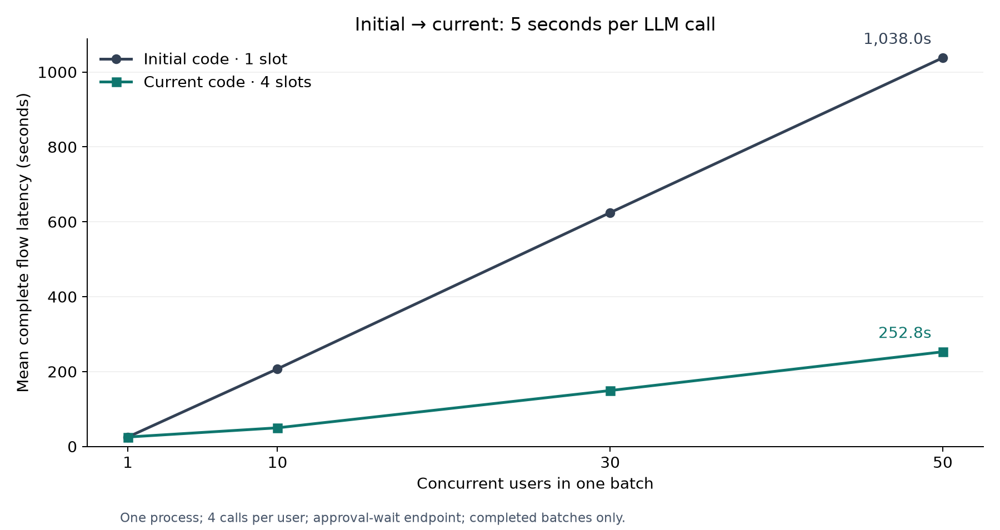
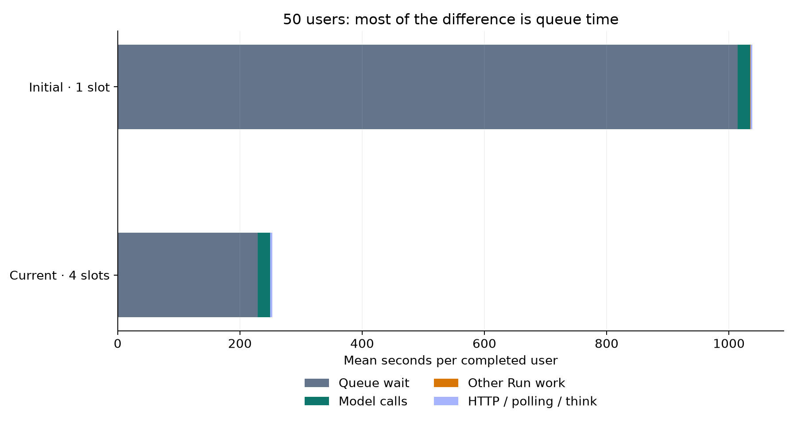

# 최초 total_merge_v1 → 현재: 전체 변경 영향과 부하 비교

**비교 기준은 초기 `c751822`와 현재 애플리케이션 `4bb5c2f`다.** 앞선 `64ad96f → 4bb5c2f` 보고서는 마지막 DB transaction 변경만 비교했다. 이번 수치를 그 결과와 섞지 않는다.

LLM 응답은 모든 호출에서 **5초**로 고정했다. 실제 API·Run Worker·LangGraph·PostgreSQL checkpoint를 실행하고, LLM의 HTTP 응답을 고정했다. 데이터 선택은 양쪽 모두 DATA_MOCK=true의 공통 예제이며 실제 업무 데이터 처리 성능은 제외한다. 사용자 한 명의 정상 흐름은 모델 4회, Run 4회이며 Workflow 승인 대기까지 진행한다. 실제 Executor 제출은 하지 않으며, Executor 이벤트 Worker·Task Reconciler는 양쪽 모두 비활성이다.

총 **8개 조건, 182개 사용자 시나리오, 136,898개 HTTP 요청**을 측정했다. 완료 182, 미완료/오류 0, HTTP 오류/응답 없음 0. 조건별 완료율은 아래 표와 [원본 집계](data/trials.csv)에 함께 표시한다.

**진행 범위:** 사용자 요청으로 100명 시험을 중단했다. 100명 부분 실행은 통계에서 제외하고, 완료한 1·10·30·50명 8개 조건만 사용한다. 추가 예정이던 현재 1자리 대조와 CRUD 단독 시험도 실행하지 않았다.

## 먼저 읽을 결론

- 1명에서는 모델 대기 약 20초가 공통이어서 전체 시간이 거의 같다. 10명 평균은 207.29초 → 49.79초, 50명 평균은 1,038.04초 → 252.80초다. 완료하지 못한 조건에는 완료 평균으로 전체 성능을 대표하지 않는다.

- 다중 사용자 시간 차이의 핵심은 **한 프로세스에서 실행 자리를 1개에서 4개로 사용할 수 있게 한 것**이다. 공급자의 5초 응답 자체를 줄인 것이 아니다. 현재 기본값은 1이므로 4자리 결과는 명시적 설정을 적용한 결과다.

- 자원 재사용과 짧은 DB transaction은 생성 횟수와 연결 점유를 줄인다. 정체 방지·세션 소유권·종료 drain·설정 통합·권한·개발 구조는 별도 기능/안전성 성과다. 정상 응답시간 개선율 하나로 모두 평가하면 누락된다.

- 측정은 로컬 단일 프로세스와 동시 처리 제한 없는 Mock LLM 조건이다. 실제 LLM 수용량, Kubernetes 자동 확장, Redis/Executor 장기 작업의 운영 성능을 보증하지 않는다.

### 측정한 네 번의 실행

| 실행 | 종료 대기 지점 | LLM 역할/횟수 | 고정 모델 대기 |
|---|---|---|---|
| 최초 접수 | data_selection | routing + intent / 2회 | 약 10초 |
| 데이터 선택 resume | analysis_context | 없음 / 0회 | 0초 |
| 분석 목적 resume | workflow_candidate_selection | skill selection + workflow / 2회 | 약 10초 |
| 후보 선택 resume | workflow_approval | 없음 / 0회 | 0초 |

위 대기시간에 DB·그래프 처리·queue·상태 확인·입력 간격이 더해진다. LLM이 없는 단계도 실행기 앞에 다른 Run이 기다리면 바로 처리되지 않는다.

## 1. 사용자 수별 전체 흐름 시간

단위는 초. 초기 코드는 실행 자리 1개, 현재 주 비교는 4개다. 평균/p95는 성공적으로 승인 대기에 도달한 사용자만 계산하며, 완료 수를 반드시 함께 본다. 한 조건당 1배치로, 사용자 p95가 반복 시험 간 신뢰구간을 뜻하지 않는다.

| 동시 사용자 | 초기 완료 | 초기 평균 | 초기 p95 | 현재 완료 | 현재 평균 | 현재 p95 | 평균 감소율 |
|---|---|---|---|---|---|---|---|
| 1 | 1/1 | 25.16 | 25.16 | 1/1 | 25.20 | 25.20 | -0.1% |
| 10 | 10/10 | 207.29 | 208.65 | 10/10 | 49.79 | 55.91 | 76.0% |
| 30 | 30/30 | 624.50 | 627.27 | 30/30 | 149.36 | 158.12 | 76.1% |
| 50 | 50/50 | 1,038.04 | 1,042.92 | 50/50 | 252.80 | 259.36 | 75.6% |

감소율이 음수면 해당 단일 측정에서 시간이 늘어난 것이다. 작은 차이는 반복 시험 없이 확정적 개선/회귀로 해석하지 않는다. 시험 종료까지 걸린 시간과 사용자 평균은 다르다. 각 사용자는 세션을 동시에 만들기 시작하고, 최초 접수→세 번의 resume→승인 대기까지 자신의 전체 시간을 잰다. 이전 측정의 짧은 Mock 지연 숫자와 직접 비교하지 않는다.

## 2. 시간이 어디에 쓰였는가

전체 시간 = Run 큐 대기 + Run 실행 + 나머지(세션 생성·HTTP·1초 폴링 감지·0.2초 입력 간격 등). 모델 전송 시간은 Run 실행 안에 포함되며 더해서 합산하지 않는다. 나머지를 전부 서버 처리시간이나 폴링 비용으로 단정하지 않는다.

| 사용자 | 버전/자리 | 전체 평균 s | 큐 대기 s | Run 실행 s | 그중 모델 s | 나머지 s |
|---|---|---|---|---|---|---|
| 1 | 초기/1 | 25.16 | 0.25 | 21.31 | 20.08 | 3.61 |
| 1 | 현재/4 | 25.20 | 0.27 | 21.07 | 20.07 | 3.87 |
| 10 | 초기/1 | 207.29 | 183.67 | 20.78 | 20.03 | 2.84 |
| 10 | 현재/4 | 49.79 | 25.57 | 20.82 | 20.03 | 3.40 |
| 30 | 초기/1 | 624.50 | 600.83 | 20.80 | 20.02 | 2.87 |
| 30 | 현재/4 | 149.36 | 125.67 | 20.68 | 20.02 | 3.01 |
| 50 | 초기/1 | 1,038.04 | 1,014.30 | 20.77 | 20.03 | 2.97 |
| 50 | 현재/4 | 252.80 | 229.05 | 20.68 | 20.02 | 3.07 |

큐 대기는 각 최초 호출/resume가 접수된 시점부터 Worker가 실행을 시작할 때까지다. 한 사용자가 모든 HITL과 외부 Executor 완료까지 Worker를 계속 독점하는 시간은 아니다. 이 시험의 LLM 없는 HITL 처리 단계도, 먼저 도착한 다른 세션의 긴 Run 뒤에 줄을 서면 늦어진다.

## 3. 동시 실행 설정과 코드 효과의 구분

이번 주 비교는 초기 코드 1자리와 현재 코드 4자리다. 현재 코드를 같은 1자리로 놓는 추가 대조는 사용자 요청으로 진행하지 않았다. 따라서 **전체 변경 + 동시성 설정을 적용한 효과**이며, 코드 교체만의 속도 개선율이나 16개 변경 각각의 독립 기여율을 확정할 수 없다.

현재 기본값은 1이다. 운영에서 4자리를 사용하려면 명시적으로 설정해야 한다. 1명 시험에서는 실제 동시 실행이 양쪽 모두 1이므로 단독 사용자 시간이 거의 같다는 사실은 확인했다.

## 4. 그래프·풀 생성과 DB 연결 점유

풀 생성은 checkpoint/bridge의 **psycopg 풀** 개수이며 서비스 SQLAlchemy 풀은 포함하지 않는다. 종료 수는 부하 측정 구간 안의 수다. 현재 공유 풀은 프로세스 종료 시 닫으므로 측정 중 종료 0이 풀 누수를 뜻하지 않는다. Worker DB 점유는 여러 연결의 checkout~checkin 시간 합이다.

| 사용자 | 버전/자리 | 그래프 생성 | 풀 생성 | 풀 종료 | Worker 점유 합 s | Run당 점유 s | 동시 graph 최대 |
|---|---|---|---|---|---|---|---|
| 1 | 초기/1 | 4 | 8 | 8 | 21.91 | 5.48 | 1 |
| 1 | 현재/4 | 1 | 2 | 0 | 2.55 | 0.64 | 1 |
| 10 | 초기/1 | 40 | 80 | 80 | 210.77 | 5.27 | 1 |
| 10 | 현재/4 | 1 | 2 | 0 | 10.29 | 0.26 | 4 |
| 30 | 초기/1 | 120 | 240 | 240 | 632.63 | 5.27 | 1 |
| 30 | 현재/4 | 1 | 2 | 0 | 24.75 | 0.21 | 4 |
| 50 | 초기/1 | 200 | 400 | 400 | 1,052.14 | 5.26 | 1 |
| 50 | 현재/4 | 1 | 2 | 0 | 41.80 | 0.21 | 4 |

같은 사용자 수에서 초기 시험은 더 오래 걸려 background CRUD와 폴링 요청도 더 많이 발생한다. 따라서 전체 DB 점유 초를 단순 비교하는 대신 Worker 점유/Run을 보여준다. 다른 SQL과 체크포인터 풀은 별개이므로 이 값을 전체 DB 부하 감소율로 확대하지 않는다.

## 5. 일반 API는 얼마나 영향을 받았나

아래는 Agent 실행 중 20 req/s로 계속 보낸 프로젝트 조회/세션 생성 API다. CRUD 단독 배치는 아직 실행하지 않았다. 지연 단위는 ms, 성공 요청의 p95다. HTTP 오류 수에는 해당 요청 종류의 오류/응답 없음도 확인해야 하며 상세 집계에 모두 보존했다.

| 사용자 | 초기 혼합 CRUD p95 | 현재 혼합 CRUD p95 | 초기 상태 GET p95 | 현재 상태 GET p95 | 초기 Run POST p95 | 현재 Run POST p95 |
|---|---|---|---|---|---|---|
| 1 | 35.61 | 28.21 | 24.13 | 27.04 | 46.47 | 42.93 |
| 10 | 31.26 | 28.40 | 31.77 | 32.23 | 64.56 | 144.00 |
| 30 | 34.12 | 28.99 | 50.90 | 32.41 | 498.25 | 229.99 |
| 50 | 36.85 | 33.08 | 77.87 | 69.31 | 296.43 | 308.21 |

CRUD 단독 비교는 아직 실행하지 않았다. 이 표의 CRUD는 Agent 실행과 동시에 보낸 혼합 요청이며, 독립 CRUD 처리량 결과로 해석하지 않는다.

상태 GET은 다음 resume에 필요한 interrupt 상태가 됐는지 확인하기 위해 1초 간격으로 호출했다. 이는 부하 발생기의 설정이며 실제 프론트의 현재 설정을 조사한 결과는 아니다. 오래 대기하면 같은 간격이어도 조회 총량이 늘어난다.

| 사용자 | 초기 상태 GET 수 | 현재 상태 GET 수 |
|---|---|---|
| 1 | 24 | 24 |
| 10 | 2019 | 478 |
| 30 | 18193 | 4357 |
| 50 | 50437 | 12263 |

## 6. 실제 모델 호출 방식과 프로젝트 지시문

동기/비동기 방식은 실제 ChatOpenAI transport를 감싸서 기록했다. 이전 호출이 asyncio 스레드에서 실행된 점도 확인했으므로 과거에 FastAPI 이벤트 루프가 LLM 대기 내내 멈췄다고 주장하지 않는다.

| 사용자 | 버전/자리 | 모델 호출 | sync | async | Mock 응답 평균 s | project prompt 전달 |
|---|---|---|---|---|---|---|
| 1 | 초기/1 | 4 | 4 | 0 | 5.00 | 0/4 |
| 1 | 현재/4 | 4 | 0 | 4 | 5.00 | 4/4 |
| 10 | 초기/1 | 40 | 40 | 0 | 5.00 | 0/40 |
| 10 | 현재/4 | 40 | 0 | 40 | 5.00 | 40/40 |
| 30 | 초기/1 | 120 | 120 | 0 | 5.00 | 0/120 |
| 30 | 현재/4 | 120 | 0 | 120 | 5.00 | 120/120 |
| 50 | 초기/1 | 200 | 200 | 0 | 5.00 | 0/200 |
| 50 | 현재/4 | 200 | 0 | 200 | 5.00 | 200/200 |

프로젝트마다 DB에 저장한 system_prompt가 모델 요청에 실제 포함되는지를 marker로 확인했다. 응답 내용은 고정 Mock이므로 LLM의 지시 이행 품질이나 결과 정확도 향상을 입증한 시험은 아니다. 추가 호출을 해서 차이가 생긴 것도 아닌지 총 호출 수로 검증한다.

## 7. CPU·이벤트 루프 관측과 측정 한계

CPU 평균 코어는 서버 프로세스 CPU 초/시험 벽시계 초다. PostgreSQL·Mock LLM·부하 발생기 CPU는 포함하지 않는다. instrumented 서버이며 원본 기록 비용도 들어간다. RSS는 원본을 메모리에 보관하는 계측의 영향을 크게 받아 제품 메모리 절감/누수 근거로 사용하지 않는다.

| 사용자 | 버전/자리 | 평균 CPU 코어 | loop lag p95 ms | 스레드 최대 | 모델 동시 최대 |
|---|---|---|---|---|---|
| 1 | 초기/1 | 0.217 | 2.41 | 4 | 1 |
| 1 | 현재/4 | 0.244 | 2.21 | 3 | 1 |
| 10 | 초기/1 | 0.207 | 2.34 | 5 | 1 |
| 10 | 현재/4 | 0.233 | 2.21 | 5 | 4 |
| 30 | 초기/1 | 0.228 | 2.59 | 5 | 1 |
| 30 | 현재/4 | 0.248 | 2.19 | 5 | 4 |
| 50 | 초기/1 | 0.251 | 2.61 | 5 | 1 |
| 50 | 현재/4 | 0.277 | 2.21 | 6 | 4 |

모델 4회×5초는 사용자당 약 20초의 모델 작업량이다. 50명이면 1,000 모델-초이고, 동시에 4개씩만 실행하면 모델 작업만으로 전체 배치에 최소 약 250초가 필요하다. 4자리는 이번 통제값이며 모든 사용자를 20초 안에 처리할 수 있는 설정이 아니다. 실제 LLM 수용량과 서비스의 허용 동시성/접수량을 함께 맞춰야 한다.

플랫폼이 자원 사용량으로 확장하는 전제도 고려해야 한다. LLM 대기에서는 긴 queue와 낮은 CPU가 공존할 수 있다. 이 로컬 측정으로 실제 플랫폼의 확장 여부를 단정할 수 없으며 CPU 기반 자동 확장만 기다리면 대기가 해결된다고 보장할 수도 없다.

모든 시험은 같은 로컬 장비의 동일한 의존성에서 순차 실행했다. 실제 Pod의 CPU/memory limit을 적용한 시험이 아니며, 운영 슬롯 4가 최적이라고 결론내릴 수 없다. 이번 조건은 한꺼번에 시작하는 사용자 배치이고 실제 사람의 긴 입력 간격을 모사하지 않는다. 프론트 폴링 간격과 도착 패턴이 바뀌면 결과도 달라진다.

Run POST도 모두 빨라진 것은 아니다. 10명 p95는 64.6→144.0ms, 30명은 498.2→230.0ms, 50명은 296.4→308.2ms다. 조건당 한 배치이므로 접수 API의 안정적인 개선/회귀 원인은 추가 검증이 필요하다. 전체 완료시간 감소와 모든 API 지연의 개선을 같은 주장으로 묶지 않는다.

## 8. 지금까지 바꾼 항목별 평가

[변경별 상세 분석](CHANGE-IMPACT.md)에 초기 문제 → 현재 구현 → 성능/기능 영향 → 검증 근거 → 남은 작업을 정리했다. 설정/권한/구조 이동을 속도 향상 수치로 꾸미지 않고, 정체·소유권·종료 개선은 기존 장애·경합 시험과 연결했다.

기존 전체 회귀 기록은 355 passed / 2 subtests passed / 0 skipped이다. 이번 부하시험에서 그 전체 회귀를 다시 실행한 수치가 아니다. 실제 Executor/Redis/일주일 대기/폐쇄망 Gaia/Kubernetes rollout 검증도 이번 완료 범위가 아니다.

**남은 핵심:** 운영 복구 관리자 API, checkpoint fencing/강제 종료 복구, 전체 DB·LLM 예산, 공개 Run ID/CRUD 계약 정리, 다중 Agent registry, main_model_name 선택·고정, project_memory 요약/저장, 실제 플랫폼 통합. 정상 부하가 통과해도 이 항목들이 자동 완료되지는 않는다.

## 9. 증거와 재현

- [시험 조건·한계·재현 명령](METHOD.md)
- [변경별 전체 분석](CHANGE-IMPACT.md)
- [조건별 CSV](data/trials.csv) · [상세 집계 JSON](data/summary.json)
- [원본 gzip 목록·SHA-256](data/manifest.json) · [자동 검증](data/validation.json)
- [실행환경/버전](sources/environment.json) · [리팩토링 commit 목록](sources/refactor-commits.txt)
- 구현/부하/분석 스크립트: `scripts/benchmarks/total_refactor/`

이 보고서의 수치는 완료한 본 시험만 사용한다. 사전 점검 실패·불완전한 환경 세팅 결과는 성능 통계에서 제외하고 METHOD에 사유를 기록했다. 원격 push·실서비스 배포·외부 자원 부하는 수행하지 않았다.
